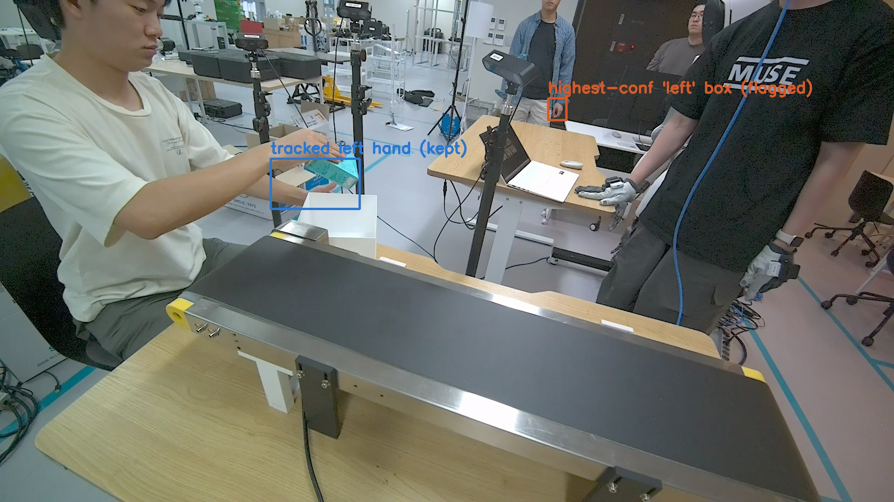
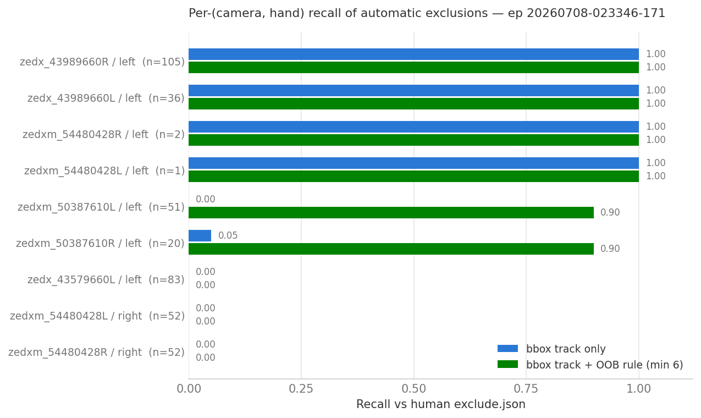

# Automatic Misdetection Filtering via Bbox Tracking (`--bbox_track`)

**Author:** Seungjun
**Date:** 2026-07-15
**Project:** MANO-pipeline — rlwrld multi-view hand annotation (`scripts/scripts_optimization/generate_kpt3d_auto.py`)

---

## 1. Scope

Multi-view triangulation is only as good as the per-camera 2D detections
feeding it, and on the conveyor captures two failure modes corrupt them
(established on real sequences, 2026-07-10):

1. **Teleporting / bystander misdetections** — a camera's
   highest-confidence "left hand" box jumps to a bystander's hand across
   the room, so the WiLoR/HaMeR crop (which is taken from the
   highest-confidence box per side) regresses keypoints on the wrong
   person entirely.
2. **Smooth-box keypoint failures** — the box stays on the right hand but
   the keypoints inside it are bad (occlusion, blur, partial crop at the
   image edge, chirality flips).

Until now these were handled by **human labeling**: per-(frame, hand,
camera) exclusions clicked in `scripts/bbox_correction_web.py` and stored
as `exclude.json` ("nogada" format), consumed by triangulation via
`--nogada`. That does not scale to 100-episode batches.

This report documents the automatic prefilter added to
`generate_kpt3d_auto.py` on branch `feature/bbox_interp_conveyor`
(commits `5a9165b`, `370485e`, merged 2026-07-13): the `--bbox_track`
flag and its companions. It replaced the deleted
`generate_kpt3d_human_label.py`, which used all valid views and relied
purely on human labels.

---

## 2. Method

### 2.1 IoU bbox tracking (`--bbox_track`)

Runs per (camera, hand) over the YOLO boxes in
`processed/hand_detection/model_boxes.npy`
(row = `[x1, y1, x2, y2, conf, is_right]`, `is_right` 1 = right /
0 = left — the same boxes whose per-side confidence maximum selects the
WiLoR/HaMeR crop in `hand_detection.py`):

- **Anchor** on the first frame with a detection of this class — the
  sequence-start assumption: the episode begins with the subject's hands
  in view and cleanly detected.
- **Advance** each frame to the same-class box with highest IoU against
  the current track box. A hand cannot teleport, so a genuine detection
  must intersect the track (`IoU > --track_iou`, default 0 = any
  intersection).
- **Coast** through detector dropouts: when no box intersects, the search
  box dilates by `--track_coast_grow` (default 0.10) of its size per
  consecutive miss, capped at `--track_coast_max` (default 0.5), so the
  track reacquires the hand after fast motion.
- **Flag** a frame when the box that actually fed the keypoint stage (the
  highest-confidence one) is *not* the tracked box and does not overlap
  it — i.e. a bystander hand out-scored the tracked one — or when every
  same-class box is off-track.



*Frame 376 of `20260708-023346-171`, camera `zedx_43989660R`: the tracked
left hand (blue) is on the task; the highest-confidence "left" detection
(orange) is a bystander across the room. The keypoint crop for this
(frame, hand, camera) came from the orange box — the tracker flags it.*

### 2.2 Out-of-frame keypoint rule (`--oob_min_kpt`)

A second, independent rule (commit `370485e`) excludes a
(frame, hand, camera) detection when **≥ N of its 21 joints fall outside
the image** in any detector's *raw* handmarks npz (`wilor_…`,
`hamer_…`). Detectors extrapolate keypoints past the image edge when the
hand is partially cropped; with that many joints outside, the in-image
remainder is unreliable too, so the whole view is dropped rather than
just the OOB joints.

The raw per-detector files must be used here: the ensemble npz already
masks OOB joints to `-1`, so the signal only survives in the per-detector
outputs. Default `N = 6` (maximizes F1 on the sweep below); `N = 8`
keeps precision at 1.0; `0` disables.

### 2.3 Output and integration

Both rules produce exclusions in the exact human-label ("nogada") schema
`{"<frame>": {"right": ["<serial>", …], "left": […]}}`, written to
`processed/hand_detection/auto_exclude.json`, then unioned with any
`--nogada` file and applied before triangulation. Downstream, the
excluded views simply never enter the DLT — the existing exhaustive
subset search + temporal gate (`--gate_cm`) operates on what remains.

---

## 3. CLI reference

| Flag | Default | Effect |
|---|---|---|
| `--bbox_track` | off | Run the IoU tracker, write `auto_exclude.json`, apply exclusions, triangulate |
| `--bbox_track_only` | off | Run the tracker (+ eval if given), write `auto_exclude.json`, exit **without** triangulating |
| `--eval_exclude <json>` | — | Score auto exclusions against a human `exclude.json` (precision/recall/F1, per-camera); implies running the tracker |
| `--track_iou` | 0.0 | Min IoU (exclusive) to count a detection as the tracked hand; 0 = any intersection |
| `--track_coast_grow` | 0.10 | Search-box dilation per consecutive missed frame |
| `--track_coast_max` | 0.5 | Cap on coasting dilation |
| `--oob_min_kpt` | 6 | Also exclude views with ≥ N/21 joints outside the image in raw wilor/hamer npz; 0 disables |

```bash
# production: filter + triangulate
python scripts/scripts_optimization/generate_kpt3d_auto.py \
    --sequence_folder datasets_rlwrld/<capture>/<ep> --tracker ensemble --bbox_track

# score against a human label without touching the 3D output
python scripts/scripts_optimization/generate_kpt3d_auto.py \
    --sequence_folder datasets_rlwrld/<capture>/<ep> --bbox_track_only \
    --eval_exclude <ep>/processed/hand_detection/exclude.json
```

---

## 4. Evaluation

Scored against the human-labeled `exclude.json` of
`datasets_rlwrld/20260708-022534/20260708-023346-171` (8 views, 414 GT
(frame, hand, camera) exclusion triples). Scoring is restricted to
triples with an actual 2D detection (402 of 414) — the human can only
flag views that detected something, and exclusions elsewhere are no-ops.
Numbers re-run 2026-07-15 on the current `main`.

| Metric | bbox track only | + OOB rule (min 6) | + OOB rule (min 8) |
|---|---:|---:|---:|
| Predicted triples | 145 | 214 | 201 |
| True positives | 145 | 208 | 201 |
| False positives | **0** | 6 | **0** |
| Precision | **1.000** | 0.972 | **1.000** |
| Recall | 0.361 | **0.517** | 0.500 |
| F1 | 0.530 | **0.675** | 0.667 |

Per-(camera, hand) recall:



| Camera / hand | GT | bbox track | + OOB (6) | Failure mode |
|---|---:|---:|---:|---|
| `zedx_43989660L` / left | 36 | **1.00** | **1.00** | bystander/teleport |
| `zedx_43989660R` / left | 105 | **1.00** | **1.00** | bystander/teleport |
| `zedxm_50387610L` / left | 51 | 0.00 | **0.90** | partial crop at image edge |
| `zedxm_50387610R` / left | 20 | 0.05 | **0.90** | partial crop at image edge |
| `zedx_43579660L` / left | 83 | 0.00 | 0.00 | smooth box, bad keypoints |
| `zedxm_54480428L` / right | 52 | 0.00 | 0.00 | smooth box, bad keypoints |
| `zedxm_54480428R` / right | 52 | 0.00 | 0.00 | smooth box, bad keypoints |

**Key takeaways:**

- The bbox tracker catches **all** teleporting/bystander misdetections,
  exactly (36/36 and 105/105 on the two affected cameras), with **zero
  false positives**.
- The OOB rule adds the partial-crop failures (the `zedxm_50387610` pair,
  0.90 recall each) that bbox continuity is blind to — the box is smooth,
  the extrapolated keypoints are not.
- Both rules are blind to **smooth-box keypoint failures** (occlusion,
  blur, chirality drift): 81–100 % of the missed GT triples had used
  boxes overlapping the previous frame's. These remain covered by the 3D
  side — the exhaustive subset search + temporal gate in the same script
  — and, where needed, human labels.
- `--oob_min_kpt 6` is the F1-optimal default; use `8` when zero false
  positives matter more than the last 1.7 points of recall.

---

## 5. Limitations

- **Sequence-start assumption.** The track anchors on the first detection
  of each (camera, hand), assumed clean. An episode that *opens* on a
  bystander's hand would anchor the track wrongly. Not observed in the
  conveyor captures (episodes start with the subject at the belt), but
  worth keeping in mind for new rig layouts.
- **A prefilter, not a replacement.** With recall ≈ 0.5 against human
  labels, `--bbox_track` reduces — it does not eliminate — the need for
  the temporal gate or, on hard sequences, `bbox_correction_web.py`
  labeling. Its value is that everything it removes is genuinely wrong
  (precision 1.0), so it is safe to run unsupervised on large batches.
- **Class-label trust.** The tracker trusts YOLO's left/right class; a
  coherent chirality flip (every camera calling the right hand "left")
  presents as a smooth track and passes. That mode is handled by the
  temporal prior gate in triangulation, not here.

---

## 6. Production status

`--bbox_track` ran on the full `20260713-044927` batch (107 episodes,
conveyor organizing, slurm array 411193) as part of the standard README
pipeline. Combined with the temporal-gated subset triangulation, all real
episodes landed at 4.2–6.8 px median reprojection error with no human
exclusion labels.
