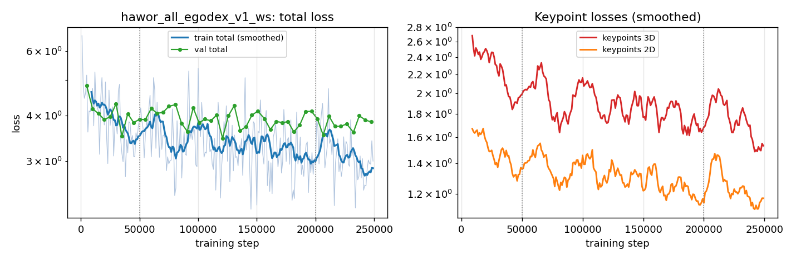
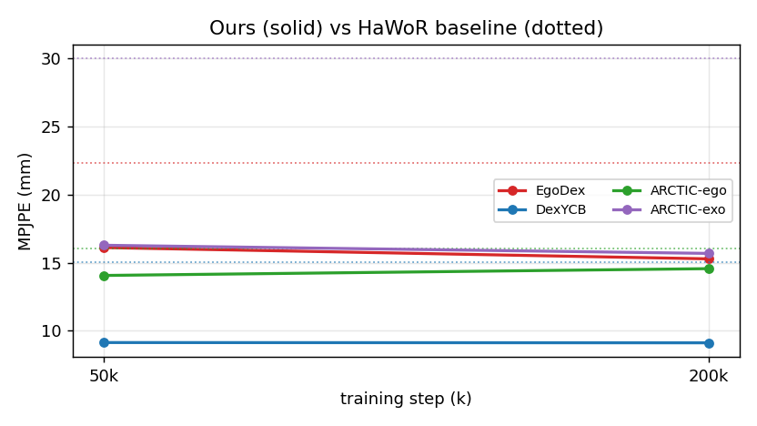
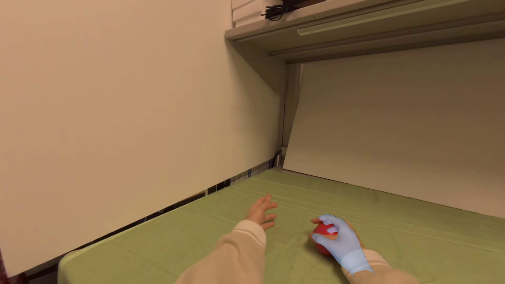
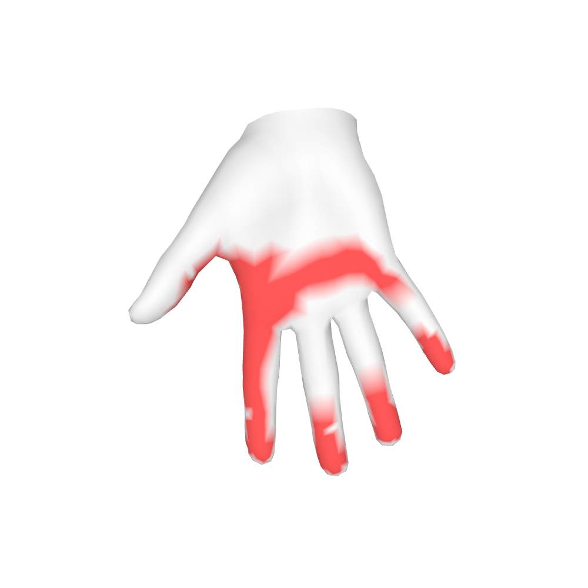
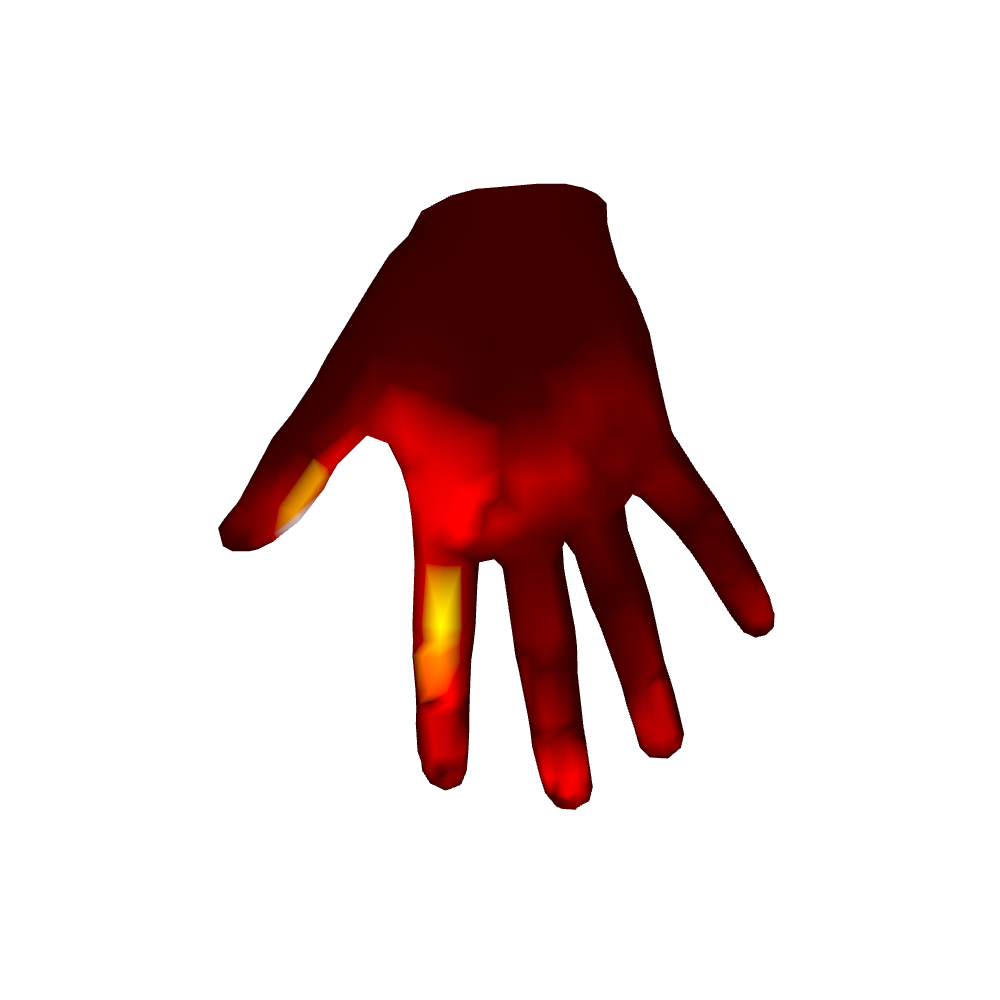

# EgoDex as a Training Corpus: Conversion, Training, and Intermediate Results

**Author:** Seungjun
**Date:** 2026-08-19
**Project:** 3D Hand Pose/Shape Estimation Ablation Study
**Status:** training in progress (249k / 500k steps) — evaluation numbers below
are intermediate checkpoints

---

## Overview

EgoDex is a large corpus of Apple Vision Pro egocentric manipulation footage
with ARKit hand tracking. It was previously used only as a **held-out
benchmark**, and it was the single benchmark where our tracker lost to
HaWoR — by a wide margin (30.7 vs 22.3 mm MPJPE). Per-frame error analysis
attributed the gap to a uniform global-orientation/depth bias (91% bias
share) that was *largest on clean, unoccluded frames*, which ruled out
occlusion or bounding-box edge effects and pointed instead at a
training-distribution hole: no headset-RGB data in our mixture.

This report covers three things: how the 560k-label EgoDex corpus was
converted into our clip training format despite having no usable MANO
annotations, how the resulting stage-1 training run is progressing, and what
the intermediate checkpoints score.

**Headline result.** Adding EgoDex to the mixture at weight 0.15, with
keypoint-only supervision, closes the gap and reverses it. At just 50k steps
the model beat HaWoR on *all four* benchmarks including EgoDex; at 200k
EgoDex MPJPE reaches **15.28 mm vs HaWoR's 22.31 mm (−32%)**, with no
regression on the lab benchmarks. The domain-hole hypothesis is confirmed.

---

## 1. Converting EgoDex to a trainable format

### 1.1 The decision that shaped everything: drop MANO

EgoDex ships MANO fits (`egodex_mano_optim`), but inspection rejected them:
betas were saturated at optimization bounds and the fitted silhouettes sat
loosely on the hands. Overlaying the fitted mesh on the source video made the
failure obvious enough that using those parameters as supervision would have
injected systematic shape/pose error into a model whose entire purpose is
accurate shape and pose.

So the conversion writes **keypoints only** — no `hand_pose`, no `betas`.
This is safe because of how the loader gates losses per sample:
`VideoDataset._parse_label` defaults the missing MANO fields to zeros and
sets `has_hand_pose = has_betas = 0`, so the MANO parameter losses multiply
by zero for EgoDex samples while the 2D/3D keypoint losses train normally.
EgoDex therefore supervises *where the joints are*, and the lab datasets
continue to supervise *what the hand mesh is*.

### 1.2 Geometry: ARKit → OpenPose

Three conversions matter:

**Joint selection (26 ARKit → 21 OpenPose).** ARKit exposes a full skeleton
including metacarpals; our models consume the 21-joint OpenPose layout. The
mapping takes the wrist plus, per finger, the Knuckle / IntermediateBase /
IntermediateTip / Tip transforms, and discards metacarpals:

```
joints = [<side>Hand] + [<side>{Thumb,Index,Middle,Ring,Little}Finger
                         × {Knuckle, IntermediateBase, IntermediateTip, Tip}]
```

**Camera convention.** ARKit `transforms/camera` is already in CV convention,
so no axis flip is applied — only normalization by the homogeneous element
and inversion to get world-to-camera:

$$
T_{c \leftarrow w} = \left( T_{w \leftarrow c} / T_{w \leftarrow c}[3,3] \right)^{-1},
\qquad
p_{\text{cam}} = R_{c \leftarrow w}\, p_{\text{world}} + t_{c \leftarrow w}
$$

with 2D obtained by the standard pinhole projection $u = K\,(p_{\text{cam}}/z)$.

**Visibility gating.** ARKit confidences alone are unreliable — they stay
high for joints that have left the frame. The per-joint validity flag
therefore combines a permissive confidence threshold with two geometric
tests:

$$
\text{ok} = (\text{conf} > 0.1) \;\wedge\; (z > 10^{-4}) \;\wedge\; (0 \le u < W) \;\wedge\; (0 \le v < H)
$$

This flag is written as the third channel of both `hand_keypoints_2d` and
`hand_keypoints_3d`, so downstream losses mask invisible joints per frame.

### 1.3 Clip structure

Each label spans a whole episode rather than a fixed window, with 16-frame
training windows sampled at load time from a baked candidate list. The
converter computes per-frame validity and bounding boxes
(`compute_valid_bbox`), then stores `valid_t0` — the set of start indices
whose 16-frame window exceeds the validity-rate threshold — plus
`valid_t0_T = 16`. Episodes where no hand yields a single valid window are
skipped entirely.

**Both hands** are converted as separate labels (`<ep>_rh.pyd`,
`<ep>_lh.pyd`) with `right = 0` for the left hand; the loader's `do_flip`
pipeline mirrors the crop so left hands train through the same right-hand
model.

### 1.4 Scale, storage, and operational details

The corpus is 2.4 TB of video — far more than `/rlwrld3` could host
alongside everything else. Videos are therefore exposed as **130 per-task
symlinks** into the source mount rather than copied, with the copy path kept
available (`--copy_video`) for a future subset. Conversion ran **sharded and
resumable** (skip if `<ep>_rh.pyd` exists), which mattered across a
multi-day run. One namespace collision needed handling: 11 task names appear
in both a main part and `extra/`, so `extra` tasks are keyed as
`<task>__extra` in both the label tree and the video symlinks.

Final corpus, from the cached dataset census:

| dataset | labels | frames | hands | annotations |
|---|---:|---:|---|---|
| **egodex** | **560,398** | **155,661,634** | both | kp2d, kp3d, cTw |
| interhand | 114,082 | 7,301,143 | both | + MANO |
| arctic | 20,484 | 1,964,394 | right | + MANO, tactile |
| hot3d_quest | 10,483 | 943,470 | both | + MANO, tactile |
| pvdb | 10,004 | 521,612 | both | + MANO, tactile |
| hrdexdb | 9,261 | 2,387,280 | right | + MANO, tactile |
| hot3d | 7,125 | 641,250 | both | + MANO, tactile |
| dexycb | 6,400 | 465,504 | both | + MANO, tactile |
| opentouch | 2,538 | 267,299 | right | + MANO, tactile |
| ho2o | 1,278 | 121,996 | both | + MANO |
| oakink2 | 1,254 | 2,009,262 | both | + MANO, tactile |
| ho3d | 899 | 83,325 | right | + MANO, tactile |
| **total** | **744,206** | **172,368,169** | | |

EgoDex alone is **75% of all labels and 90% of all frames** in the corpus —
which is exactly why it is sampled at a modest weight rather than by size.

---

## 2. Training run

`hawor_all_egodex_v1_ws_260818` — stage-1 pose training, warm-started from
the public HaWoR checkpoint.

| | |
|---|---|
| model | `hawor_static` (pose-only stage 1) |
| data mix | `mix_all_egodex`, EgoDex at **WEIGHT 0.15** |
| hardware | 1× H100, batch 8 clips × 16 frames |
| schedule | LR 1e-5, warmup 2000, checkpoint every 50k |
| progress | **249k / 500k steps**, ~9k steps/h, zero crashes |
| wandb | `rlwrld_hawor_test4/g9jkpnpb` |

**Why `hawor_static` and not `hawor_tactile`.** The v2 force model retrains
its contact and force branches from scratch on a separate stream
(`st_module_touch` + `VertexTouchHead`), and never consumes stage-1's tactile
head. Stage 1 therefore has no reason to spend capacity on contact — pose is
the bottleneck — so this run trains pose only. The one remaining dependency
is that v2 warm-starts `st_module_touch` from stage-1's `st_module`, which a
pose-only stage 1 still provides.

**Sampling weights.** EgoDex sits at 0.15, equal to ARCTIC-ego, HOT3D, and
OAKINK2 — deliberately far below its 75%-of-corpus share, so it augments the
mixture rather than dominating it. InterHand remains excluded after its NaN
2D keypoints (347 of 114,082 clips) killed an earlier run through
`0 × NaN = NaN` in confidence masking.



Total loss falls from 6.6 to ~2.9 with validation tracking it closely and no
divergence. The keypoint terms both trend down over the full run, with
visible oscillation from mixture resampling. Note that validation is measured
on ARCTIC-ego only, so it does not reflect the EgoDex gains.

---

## 3. Evaluation (intermediate checkpoints)

Protocol: `eval_video.py`, 16-frame windows, zeroed betas (no GT shape at
inference), GT-keypoint bounding boxes, per-frame validity filtering —
identical for our model and for HaWoR's released checkpoint.

### 3.1 Checkpoint progression

| benchmark | 50k | 200k | HaWoR |
|---|---|---|---|
| EgoDex MPJPE / PA / AUC | 16.11 / 9.26 / 81.5 | **15.28 / 8.99 / 82.0** | 22.31 / 10.97 / 78.1 |
| DexYCB MPJPE / PA / AUC | 9.13 / 4.17 / 91.7 | 9.11 / 4.20 / 91.6 | 15.05 / 4.92 / 90.2 |
| ARCTIC-ego MPJPE / PA / AUC | **14.06** / 6.80 / 86.4 | 14.56 / 6.84 / 86.3 | 16.05 / 7.16 / 85.7 |
| ARCTIC-exo MPJPE / PA / AUC | 16.28 / 7.71 / 84.6 | **15.68 / 7.23 / 85.6** | 30.01 / 10.31 / 79.4 |



**The model converges remarkably early.** Between 50k and 200k — a 4×
increase in training — EgoDex improved 0.83 mm, ARCTIC-exo 0.60 mm, DexYCB
was flat, and ARCTIC-ego drifted 0.50 mm *worse*. This is a very different
curve from the EgoDex-free run, which was still moving at 500k. Practical
consequence: the remaining 250k steps are unlikely to change the paper's
numbers materially, and 200k is already a defensible checkpoint to report.

### 3.2 Against published baselines

Paper-format table (DexYCB test, ARCTIC-ego validation, EgoDex test; MPJPE
and PA-MPJPE in mm ↓, AUC over 0–50 mm ↑). Baselines without released
weights or a reproducible EgoDex pipeline are marked "–".

| Method | DexYCB MPJPE / PA / AUC | ARCTIC-ego MPJPE / PA / AUC | EgoDex MPJPE / PA / AUC |
|---|---|---|---|
| HandOccNet | 14.04 / 5.80 / 88.4 | 56.18 / 12.72 / 74.6 | – |
| Deformer | 13.64 / 5.22 / 89.6 | – | – |
| H2ONet | 18.97 / 6.54 / 86.9 | 47.35 / 12.37 / 75.4 | – |
| HFL-Net | 18.26 / 6.72 / 86.6 | 51.19 / 13.38 / 73.3 | – |
| HaMeR | 15.49 / 5.42 / 89.2 | 26.32 / 9.21 / 81.7 | – |
| HaWoR | 15.05 / 4.92 / 90.2 | 16.05 / 7.16 / 85.7 | 22.31 / 10.97 / 78.1 |
| HaPTIC | 11.04 / 5.01 / 90.0 | 15.61 / **6.65** / **86.7** | – |
| UniHOPE | 17.29 / 6.58 / 86.8 | 43.42 / 13.21 / 73.8 | – |
| **Ours (200k)** | **9.11** / **4.20** / **91.6** | **14.56** / 6.84 / 86.3 | **15.28** / **8.99** / **82.0** |

Notes: DexYCB PA/AUC baselines quoted from HaWoR; MPJPE from each method's
own paper where available. All other numbers measured by us under the shared
protocol.

Our model leads every DexYCB metric and the camera-frame MPJPE on all three
benchmarks. **HaPTIC retains ARCTIC-ego PA and AUC** (6.65 / 86.7 vs our
6.84 / 86.3) — and since PA has been drifting *away* across checkpoints
(6.80 → 6.84), the earlier expectation that a mature checkpoint would
reclaim those cells now looks unlikely. HaPTIC is also stronger on
ARCTIC-exo (12.02 / 5.77 / 88.5), which is a genuine loss for us on that
view; the counterpoint is that HaPTIC is a multi-view-trained lab-data model
with no EgoDex pipeline at all, so it cannot be evaluated on the in-the-wild
egocentric footage that this work targets.

### 3.3 Qualitative: touch transfers zero-shot to Vision Pro footage

The v2 force model (trained only on PVDB/OpenTouch lab pressure data) was run
on unmodified Vision Pro clips. It produces coherent grasp–release cycles
with contact concentrated on thumb and index pads and peak pressures in the
15–22 kPa range — no fine-tuning, no adaptation.

| pose overlay (EgoDex roll_ball) | contact (cam_0, frame 657) | force (cam_0, frame 657) |
|---|---|---|
|  |  |  |

Per-frame renders were generated for two full sequences (roll_ball: 300
frames; cam_0: 773 frames, 492 of which register contact), with the force
heatmap on a fixed scale so brightness is comparable across frames.

---

## 4. Conclusions and next steps

1. **The EgoDex deficit was a data problem, not a capacity problem.** A
   keypoint-only corpus at weight 0.15 cut EgoDex MPJPE by half versus the
   EgoDex-free model, and by a third versus HaWoR, within 50k steps.
2. **Missing MANO annotations are not a barrier.** The per-sample loss gating
   lets a keypoint-only dataset contribute without contaminating mesh
   supervision — worth remembering for the next large corpus we consider.
3. **Early convergence changes the schedule calculus.** Gains are essentially
   exhausted by 200k; long runs on this mixture buy little.
4. **Open item: ARCTIC PA against HaPTIC.** We lose ARCTIC-ego PA/AUC and
   ARCTIC-exo outright. If the paper's framing is egocentric in-the-wild
   tracking, the ego + EgoDex presentation is the aligned one and exo belongs
   in a view-robustness ablation.

**In flight:** the run continues to 500k (Friday) for a final confirmation
checkpoint; a parallel 1M-step run of the EgoDex-free model is at 650k. A
shape-conditioning variant (feeding the shape embedding as the decoder's
start token instead of adding it post-decoder) is prepared but not yet
queued.
