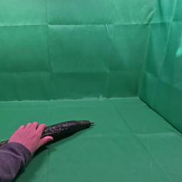
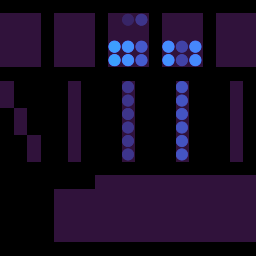
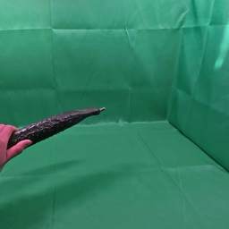
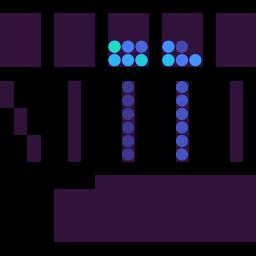
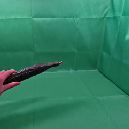
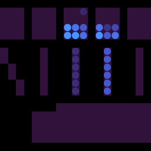

# EgoTactile vs. EgoPressDiff: Paper & Dataset Comparison

**Author:** Seungjun
**Date:** 2026-07-08
**Sources:** `EgoTactile/egotactile.pdf` (arXiv 2606.09243, ICML 2026), `EgoTactile/egopressdiff.pdf` (arXiv 2606.06872, ICASSP 2026), debug visualizations in `EgoTactile/vis_debugs/sample_video_tactile/`

---

## TL;DR

The two papers are by the **same core group** (Tsinghua SIGS — Zeng, Shi, Lu, Yang, Liao), published three days apart on arXiv, and form a two-step arc:

1. **EgoPressDiff** (ICASSP 2026, 5 pages) is the *method-only* precursor. It reframes egocentric hand-pressure estimation as **conditional video diffusion** (SVD backbone) and sets SOTA on the **existing EgoPressure dataset** (Zhao et al., CVPR 2025) — a *planar touchpad* setting. **It proposes no new dataset.**
2. **EgoTactile** (ICML 2026, 26 pages) is the follow-up that fixes the data problem the first paper ran into: planar-surface datasets can't teach full-hand grasping of real 3D objects. It contributes a **new benchmark** (glove-sensed full-hand pressure paired with egocentric video for 63 everyday objects), plus two baselines — a discriminative **EgoPressureFormer** and a generative **EgoPressureDiff**, the latter being a direct evolution of EgoPressDiff.

The debug visualizations under `vis_debugs/sample_video_tactile/` are samples of the **EgoTactile** dataset (gloved-hand set), and their format matches the paper exactly — see [Section 4](#4-what-the-debug-visualizations-show).

---

## 1. Paper-level comparison

| | **EgoPressDiff** | **EgoTactile** |
|---|---|---|
| Venue / length | ICASSP 2026, 5 pages | ICML 2026, 9 pages + 15 pages appendix |
| arXiv | 2606.06872 (Jun 5, 2026) | 2606.09243 (Jun 8, 2026) |
| Task | Egocentric **UV-domain** pressure estimation on a **planar touchpad**; output is a UV-pressure map textured onto the MANO hand mesh | Egocentric **3D grasp pressure prediction** on everyday objects; output is a 162-sensor pressure sequence or an equivalent canonical hand heatmap (deterministically inter-convertible) |
| New dataset? | **No** — evaluates on EgoPressure (Zhao et al., CVPR 2025) | **Yes** — the EgoTactile benchmark (glove-sensed full-hand pressure + egocentric video) |
| Core method | Video diffusion (SVD) conditioned on **geometric** signals: PoseNet (hand-pose maps), VAE-encoded depth, a Vertex Encoder over 778 MANO vertices, fused via a **Distribution-Calibrated (DC) Spatial Layer** that aligns latent statistics (mean/std matching) before fusion | Two baselines. (a) **EgoPressureFormer**: TimeSformer with query-based sensor decoding + contact gate (discriminative). (b) **EgoPressureDiff**: video diffusion (SVD) conditioned on **semantic/physical** signals: hint masks, text prompts (object weight, material, subject attributes), and a pressure-heatmap prototype, fused via a **Physically-Informed Feature Rectification (PIFR) layer** (text-conditioned affine modulation of the prototype feature) |
| Key claim | First diffusion model for hand-pressure estimation; +34% Volumetric IoU over the strongest baseline on EgoPressure ego-view (32.61 vs 24.19 for PressureVision++) | Generative priors + physical conditioning resolve occlusion and physical ambiguity that make deterministic regression ill-posed on 3D grasps; 56.3 C-IoU / 38.9 V-IoU vs 26.5 V-IoU for EgoPressureFormer (Object-Held-Out) |
| Stated limitation | Trained only on simple postures / planar contact; authors explicitly call for "a more diverse hand-pressure dataset for daily activities and complex grasps" | Controlled green-screen environment; bare-hand set only weakly paired; slow inference (mitigated by consistency distillation, 2.8→6.9 FPS) |

The lineage is explicit: EgoPressDiff's stated future work ("building a more diverse hand-pressure dataset ... extending EgoPressDiff with stronger priors") is precisely what EgoTactile delivers. EgoTactile's related-work section positions EgoPressDiff as "focused on the EgoPressure planar-touch setting, whereas EgoTactile addresses full-hand pressure estimation for occluded 3D object grasps."

### How the diffusion method evolved between the papers

Both models adapt the same Stable Video Diffusion backbone with a modified U-Net spatial layer, but the *conditioning philosophy* flips:

- **EgoPressDiff** conditions on **geometry** (hand pose, depth, MANO vertices). On a flat touchpad the contact region is visible and geometry suffices; the DC Spatial Layer just fixes the statistical mismatch between image and vertex latents.
- **EgoPressureDiff** (in EgoTactile) drops depth/pose/vertex conditioning and instead injects **non-visual physical priors**: text metadata (object weight, stiffness, subject physiology), a spatial hint mask, and an anatomical pressure prototype. The PIFR layer uses the text feature to predict scale/shift parameters that rectify the prototype feature. This is because in 3D grasping the contact region is *occluded* and visually identical objects can differ in weight or fill state — geometry alone can no longer disambiguate force magnitude. Ablations confirm the shift matters: removing text costs 8.4% V-IoU and raises MAE from 3.4 to 5.1 N; removing the prototype nearly doubles CoP error (3.1 → 5.5).

---

## 2. Dataset comparison: EgoPressure (used by EgoPressDiff) vs. EgoTactile (proposed)

Since EgoPressDiff proposes no dataset, the meaningful dataset comparison is between **EgoPressure** — the benchmark it evaluates on — and the new **EgoTactile** benchmark.

| | **EgoPressure** (Zhao et al., CVPR 2025) | **EgoTactile** (proposed) |
|---|---|---|
| Pressure sensor | Sensel Morph **touchpad** (world-side sensing) | **162-taxel tactile glove**, 0–350 N range, ~17 Hz (hand-side sensing) |
| Interaction surface | Planar touchpad only | **63 everyday 3D objects**, 7 categories (Packaging 26, Daily Household 11, Fruits&Veg 9, Tools&Electronics 6, Sports&Toys 5, Kitchenware 3, Office Supplies 3), weights 2 g–1082 g |
| Pressure coverage | Whatever touches the pad (press/touch gestures) | **Full-hand** grasp pressure (fingers + palm), dynamic five-stage grasps (approach → contact → grasp/hold → release → retreat) |
| Viewpoint | Ego + 7 static exo RGB-D cameras | Ego only, but two mounts (head + neck, DJI Action 5 Pro, 1280×720 @ 30 fps, synchronized to a 15 Hz master clock with the glove) |
| Scale | 4.3M frames, 21 participants, avg clip 420 frames | 319k frames, 768 clips, 5.82 h, 12 participants (6M/6F) |
| Ground-truth representation | UV pressure map on the MANO mesh (kPa) | Sparse 162-sensor sequence ↔ dense canonical hand heatmap (Newtons), linked by a fixed linear rendering operator / Ridge-regression inverse |
| Subject attributes | Yes | Yes — age, body weight, body fat rate, gender, hand length, dominant hand (self-reported, anonymized) |
| Object attributes | No (no objects) | Yes — name, category, **weight, surface material, load state** (filled/empty); usable as conditioning signals |
| Bare-hand data | No (gloveless by nature — the pad senses) | Yes — a **weakly-paired bare-hand subset** (75 clips): visible hand is bare, a second gloved hand performs a metronome-synchronized grasp of the same object off-camera to provide pressure labels (validated: contact-onset gap ≈105 ms, 82.7% contact IoU in a dual-glove study) |
| Splits | Per EgoPressure protocol (15 train / 6 test participants) | Object-Held-Out (5 unseen objects: Apple, CocaCola-330ml, Corn, Dumbbell, TennisBall) and Subject-Held-Out (p007, p011 unseen); plus a 30-clip realistic-scene test set (kitchen, office, bedroom…) |
| Environment | Lab desk with touchpad | Controlled **green screen**, randomized lighting/pose; separate in-the-wild test set for robustness evaluation |

**The trade-off in one sentence:** EgoPressure is ~13× larger in frames and has multi-view coverage, but only ever measures a hand pressing a flat pad; EgoTactile is smaller and green-screen-controlled, but is the first benchmark to pair egocentric video with *full-hand* pressure on *diverse 3D objects*, with the physical metadata (object weight, fill state, subject physiology) needed to study force ambiguity — plus the bare-hand subset for sensor-free transfer.

EgoTactile's own dataset table also situates both against PressureVisionDB (3.0M frames, planar, exo) and ContactLabelDB (2.9M frames, diverse surfaces but fingertip-only weak labels) — EgoTactile is the only one with full-hand pressure on 3D objects and both subject and object attributes.

---

## 3. Results context

- On **EgoPressure** (ego view), EgoPressDiff achieves 39.53 Contact IoU / 32.61 Volumetric IoU / 43 kPa MAE, beating PressureVision++ (32.25 / 24.19 / 48). Ablations show depth is its most critical signal (removing it: V-IoU 32.61 → 19.83) — consistent with a *visible-contact* task where geometry carries the signal.
- On **EgoTactile** (Gloved, Object-Held-Out), EgoPressureDiff reaches 96.4 Temporal Acc. / 56.3 C-IoU / 38.9 V-IoU / 3.4 N MAE, vs 84.5 / 36.8 / 26.5 / 6.2 for EgoPressureFormer and 65.2 / 24.5 / 16.8 / 9.2 for PressureVision. In zero-shot gloved→bare transfer the diffusion model keeps 47.2 C-IoU while discriminative baselines collapse (≤24.8), the paper's main evidence that generative world priors generalize past surface appearance.

---

## 4. What the debug visualizations show

`vis_debugs/sample_video_tactile/` contains eleven sample clips — eight from the **gloved-hand set** (e.g. `p001-Cucumber`, `p001-TennisBall`, `p003-PureMilk-1000ml`, `p005-Dumbbell`; note TennisBall and Dumbbell are two of the five Object-Held-Out *test* objects) and three from the **bare-hand set** (`p002-BellPepper`, `p012-CocaCola-500ml`, `p001-ShinRamyunCupNoodles`). Each clip provides per-frame `*_rgb.png` / `*_pressure.png` pairs, an mp4, and a `.txt` with the clip-level text metadata.

The `p001-Cucumber-repeat0000` clip has 529 synchronized frame pairs (≈35 s at the 15 Hz master clock). Its metadata file reads:

> "This video shows the action of picking up Cucumber. The weight of Cucumber is 246g, and its surface material is organic_skin. The person performing the action is female, 29 years old, weighing 52kg with 19% body fat."

This is exactly the paper's **text-metadata conditioning signal** (object weight/material + subject demographics) consumed by the PIFR layer.

| Phase | RGB (ego view) | Pressure (162-taxel canonical layout) |
|---|---|---|
| Contact |  |  |
| Lift / hold |  |  |
| Late hold |  |  |

Everything matches the paper's described setup: green-screen backdrop, gloved hand, egocentric view. The pressure heatmaps use the canonical hand layout from the paper's Figure 5 (five finger columns — thumb to little finger — on top, palm block at the bottom). During the hold, pressure concentrates on the index/middle finger columns with the thumb pads active — a plausible precision grasp for a 246 g cucumber — while the palm stays mostly inactive, illustrating the paper's point that this is a delicate-grasp object rather than a power grasp. The full clip is in `assets/cucumber_clip.mp4`.

One thing visible in the samples that the paper also flags: with the object held in front of the camera, the actual contact regions (finger pads on the far side of the cucumber) are **fully occluded** in the RGB view — the core motivation for the generative, physically-conditioned formulation.

### 4.1 How the force values are obtained (taxel → heatmap → readout)

Ten additional force-annotated clips (`*_force.mp4`, e.g. `p005-Dumbbell-repeat0000_force.mp4`) add a bottom panel showing total force over time with a live per-hand readout in Newtons. The chain from raw sensor to that number:

1. **Raw measurement — per taxel.** Each frame in a clip's `data.json` carries a `sensor_256` vector per hand: a 256-slot array in which each active slot is one physical sensing element on the glove reporting its own scalar force (0–350 N range per sensor, README). The active layout per hand (defined in `scripts/denoise.py`) is:
   - **Fingers:** 5 fingers × 12 taxels (4 rows of 3 down each finger) = 60 taxels
   - **Palm:** 72 taxels
   - **Bend sensors:** 5 (one per finger) — flexion, not force

   So each frame is a spatial force map over ~132 force taxels per hand at the 15 Hz master clock, synchronized with the video. (These finger + palm + bend elements are the "162-taxel" glove of the paper.)
2. **Heatmap rendering (right panel of the videos).** Each taxel value is placed at its position on the 2-D canonical hand layout (`LEFT/RIGHT_MASK_INDEXED` in `scripts/raw_to_training.py`), spread with a small Gaussian, and colored by magnitude — the heatmap *is* the per-sensor force, showing which fingertips/palm regions press and how hard. This is the same fixed linear rendering operator that links the sparse 162-sensor representation to the dense canonical heatmap in the paper.
3. **Scalar readout (bottom panel) — derived, not measured.** Per frame: denoise the per-taxel values, drop the 5 bend sensors, zero readings under a 5 N noise floor, then **sum over all ~132 force taxels**. "RH 1034 N" therefore means "sum of all individual contact forces across the hand," not a single-gauge grip force — heavy/large-contact objects sum high (Dumbbell peaks at 1151 N) while light ones stay low (Sponge peaks at 38 N).

Peak summed force across the ten annotated samples: Dumbbell 1151 N, CocaCola-500ml 887 N, 7Up-550ml 828 N, Apple 817 N, PureMilk-1000ml 612 N, TennisBall 536 N, RubiksCube 394 N, BellPepper 363 N, ShinRamyunCupNoodles 363 N, Sponge 38 N — ordering that tracks object weight and grasp type, as the paper's physical-ambiguity argument predicts.

---

## 5. Takeaways

1. **Only EgoTactile proposes a dataset.** EgoPressDiff is a method paper on the third-party EgoPressure benchmark; treat "the two proposed datasets" as EgoTactile (new) vs. EgoPressure (adopted).
2. **Same team, deliberate progression**: planar-touch method (ICASSP) → 3D-grasp benchmark + upgraded method (ICML). The diffusion backbone carried over; the conditioning changed from geometric (pose/depth/vertices, DC Spatial Layer) to physical/semantic (text, mask, prototype, PIFR layer) because occlusion and physical ambiguity dominate in 3D grasping.
3. **For our tactile work**, EgoTactile is the more relevant resource: glove-side full-hand pressure (162 taxels, Newtons), object weight/material labels usable as conditioning or auxiliary targets, and a weakly-paired bare-hand subset — a useful template if we ever need pressure labels for bare-hand egocentric video.
