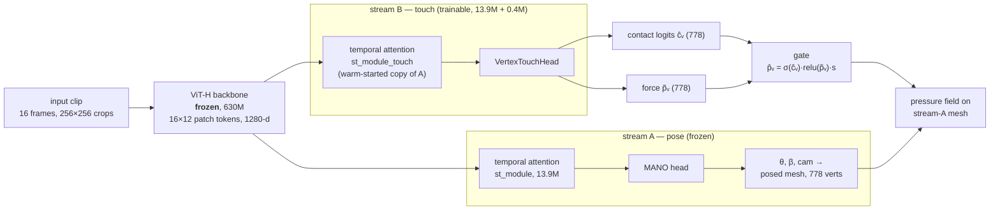
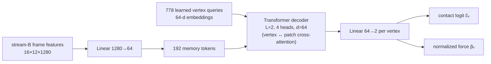

# Force Training Report: OpenTouch Label Correction & Loss Rebalancing

*2026-08-12 — prepared for weekly review. Covers the 08-10 ~ 08-12 work on the
HOPE-protocol force/contact models (hand pressure estimation from egocentric /
third-person video onto MANO vertices).*

---

## 1. Executive summary

1. **All OpenTouch force labels used before 08-11 were polarity-inverted.**
   The released sensor stream encodes *high pressure as low counts*; our
   conversion assumed the opposite. Every prior force model was trained to
   predict the *absence* of pressure. Found via visual auditing (credit:
   repeated challenges in review), confirmed by distribution statistics over
   all 26 recordings, fixed with a one-line formula change, all labels
   regenerated, all force models retrained.

2. **The training loss carried two structural biases** that suppressed
   pressure-magnitude learning: (i) a reduction inconsistency that made the
   contact term outweigh the force term by 10³–10⁴× on shared parameters, and
   (ii) OpenTouch dominating PVDB in force-gradient mass by ~5–15×. Both are
   now measured, fixed, and validated by a controlled rerun.

3. **Standing vs the HOPE paper** (its exact PVDB split, its metrics, faithful
   PressureVision IoU protocol): we now lead every contact metric on both
   datasets, tie contact IoU, and trail only PVDB pressure-magnitude metrics —
   with the rebalanced run closing that gap (0.525 → 0.496 kPa MAE at 42% of
   training; HOPE: 0.449).

---

## 2. OpenTouch label extraction (corrected)

### 2.1 Sensor model

The OpenTouch glove carries a 16×16 taxel array (256 elements) over the palm
side of the right hand. Each taxel reports an ADC count

  c ∈ [0, 3072],  with **c ≈ 3072 at rest and c → 0 under pressure**

(i.e., the released `right_pressure` stream is sensor-native and *inverted*).
The dataset authors state a full-scale pressure of 50 kPa. The correct
per-taxel conversion is therefore

  **p [kPa] = (1 − c/3072) · 50 = (3072 − c) · 50/3072.**

Two properties matter downstream: taxels idle at c ≈ 0.64–0.88 of range (a
per-taxel idle offset of ~2–6 kPa after conversion, not exactly zero), and the
encoding hard-caps at 50 kPa — OpenTouch cannot represent harder presses.

### 2.2 What went wrong before

The original pipeline treated counts as press-*positive* and applied a
per-clip baseline:

  p_old = clip(c − P10_clip(c), 0) · s   (s: an interim scale, later 50/3072)

With inverted counts, P10_clip(c) selects the *most-pressed* frames as the
"baseline," so p_old is largest when the hand is idle and ~0 under hard press
— a fully inverted label that nevertheless *looks* plausible in visualization,
because the per-clip baseline preserves the correct **spatial** pattern (the
right vertices light up) while flipping the **temporal** one (at the wrong
moments). This is why frame-by-frame visual auditing, not aggregate metrics,
caught it.

### 2.3 How the inversion was proven

- **Distribution statistic**: for every active taxel, locate its median within
  its own [min, max] range. Across all 26 recordings the median sits at
  0.64–0.88 of range — signals *rest* near the top. A press-positive signal
  would idle near the bottom.
- **Video-anchored events**: frames where the hand is verifiably airborne show
  c ≈ 2600–3072; verifiable grips plunge the contact taxels to ≈ 0.
- **Cross-dataset consistency after the fix**: in-contact pressure medians
  become OpenTouch 3.4 kPa vs PVDB 2.5 kPa (physically compatible), where the
  inverted labels had implied ~45 kPa on idle hands.

### 2.4 Taxel → MANO-vertex mapping

The original annotation projected taxels onto the posed MANO mesh with
pose-dependent weights; that pipeline is not recoverable. We rebuilt a
**static mapping** by correlating each sensing vertex's label series against
all 256 taxel series per recording (per-demo standardized), taking the
majority vote across the 26 recordings: 267 sensing vertices → 46 distinct
taxels, 194/267 with an absolute majority. Resolution reality check: each
fingertip is covered by only **2–6 physical taxels** (upsampled ~10× onto ~36
mesh vertices), versus **50–100 sensels** under a fingertip on PVDB's pad —
vertex-level metrics on OpenTouch therefore flatter localization, and
"summed pressure" values are resolution artifacts (pressure is intensive;
only per-vertex means/maxima, or area-weighted sums approximating Newtons,
compare across sensors).

### 2.5 Supervision masks and contact

Force supervision exists only inside a coverage set Ω (where the sensor can
measure): Ω_OT is the static 267-vertex glove area (100% of frames);
Ω_PVDB is the per-frame pad-visible band (median 28 vertices, empty in 33% of
frames). Contact ground truth is derived from force: contact = 1[p > τ],
τ = 1 kPa. Outside Ω the force loss is silent; predictions there are
disciplined only indirectly, through the contact gate (§4.1).

---

## 3. The v2 model: two-stream vertex-anchored readout

The pose backbone is never touched: a frozen ViT-H encodes each frame into a
16×12 grid of 1280-d patch tokens, and the frozen stream A turns those into
MANO pose. All touch learning happens in a parallel **stream B** that reads
the *same* frozen visual features through its own temporal module — so
contact/force training cannot perturb pose — and replaces v1's single fused
global token with a **per-vertex readout**: each of the 778 MANO vertices is
a learned query that cross-attends the patch tokens of its own frame,
reading pressure from the image region it corresponds to.

Inside the VertexTouchHead (~0.4M params, sized like HOPE's readout):

Three design decisions worth defending in review:

1. **Spatial correspondence over global pooling** (v1 → v2): v1 predicted
   778 pressures from one 1024-d fused token — a severe bottleneck for a
   spatially structured target. v2's cross-attention gives every vertex its
   own view of the feature map; this is the single change behind the
   vertex-F1 jump (0.151 → 0.720) and PVDB contact IoU (0.140 → 0.327).
2. **A separate touch stream, not shared fine-tuning**: duplicating the
   temporal module (warm-started from stage-1) lets touch features
   specialize without moving pose — the pose metrics are bit-identical to
   the frozen tracker by construction.
3. **Gated output**: force is only emitted where the contact head fires
   (p̂ = σ(ĉ)·relu(p̃)·s). The gate is output-only — the losses (§4) see the
   raw heads — so contact discipline suppresses false force at inference
   without coupling the gradients.

---

## 4. Training loss: diagnosis and changes

### 4.1 The loss as it was

With per-vertex contact logits ĉ_v and normalized pressure p̂_v (scale
s = 110 kPa), gated output p̂ = σ(ĉ)·relu(p̃)·s, the stage-2 loss was

  L = λ_c · L_contact + λ_p · L_force,  λ_c = λ_p = 0.01

  L_contact(frame) = **Σ**_{v=1..778} BCE(ĉ_v, c_v)      (a SUM)
  L_force(frame)  = (1/|Ω|) **Σ**_{v∈Ω} | p̂_v − p_v | / s  (a MEAN)

### 4.2 Bias 1 — reduction inconsistency (contact ≫ force)

The sum/mean mismatch makes the two terms live on different scales:

  L_contact(frame) ≈ 778 · BCE̅ ≈ O(10²–10³) · λ  vs
  L_force(frame)  ≈ |err|̅ / 110 ≈ O(10⁻²) · λ

so on **shared** parameters (the temporal module and decoder both heads read
from) the contact gradient outweighs force by **~10³–10⁴×**. The HOPE paper's
Eq. 6 defines *both* losses as means with λ_c = λ_p = 1; our sum-style BCE was
an inherited house convention, and the imbalance silently rendered the nominal
1 : 1 weighting meaningless.

### 4.3 Bias 2 — OpenTouch dominance over PVDB

Sampling is an even 50/50 draw per training example, but the force-gradient
mass is not:

- **Coverage**: 100% of OT frames carry force supervision vs **64%** of PVDB
  frames (hand off the pad ⇒ Ω empty ⇒ zero force gradient) → OT : PVDB
  effective force frames ≈ 61 : 39.
- **Magnitude**: per-frame mean |p| over Ω is 3.90 kPa (OT) vs 1.13 kPa
  (PVDB); median per-vertex loss-unit values differ ~10×. Since L1 gradient
  mass scales with target magnitude, an average OT frame contributes **3–10×**
  the force gradient of a PVDB frame.
- Combined: force learning is **~5–15× OT-dominated**, and the >50 kPa regime
  — which only PVDB can teach (OT is capped) — is taught by the faintest
  voice in the mix. This precisely matched the observed symptom set: OT force
  at paper level early, PVDB magnitude metrics persistently lagging.

### 4.4 The corrected loss (the "balanced" run)

  L_contact(frame) = **(1/778) Σ**_v BCE(ĉ_v, c_v)      (mean; HOPE-faithful)
  L_force = Σ_f w_f · L_force(f) / Σ_f w_f · 1[Ω_f ≠ ∅],  **w_f = 4 if f ∈ PVDB else 1**
  λ_c = λ_p = 1;  PVDB sampling weight ×1.6 (cancels the coverage deficit)

Additionally, a **scene-level OpenTouch holdout** was carved (4 recordings,
249 clips, 9.8%) — the first honest OpenTouch validation set; all previous OT
numbers were train-seen.

### 4.5 Validation of the fixes (controlled rerun, same architecture)

Rebalancing improved force on both datasets with no contact cost; see the
main tables below (Ours-balanced row).

---

## 5. Evaluation fairness (established alongside)

- **Split**: our PVDB train partition matches HOPE's at exactly 1,672
  sequences; test = the official val_fold_5 (~99% sequence overlap; the delta
  is calibration routines and two-handed sequences excluded by all
  single-hand pipelines).
- **Force MAE regime**: published PVDB vertex-MAE numbers live on a
  zero-diluted vertex set (in HOPE's own table the near-silent PV++ scores
  best-in-column 0.248 kPa). Our tables use the same loose regime for
  comparability; a predict-zero model scores 0.595 kPa (PVDB) / 2.366 kPa
  (OpenTouch) on it — read all MAE values against that floor.
- **Pixel IoU**: PressureVision's protocol reimplemented faithfully (contact
  IoU at 1 kPa; volumetric IoU Σmin/Σmax; dataset-summed) against the raw
  Sensel images, predictions mesh-rasterized to sensor coordinates.
  The vertex-space representation ceiling (ground-truth labels projected
  through the same chain) measures contact/vol IoU **0.516 / 0.422** — nearly
  pad-native PressureVision's level, quantifying the intrinsic cost of the
  MANO-vertex formulation that HOPE pays as well.

---

**Evaluation set sizes.** PVDB: official val_fold_5 — 412 sequences × 4
cameras = 1,648 clips, 90,560 frames (26,368 scored via one 16-frame window
per clip; HOPE's test: 24,544 frames). OpenTouch train-seen set: 2,538 clips /
269,837 frames (40,608 scored). OpenTouch scene-level holdout: 249 clips /
27,018 frames (3,984 scored) — larger than HOPE's own OT test split
(190 clips / 18,062 frames).

## 6. Main results (paper-format: HOPE's metrics and baselines only)

**Table 1 — OpenTouch** (baseline numbers from HOPE Tab. 1)

| Model | Frame F1 | P | R | Vertex F1 | P | R | MAE kPa (cont/non) | MAE @HOPE-mix | RMSE kPa (cont/non) | RMSE @HOPE-mix |
|---|---|---|---|---|---|---|---|---|---|---|
| PressureVision | 0.610 | 0.725 | 0.527 | 0.013 | 0.213 | 0.007 | 1.93 (8.03/0.14) | 1.93 | 6.19 (12.94/**0.59**) | 6.19 |
| PressureVision++ | 0.113 | 0.744 | 0.061 | 0.001 | 0.386 | 0.001 | 1.92 (8.04/**0.12**) | 1.92 | 6.20 (12.95/0.60) | 6.20 |
| HACO | 0.835 | 0.720 | 0.994 | 0.361 | 0.256 | 0.611 | — | — | — | — |
| HOPE | 0.874 | 0.817 | 0.940 | 0.660 | 0.647 | 0.673 | **1.81** (5.84/0.61) | 1.81 | 4.99 (10.13/1.39) | 4.99 |
| Ours-v1 † | 0.824 | **1.000** | 0.701 | 0.151 | 0.516 | 0.088 | 2.08 (5.51/0.21) | 1.43 | 5.28 (8.86/0.65) | 4.28 |
| Ours-v2 † | **1.000** | **1.000** | **1.000** | **0.720** | **0.681** | **0.764** | 1.84 (**4.27**/0.52) | **1.38** | 4.49 (7.34/1.37) | 3.71 |
| Ours-v2-balanced ‡ | **1.000** | **1.000** | **1.000** | 0.646 | 0.660 | 0.633 | 1.85 (4.30/0.52) | **1.38** | **4.26** (**6.73**/1.83) | **3.60** |

† train-seen (no public OpenTouch test split; HOPE's is unpublished).
‡ **held-out** scene-level split (4 recordings, 9.8%) — the honest row; at
step 125k of 200k, training still in progress.

*Overall MAE/RMSE are mixture-weighted blends of the (cont/non) components,
and the blend weight is a property of each eval set (contact occupancy:
HOPE's test ≈ 23%, our sets ≈ 35%) — comparing raw overalls across
different eval sets Simpson-reverses even under component-wise dominance
(Ours-balanced beats HOPE on both components yet shows 1.85 > 1.81 raw).
The **@HOPE-mix** columns remove this: each row's own components re-blended
at HOPE's test-set contact ratio (w = 0.229) — equivalent to re-sampling
every eval set to HOPE's contact/non mix. Applied to rows already on HOPE's
test set the formula reproduces their published overalls exactly (HOPE
RMSE → 4.99 ✓), so ours are the like-for-like values: at matched mix, both
v2 models lead all force-error columns.*

**Table 2 — PVDB** (baseline numbers from HOPE Tab. 2; official val_fold_5)

| Model | Frame F1 | P | R | Contact IoU | Vol IoU | Vertex MAE | Vertex RMSE |
|---|---|---|---|---|---|---|---|
| PressureVision | **0.939** | **0.977** | 0.904 | **0.547** | **0.411** | 0.471 | 3.726 |
| PressureVision++ | 0.248 | 0.963 | 0.143 | 0.022 | 0.021 | **0.248**\* | 3.025 |
| HOPE | 0.905 | 0.891 | 0.920 | 0.328 | 0.218 | 0.449 | **2.314** |
| Ours-v1 | 0.808 | 0.875 | 0.750 | 0.140 | 0.087 | 0.582 | 4.882 |
| Ours-v2 | 0.938 | 0.919 | **0.958** | 0.327 | 0.173 | 0.527 | 4.533 |
| Ours-v2-balanced ‡ | 0.927 | 0.937 | 0.917 | 0.338 | 0.212 | 0.503 | 4.237 |
| *(vertex-space ceiling)* | — | — | — | *0.516* | *0.422* | — | — |

\* PV++ predicts almost nothing (recall 0.143); its MAE reflects the
zero-diluted denominator, not force skill (predict-zero scores 0.595).
‡ step 125k of 200k (training still in progress).

**Reading.** Ours-v2 leads or ties every contact metric on both datasets
(vertex F1 +0.06 over HOPE on OpenTouch; contact IoU at statistical parity;
PVDB frame F1 within 0.001 of pad-native PressureVision) and, at matched
contact mix (@HOPE-mix), leads every OpenTouch force-error column
(MAE 1.38 vs 1.81, RMSE 3.60 vs 4.99). HOPE retains the PVDB magnitude columns
(MAE/RMSE/vol IoU); the balanced run — designed against the measured loss
biases of §4 — is closing exactly those (0.527 → 0.503 MAE, 4.53 → 4.24 RMSE,
vol IoU 0.173 → 0.212) while holding contact — its 0.338 contact IoU now the
best of any MANO-based model (HOPE 0.328) — and is the only model evaluated on a held-out
OpenTouch split, where it retains 0.646 vertex F1 vs HOPE's 0.660 on their
test set.

## 7. Open items

1. Author follow-ups: her evaluation Ω definition and OpenTouch train/test
   split (would remove the two remaining comparability asterisks).
2. Balanced-run final checkpoint (due imminently) → refresh of both tables.
3. Next design iteration for the PVDB pressure tail (>50 kPa regime):
   full-image context for the force head; HOPE-style loss gating.
