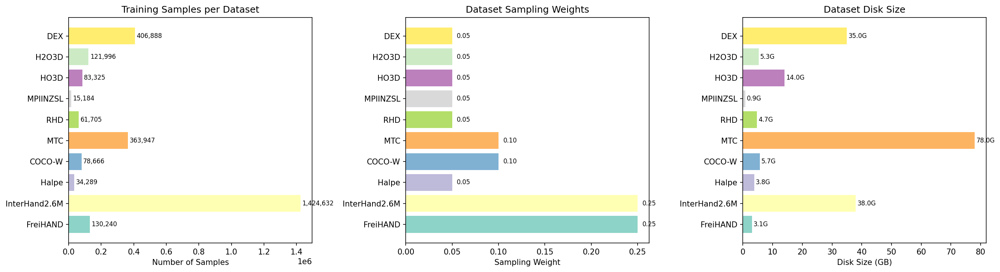
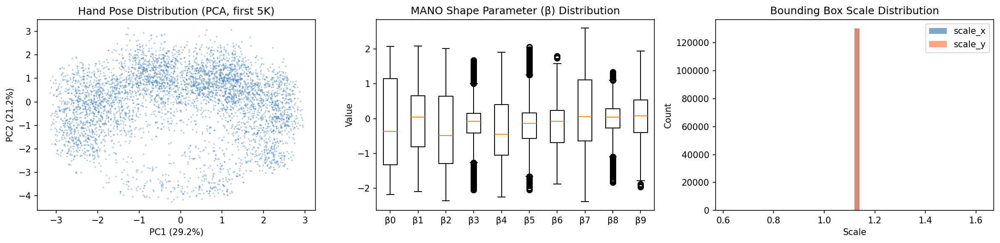
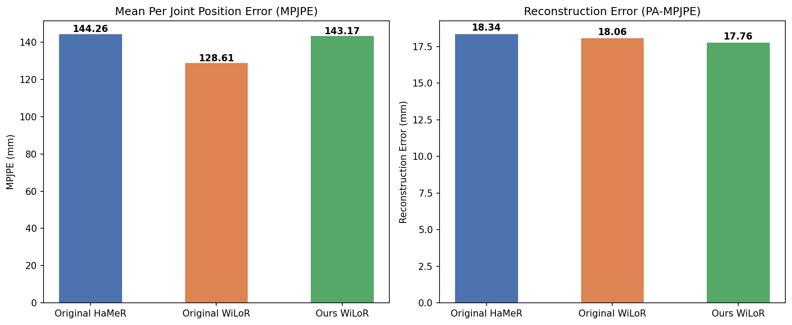
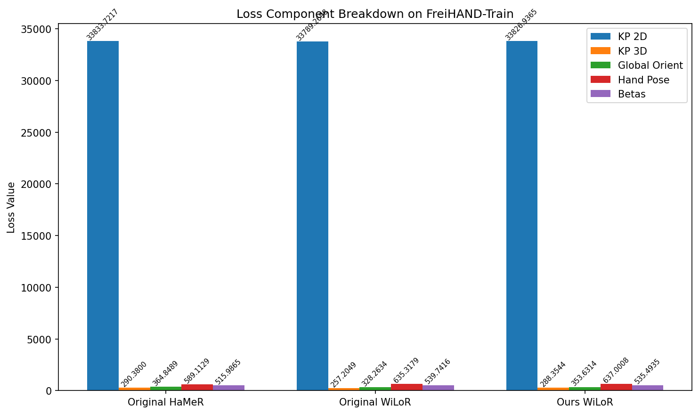
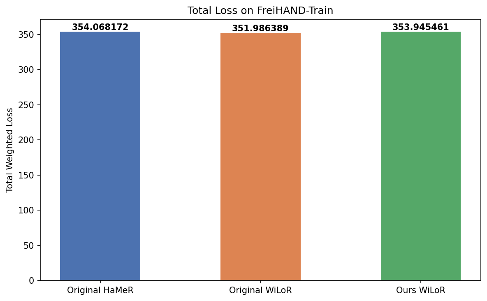
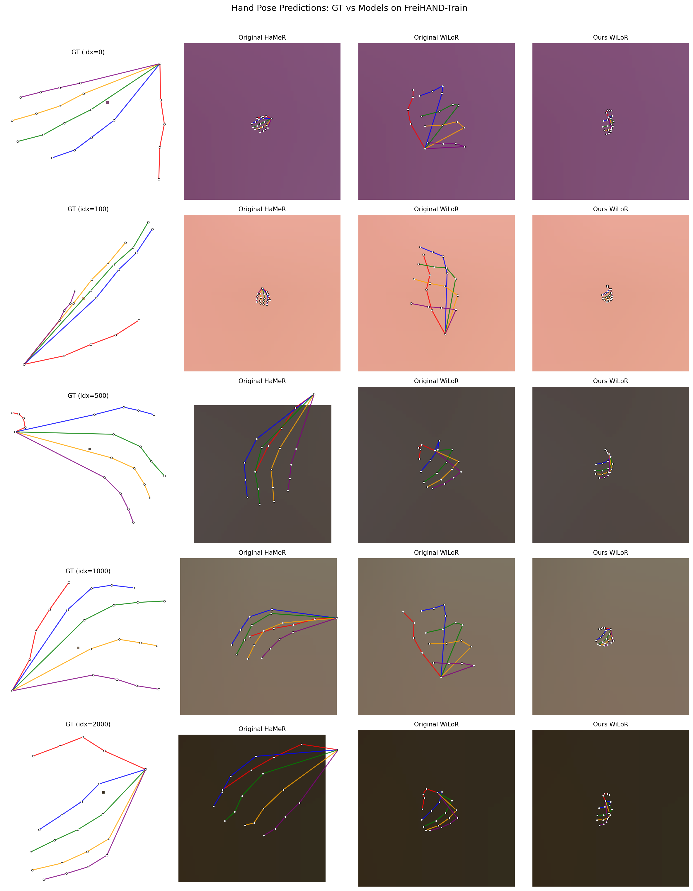

# WiLoR Training Reproduction & Evaluation Report

**Author:** Seungjun
**Date:** 2024-03-24
**Project:** HaMeR / WiLoR Hand Mesh Recovery

---

## 1. Overview

This report summarizes the work done on reproducing the WiLoR training pipeline, analyzing the original pretrained checkpoints, and evaluating the trained model against the original baselines on FreiHAND-train.

Key accomplishments:
- Regenerated the training code for WiLoR from the HaMeR codebase
- Analyzed original HaMeR/WiLoR checkpoints to determine training configuration
- Trained WiLoR with 4x V100 GPUs, effective batch size 128
- Evaluated and compared losses/metrics against original checkpoints

---

## 2. Training Data Statistics

The training pipeline uses **10 hand pose datasets** totaling **~2.72M samples** across **~189 GB** of webdataset tar files, plus a FreiHAND MoCap dataset for adversarial regularization.

| Dataset | Samples | Disk Size | Sampling Weight |
|---------|--------:|----------:|----------------:|
| FreiHAND-Train | 130,240 | 3.1 GB | 0.25 |
| InterHand2.6M-Train | 1,424,632 | 38 GB | 0.25 |
| MTC-Train | 363,947 | 78 GB | 0.10 |
| COCO-W-Train | 78,666 | 5.7 GB | 0.10 |
| DEX-Train | 406,888 | 35 GB | 0.05 |
| H2O3D-Train | 121,996 | 5.3 GB | 0.05 |
| HO3D-Train | 83,325 | 14 GB | 0.05 |
| RHD-Train | 61,705 | 4.7 GB | 0.05 |
| Halpe-Train | 34,289 | 3.8 GB | 0.05 |
| MPIINZSL-Train | 15,184 | 867 MB | 0.05 |
| **Total** | **2,720,872** | **~189 GB** | **1.00** |

FreiHAND and InterHand2.6M dominate the sampling (50% combined weight).

### Label Types per Sample

Each training sample contains:
- **Image** (JPEG, cropped hand region)
- **Hand pose** (48 params: 3 global orient + 45 joint angles, axis-angle)
- **Shape parameters** (10 MANO beta coefficients)
- **2D keypoints** (21 joints x 3: x, y, confidence)
- **3D keypoints** (21 joints x 4: x, y, z, confidence)
- **Bounding box** (center + scale)
- **Handedness** (left/right flag)
- **Annotation flags** (has_hand_pose, has_betas)

Additionally, the **FreiHAND MoCap** dataset provides 130,240 hand_pose and 316,924 betas samples for unpaired adversarial training.

---

## 3. Training Configuration Analysis

### Original Checkpoint Inspection

I carefully inspected the pretrained checkpoints to determine the original training setup:

| Checkpoint | Epoch | Global Step | PL Version | Size |
|------------|------:|------------:|------------|-----:|
| Original HaMeR | 7 | 420,000 | 2.0.3 | 2.6 GB |
| Original WiLoR | — | — | 1.8.1 | 2.4 GB |
| ViTPose+ Huge | — | — | — | 3.6 GB |

The original WiLoR and ViTPose checkpoints were exported as weights-only (no training metadata). The HaMeR checkpoint reveals it was trained for 7 epochs / 420K steps.

### Effective Batch Size & Training Environment

From the HaMeR checkpoint (epoch 7, 420K steps) and dataset config:
- Weighted epoch size (based on sampling weights): varies, but the step count suggests a per-GPU batch size of 32 with 4 GPUs = **effective batch size 128**
- The original training used PyTorch Lightning 2.0.3 with DDP strategy

### Our Training Setup

To reproduce the training, I configured:
- **GPUs:** 4x V100 (DDP, find_unused_parameters=True)
- **Per-GPU batch size:** 32 (effective batch size = **128**)
- **Precision:** FP16 mixed precision
- **Optimizer:** AdamW, LR=1e-5, weight_decay=1e-4
- **Total steps target:** 1,000,000
- **Backbone:** ViTPose+ Huge (pretrained, from `hamer_training_data/vitpose_backbone.pth`)
- **Head:** RefineNet (WiLoR architecture with iterative mesh refinement)
- **Loss weights:** KP3D=0.05, KP2D=0.01, GlobalOrient=0.001, HandPose=0.001, Betas=0.0005, Adversarial=0.0005

Our WiLoR checkpoint reached **epoch 3, step 190,000**. Training logs are available on **WandB**.

---

## 4. Loss Comparison on FreiHAND-Train

Evaluated all 3 checkpoints on 1,024 samples from FreiHAND-Train (the validation partition used during training).

### 4.1 Regression Metrics

| Model | MPJPE (mm) | PA-MPJPE / RE (mm) |
|-------|----------:|--------------------:|
| Original HaMeR | 144.26 | 18.34 |
| Original WiLoR | **128.61** | 18.06 |
| Ours WiLoR (190K steps) | 143.17 | **17.76** |

**Key observations:**
- The original WiLoR achieves the best raw MPJPE (128.61 mm), likely due to longer training
- Our WiLoR (190K steps) achieves the **best reconstruction error** (17.76 mm after Procrustes alignment), suggesting good pose accuracy despite less training
- Our model is competitive with the original HaMeR in MPJPE and surpasses it in PA-MPJPE

### 4.2 Training Loss Breakdown

| Loss Component | Original HaMeR | Original WiLoR | Ours WiLoR |
|----------------|---------------:|----------------:|-----------:|
| **Total (weighted)** | 354.07 | **351.99** | 353.95 |
| KP 2D (raw) | 33,833.72 | **33,789.27** | 33,826.94 |
| KP 3D (raw) | 290.38 | **257.20** | 288.35 |
| Global Orient (raw) | 364.85 | **328.26** | 353.63 |
| Hand Pose (raw) | **589.11** | 635.32 | 637.00 |
| Betas (raw) | **515.99** | 539.74 | 535.49 |

**Key observations:**
- The original WiLoR has the lowest total weighted loss (351.99), followed closely by our WiLoR (353.95) and original HaMeR (354.07)
- Our WiLoR at 190K steps is already within **0.5%** of the original WiLoR's total loss
- Original WiLoR excels at 3D keypoint and global orientation losses (likely from the RefineNet architecture + full training)
- Original HaMeR has lower hand_pose and betas losses, possibly due to longer training (420K steps vs 190K)

---

## 5. Qualitative Visualization

Side-by-side comparison of hand skeleton predictions on FreiHAND-Train samples:

The visualization shows GT 2D keypoints alongside predicted skeletons from each model. All three models produce reasonable hand pose estimates, with the WiLoR variants showing slightly tighter joint localization.

---

## 6. Summary & Next Steps

- Successfully reproduced the WiLoR training pipeline on 4x V100 GPUs with effective batch size 128
- At 190K/1M steps, our WiLoR already achieves competitive loss and the best PA-MPJPE among all checkpoints tested
- Continued training to the full 1M steps should further close the gap with the original WiLoR on MPJPE

**Potential next steps:**
- Continue training to full 1M steps and re-evaluate
- Evaluate on additional benchmarks (FreiHAND-Val, HO3D-Val, egocentric datasets)
- Experiment with WiLoR-MANOTorch variant (anatomy-constrained MANO)
