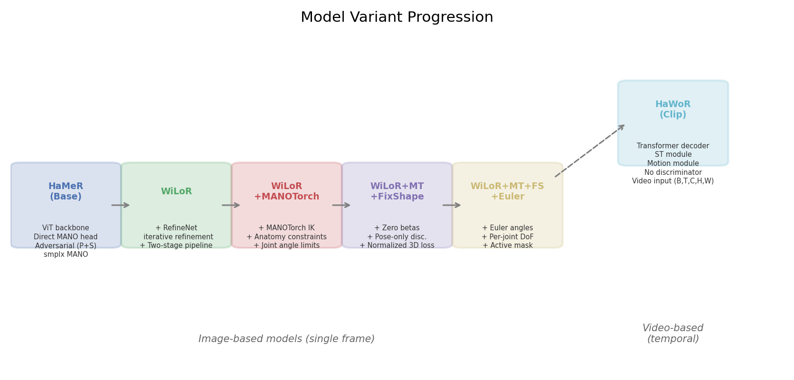
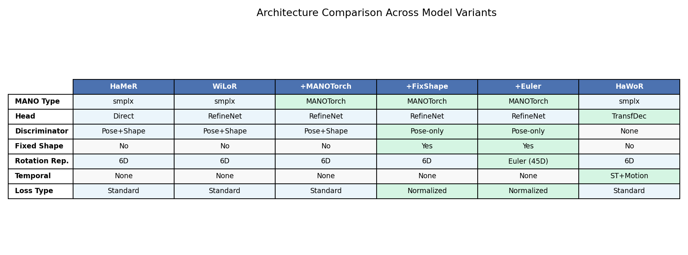
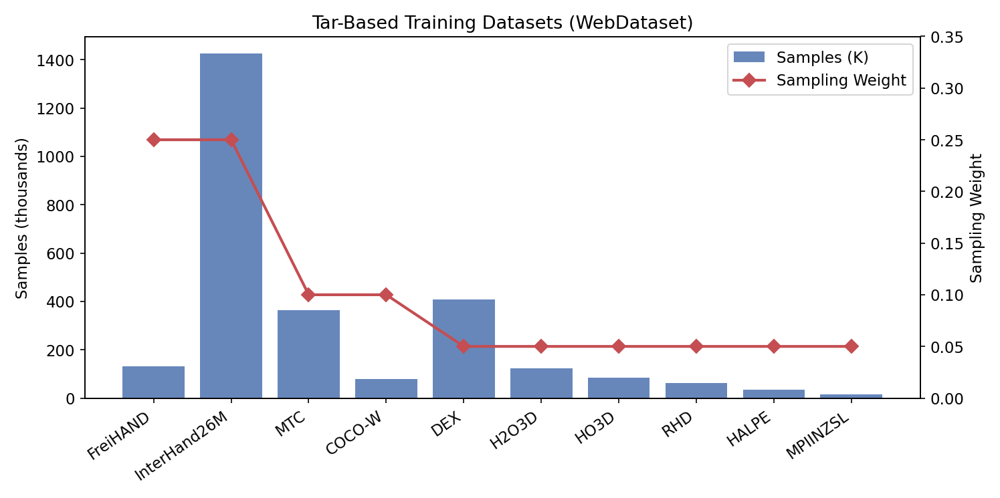
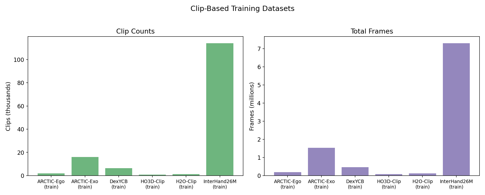
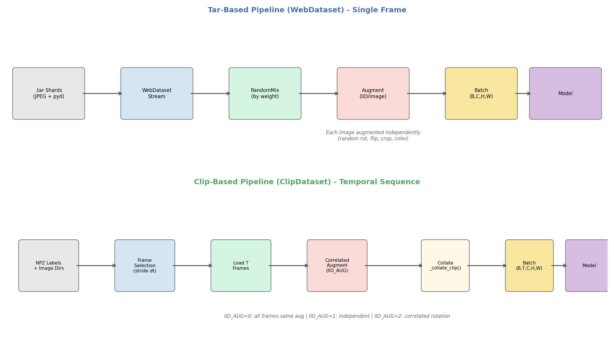
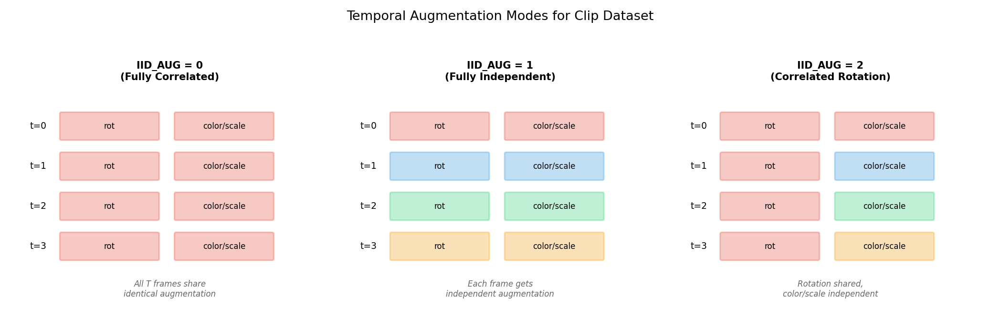

# Hand Tracking Ablation: Repository Overview & Data Pipeline Report

**Author:** Seungjun
**Date:** 2026-04-01
**Project:** 3D Hand Pose/Shape Estimation Ablation Study

---

## 1. Overview

This report documents the `hand_tracking_ablation` repository: a comprehensive ablation study framework for 3D hand pose and shape estimation from images and video. The system builds on HaMeR (CVPR 2024), progressively introducing architectural refinements across **6 model variants** (5 image-based, 1 video-based) trained on **10 single-frame datasets** (~2.7M images) and **7 temporal clip datasets** (~10M frames).

Key capabilities:
- Single-frame and temporal (video) hand mesh recovery
- Progressive ablation: base model -> RefineNet -> anatomy constraints -> fixed shape -> Euler angles -> temporal modeling
- Two distinct data pipelines: tar-based WebDataset (single frame) and ClipDataset (temporal sequences)
- Multi-GPU distributed training with PyTorch Lightning + Hydra configs

---

## 2. Repository Structure

```
hand_tracking_ablation/
├── models/                              # Image-based model variants
│   ├── hamer/                           #   HaMeR (base)
│   ├── wilor/                           #   WiLoR (+ RefineNet)
│   ├── wilor_manotorch/                 #   + MANOTorch IK
│   ├── wilor_manotorch_fix_shape/       #   + zero-beta shape
│   ├── wilor_manotorch_fix_shape_euler/ #   + Euler angle prediction
│   ├── datasets/                        #   Tar/WebDataset loading
│   ├── utils/                           #   Shared utilities
│   ├── configs/                         #   YACS base configs + dataset YAMLs
│   └── configs_hydra/                   #   Hydra experiment configs
│       ├── experiment/                  #     Model variant configs
│       ├── data/                        #     Dataset mix configs
│       ├── trainer/                     #     Trainer configs (ddp, gpu, etc.)
│       └── launcher/                    #     Job submission (local, slurm)
│
├── models_clip/                         # Video/clip-based model variants
│   ├── hawor/                           #   HaWoR (temporal transformer)
│   ├── hamer/                           #   Clip-adapted HaMeR
│   ├── datasets/                        #   ClipDataset loading
│   ├── configs/                         #   YACS configs for clip models
│   └── configs_hydra/                   #   Hydra configs for clip models
│
├── scripts/                             # Entry points
│   ├── train.py                         #   Training (image models)
│   ├── train_clip.py                    #   Training (clip models)
│   ├── eval.py                          #   Evaluation
│   └── convert_*.py                     #   Data conversion utilities
│
├── slurm/                               # SLURM job scripts
│   ├── v100/                            #   V100 GPU cluster
│   └── l40s/                            #   L40S GPU cluster
│
├── third-party/                         # External dependencies
│   ├── ViTPose/                         #   2D hand keypoint detection
│   └── manotorch/                       #   MANO IK solver (submodule)
│
├── _DATA/                               # Checkpoints, MANO files (gitignored)
├── hamer_training_data/                 # Tar shards + backbone weights
├── hamer_evaluation_data/               # Evaluation annotations
├── eval.py                              # Standalone evaluation
├── demo.py                              # Standalone demo/inference
└── pyproject.toml                       # Package definition
```

### Key Entry Points

| Script | Purpose | Example |
|--------|---------|---------|
| `scripts/train.py` | Train image-based models | `python scripts/train.py exp_name=wilor experiment=wilor trainer=ddp` |
| `scripts/train_clip.py` | Train clip-based models | `python scripts/train_clip.py exp_name=hawor2 experiment=hawor2 trainer=ddp` |
| `eval.py` | Evaluate on benchmarks | `python eval.py --dataset FREIHAND --checkpoint <path>` |
| `demo.py` | Run inference + visualize | `python demo.py --checkpoint <path> --img_folder <dir>` |

### Config System

Two-tier configuration:
1. **YACS** (`models/configs/__init__.py`) -- base config defaults and dataset YAML definitions
2. **Hydra** (`models/configs_hydra/`) -- experiment composition with command-line overrides

---

## 3. Model Variants

The repository implements 6 model variants in a progressive ablation chain. All share a ViT (Vision Transformer) backbone and MANO parametric hand model output.





### 3.1 HaMeR (Base Model)

**Directory:** `models/hamer/` | **Class:** `HAMER`

The baseline model from HaMeR (CVPR 2024). ViT backbone extracts features, a direct MANO head regresses hand parameters (global orientation, 15 joint rotations in 6D representation, 10 shape betas, weak-perspective camera). Adversarial training with a pose+shape discriminator regularizes predictions using unpaired MoCap data.

- **MANO layer:** smplx
- **Rotation representation:** 6D continuous rotation
- **Discriminator:** Pose + Shape
- **Optimization:** Manual (alternating generator/discriminator)

### 3.2 WiLoR (+ RefineNet)

**Directory:** `models/wilor/` | **Class:** `WiLoR`

Adds **RefineNet**, a two-stage iterative refinement module. The backbone outputs temporary MANO parameters and features. These, along with the temporary mesh vertices, are fed into RefineNet which refines pose, shape, and camera predictions using deconvolution upscaling.

- **Key addition:** RefineNet head with spatial alignment via temporary vertices
- **Two-stage pipeline:** Backbone -> temporary MANO -> RefineNet -> refined MANO

### 3.3 WiLoR + MANOTorch (+ Anatomy Constraints)

**Directory:** `models/wilor_manotorch/` | **Class:** `WiLoRMANOTorch`

Replaces the standard smplx MANO layer with **MANOTorch**, which adds anatomy-aligned joint rotation constraints. Each joint's rotation is decomposed into Euler angles (twist, spread, bend) via `AxisLayerFK`, with inactive axes zeroed and active axes clamped to anatomically valid ranges.

- **Key addition:** Anatomy-constrained MANO via inverse kinematics
- **Joint limits:** MCP joints have 3 DoF; PIP/DIP are hinge joints (bend only)
- **GT preprocessing:** Labels pre-constrained via batched IK in dataset conversion

### 3.4 WiLoR + MANOTorch + FixShape (+ Zero Betas)

**Directory:** `models/wilor_manotorch_fix_shape/` | **Class:** `WiLoRMANOTorchFixShape`

Fixes MANO betas to zero (mean hand shape), removing shape estimation entirely. Uses a **pose-only discriminator** and introduces **NormalizedKeypoint3DLoss** to handle the systematic bone-length mismatch caused by fixed shape.

- **Key addition:** Zero betas, scale-normalized 3D loss
- **NormalizedKeypoint3DLoss:** Rescales GT keypoints by `(pred_scale / gt_scale)` before computing L1

### 3.5 WiLoR + MANOTorch + FixShape + Euler (+ Per-Joint DoF)

**Directory:** `models/wilor_manotorch_fix_shape_euler/` | **Class:** `WiLoRMANOTorchFixShapeEuler`

Predicts hand joint rotations as anatomy-aligned **Euler angles** (15 joints x 3 angles = 45D) instead of 6D continuous rotations. An active mask enforces per-joint DoF structure: 3 DoF for MCP joints, 1 DoF for PIP/DIP joints.

- **Key addition:** Direct Euler angle prediction with structural DoF enforcement
- **Active mask:** Zeros inactive angle dimensions before MANO forward pass
- **Loss:** Configurable in Euler or rotation matrix space

### 3.6 HaWoR (Temporal / Video-Based)

**Directory:** `models_clip/hawor/` | **Class:** `HAWOR`

A fundamentally different architecture designed for **video input**. Uses a frozen ViT backbone with a **MANOTransformerDecoderHead** instead of RefineNet. Optional spatiotemporal (ST) and motion modules add temporal attention across frames.

- **Input:** `(B, T, C, H, W)` video clips (default T=16 frames)
- **ST Module:** Temporal attention over spatial features
- **Motion Module:** Temporal refinement of pose sequences
- **No discriminator:** Trained with direct supervision only
- **Camera:** Weak-perspective (CLIFF-style) projection

---

## 4. Dataset Statistics

### 4.1 Tar-Based Training Datasets (WebDataset)

Used by image-based models (`models/`). Total: **~2.72M images** across 10 datasets stored as tar shards.

| Dataset | Images | Tar Files | Sampling Weight |
|---------|-------:|----------:|----------------:|
| FreiHAND-Train | 130,240 | 131 | 0.25 |
| InterHand2.6M-Train | 1,424,632 | 1,057 | 0.25 |
| MTC-Train | 363,947 | 307 | 0.10 |
| COCO-Wholebody-Train | 78,666 | 37 | 0.10 |
| DEX-Train | 406,888 | 407 | 0.05 |
| H2O3D-Train | 121,996 | 61 | 0.05 |
| HO3D-Train | 83,325 | 84 | 0.05 |
| RHD-Train | 61,705 | 42 | 0.05 |
| HALPE-Train | 34,289 | 23 | 0.05 |
| MPIINZSL-Train | 15,184 | 16 | 0.05 |
| **Total** | **2,720,872** | **2,165** | **1.00** |

Additionally, **FreiHAND-MoCap** provides 130,240 unpaired hand pose samples for adversarial discriminator training.



### 4.2 Clip-Based Training Datasets (ClipDataset)

Used by video-based models (`models_clip/`). Total: **~143K clips** containing **~10M frames** across 7 datasets.

| Dataset | Clips | Total Frames | Avg Frames/Clip |
|---------|------:|-------------:|----------------:|
| ARCTIC-Ego (train) | 2,007 | 192,383 | ~96 |
| ARCTIC-Exo (train) | 16,056 | 1,539,064 | ~96 |
| DexYCB (train) | 6,400 | 465,504 | ~73 |
| HO3D-Clip (train) | 899 | 83,325 | ~93 |
| H2O-Clip (train) | 1,278 | 121,996 | ~95 |
| InterHand26M-Clip (train) | 114,082 | 7,301,143 | ~64 |
| HOT3D-Clip | 8 | N/A | N/A |
| **Total** | **140,730** | **~9.7M** | |

Validation: ARCTIC-Ego-Val (269 clips), ARCTIC-Exo-Val (2,152 clips).



### 4.3 Evaluation Datasets

| Dataset | Samples | Purpose |
|---------|--------:|---------|
| FreiHAND-Val | 3,960 | Primary benchmark (MPJPE, PA-MPJPE, AUC) |
| HO3D-Val | varies | Hand-object interaction |
| NEWDAYS | varies | In-the-wild evaluation |
| Epic-Kitchens | varies | Egocentric evaluation |

### 4.4 Per-Sample Label Structure

Each training sample (both tar and clip) contains:

| Field | Shape | Description |
|-------|-------|-------------|
| Image | (C, H, W) | Cropped hand region (256x256 after preprocessing) |
| `hand_pose` | (48,) | 3 global orient + 45 joint angles (axis-angle) |
| `betas` | (10,) | MANO shape coefficients |
| `keypoints_2d` | (21, 3) | 2D joints + confidence |
| `keypoints_3d` | (21, 4) | 3D joints + confidence |
| `center`, `scale` | (2,), (1-2,) | Bounding box parameters |
| `right` | (1,) | Handedness flag |
| `has_hand_pose`, `has_betas` | (1,) | Annotation availability flags |

---

## 5. Data Loading Pipelines

The two data pipelines serve fundamentally different training paradigms: single-frame regression vs. temporally-aware video modeling.



### 5.1 Tar-Based Pipeline (WebDataset)

**Used by:** `models/` (HaMeR, WiLoR, all MANOTorch variants)
**Code:** `models/datasets/image_dataset.py`

**Storage format:** Data is stored as `.tar` archive shards (~1000 samples each). Each sample within a tar contains a JPEG image and a pickled metadata dict (`data.pyd`). This format enables efficient sequential I/O -- the WebDataset library streams through tars without random access, making it well-suited for large-scale training.

**Data flow:**

```
.tar shards (on disk)
    |
    v
wds.WebDataset(urls)          # Stream from tar archives
    |
    v
.decode('rgb8')               # Decompress JPEG -> numpy
    |
    v
Filter pipeline               # suppress_bad_kps, filter_numkp,
    |                         # filter_reproj_error, filter_bbox_size
    v
process_webdataset_tar_item() # Augment, crop, normalize per image
    |
    v
wds.RandomMix(weights)        # Weighted dataset mixing
    |
    v
.shuffle(4000)                # Shuffle buffer
    |
    v
DataLoader                    # Batch to (B, C, H, W)
    |
    v
Model forward pass            # Single-frame prediction
```

**Key characteristics:**
- **Iterable dataset** -- no random access, streaming through tar files
- **Independent augmentation** -- each image augmented with independent random parameters (rotation, flip, scale, color jitter, translation)
- **Weighted mixing** -- `wds.RandomMix` samples datasets proportionally to weights
- **Batch shape:** `(B, C, H, W)` -- each sample is a single frame, no temporal context

### 5.2 Clip-Based Pipeline (ClipDataset)

**Used by:** `models_clip/` (HaWoR, clip-HaMeR)
**Code:** `models_clip/datasets/clip_dataset.py`

**Storage format:** Video sequences are stored as per-sequence NPZ label files (containing frame paths, bounding boxes, MANO parameters for all frames) plus image directories. This map-style format enables random access to any clip and flexible temporal sampling.

**Data flow:**

```
Per-sequence label files (.npz/.pyd) + image directories
    |
    v
ClipDataset.__getitem__(idx)
    |
    v
_parse_label()               # Load sequence labels, handle left-hand
    |                        # pre-flip, camera frame transforms
    v
_get_frame_ids()             # Select T frames with temporal stride
    |                        # t0 = random start, dt = random stride
    v
get_aug_list(T)              # Generate T augmentation tuples
    |                        # (correlated or independent by IID_AUG mode)
    v
for each frame i in T:
    _load_one(data, i, aug)  # Load image, apply augmentation, crop
    |
    v
_collate_clip()              # Stack T per-frame dicts -> temporal batch
    |
    v
DataLoader                   # Batch to (B, T, C, H, W)
    |
    v
_prepare_batch()             # Map to model format (centers, scales, focal)
    |
    v
Model forward pass           # Temporal prediction with ST/Motion modules
```

**Key characteristics:**
- **Map-style dataset** -- random access by index, supports standard sampling
- **Temporal sequences** -- each sample contains T consecutive frames (default T=16)
- **Temporal stride augmentation** -- random stride `dt` in `[1, AUG_DT]` varies temporal resolution
- **Batch shape:** `(B, T, C, H, W)` -- temporal dimension preserved for temporal modules

### 5.3 Augmentation: The Critical Difference

The most important difference between the two pipelines is how augmentation is applied across frames.



**Tar pipeline (single frame):** Every image is augmented independently. Each sample draws its own random rotation, flip, scale, crop, and color jitter.

**Clip pipeline (temporal sequence):** Augmentation across T frames can be **correlated** to maintain temporal consistency. Three modes are available via `IID_AUG`:

| Mode | Rotation | Color/Scale/Flip | Use Case |
|------|----------|-----------------|----------|
| `IID_AUG=0` | Shared | Shared | Maximum consistency -- all frames identical augmentation |
| `IID_AUG=1` | Independent | Independent | Maximum diversity -- mimics single-frame behavior |
| `IID_AUG=2` | Shared | Independent | **Best of both** -- geometric consistency with visual diversity |

**Why correlated augmentation matters:** Temporal models learn to track motion across frames. If each frame has a different random rotation, the apparent motion becomes incoherent, harming temporal learning. `IID_AUG=2` (correlated rotation, independent color) is the default for clip training: it preserves the geometric structure of motion while still providing augmentation diversity.

**Implementation** (`models_clip/datasets/utils.py:get_aug_list()`):
```python
if config.IID_AUG == 0:      # All correlated
    aug = do_augmentation(config)
    aug_list = [aug] * T
elif config.IID_AUG == 1:     # All independent
    aug_list = [do_augmentation(config) for _ in range(T)]
elif config.IID_AUG == 2:     # Correlated rotation only
    aug_list = []
    for i in range(T):
        aug = do_augmentation(config)
        if i > 0:
            aug[1] = aug_list[0][1]  # Copy rotation from frame 0
        aug_list.append(aug)
```

### 5.4 Temporal Sampling

Clip datasets support temporal stride augmentation to vary the effective frame rate during training:

```python
# Training: random start + random stride
dt = random.randint(1, AUG_DT)          # e.g., AUG_DT=3 -> stride 1, 2, or 3
t0 = random.randint(0, seq_len - T * dt) # random start position
frame_ids = range(t0, t0 + T * dt, dt)   # T frames with stride dt

# Validation: deterministic
frame_ids = range(0, T)                  # First T frames, stride 1
```

This augmentation exposes the model to varying temporal scales -- stride 1 captures fine motion, stride 3 captures broader dynamics -- without needing to store multiple temporal resolutions on disk.

### 5.5 Mixed Training (Clip + Single-Frame)

The `ClipDataModule` supports training with both clip and single-frame data simultaneously:

```python
train_dataloaders = {
    'img': clip_dataloader,      # Primary: temporal clips
    'mocap': mocap_dataloader,   # MoCap for discriminator (if used)
    'single': single_dataloader, # Optional: single-frame tar data
}
# Enabled when TRAIN.IMAGE_BATCH_SIZE > 0
```

This allows auxiliary single-frame supervision to complement temporal training, preventing overfitting to the smaller clip datasets.

### 5.6 Pipeline Comparison Summary

| Aspect | Tar-Based (WebDataset) | Clip-Based (ClipDataset) |
|--------|------------------------|--------------------------|
| **Storage** | .tar shards (~1K samples each) | NPZ labels + image directories |
| **Access** | Streaming (iterable) | Random access (map-style) |
| **Sample** | 1 image | T consecutive frames |
| **Batch shape** | `(B, C, H, W)` | `(B, T, C, H, W)` |
| **Augmentation** | IID per-image | Temporally correlated (3 modes) |
| **Temporal stride** | N/A | Random stride augmentation |
| **Mixing** | `wds.RandomMix` (streaming) | Weighted random sampling |
| **Total data** | ~2.7M images | ~10M frames in ~143K clips |
| **I/O pattern** | Sequential (fast for HDD) | Random (benefits from SSD) |

---

## 6. Training Configuration

### Default Settings

| Parameter | Image Models | Clip Models |
|-----------|-------------|-------------|
| Optimizer | AdamW | AdamW |
| Learning rate | 1e-5 | 1e-5 |
| Weight decay | 1e-4 | 1e-4 |
| Batch size (per GPU) | 32 | 4 |
| Gradient clipping | 1.0 | 1.0 |
| Precision | FP16 (mixed) | FP32 (V100) |
| Total steps | 1,000,000 | 2,500,000 |
| Val interval | 500 steps | 500 steps |
| DDP strategy | `ddp_find_unused_parameters_true` | Same |

### Loss Weights

| Loss Component | Weight | Description |
|----------------|-------:|-------------|
| KEYPOINTS_2D | 0.01 | 2D joint reprojection |
| KEYPOINTS_3D | 0.05 | 3D joint position |
| GLOBAL_ORIENT | 0.001 | Wrist rotation |
| HAND_POSE | 0.001 | 15 joint rotations |
| BETAS | 0.0005 | Shape parameters (0 for FixShape variants) |
| ADVERSARIAL | 0.0005 | Discriminator loss (0 for HaWoR) |

### SLURM Cluster

| Partition | GPUs | Typical Use |
|-----------|------|-------------|
| `v100` | V100 x4 | Main training (image + clip models) |
| `l40s-gpu` | L40S x1 or x4 | Alternative training |
| `rlwrld-gpu` | H200 x8 | Large-scale training |

---

## 7. Summary

This repository provides a systematic ablation framework for 3D hand pose estimation, progressing from a standard ViT+MANO baseline (HaMeR) through increasingly sophisticated architectural choices:

1. **RefineNet** (WiLoR) -- iterative spatial refinement
2. **MANOTorch** -- anatomy-constrained joint rotations
3. **Fixed shape** -- simplification by removing shape estimation
4. **Euler angles** -- direct DoF-aware rotation prediction
5. **Temporal modeling** (HaWoR) -- video-based with spatiotemporal attention

The two data pipelines (tar-based WebDataset for single frames, ClipDataset for temporal sequences) reflect the fundamental architectural split between image-based and video-based models. The key innovation in the clip pipeline is **correlated augmentation** that preserves temporal motion coherence while maintaining augmentation diversity.
