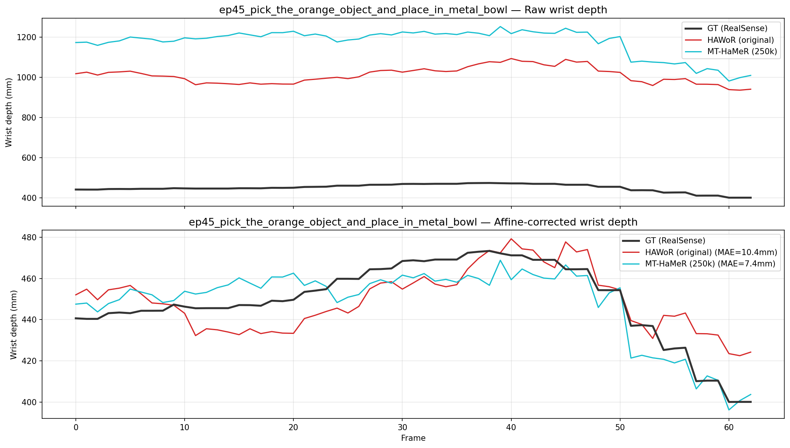
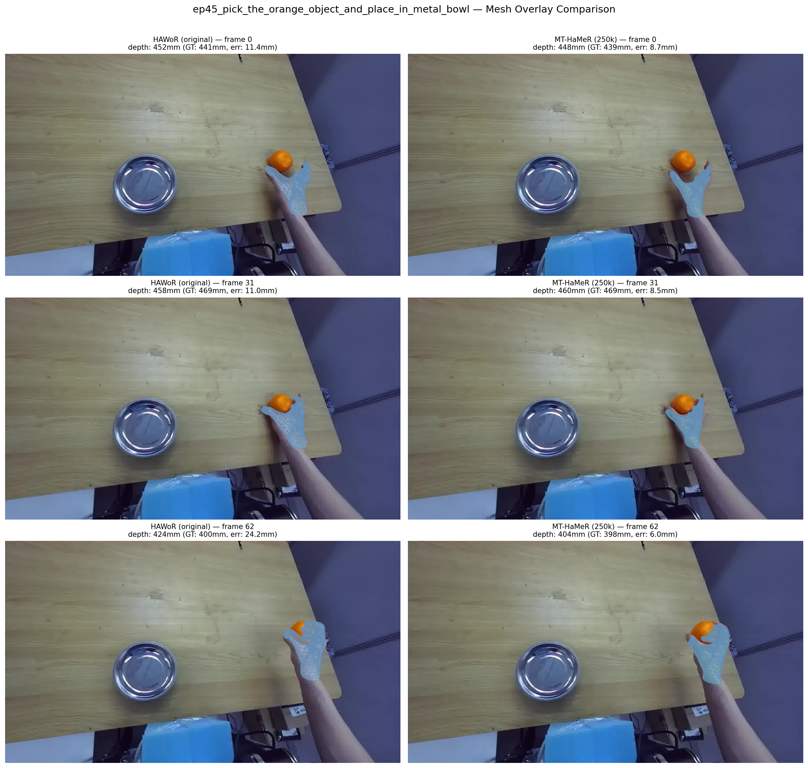
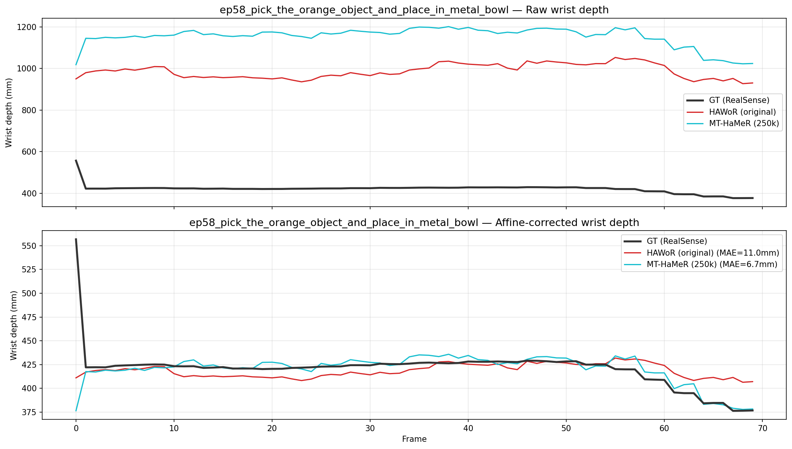
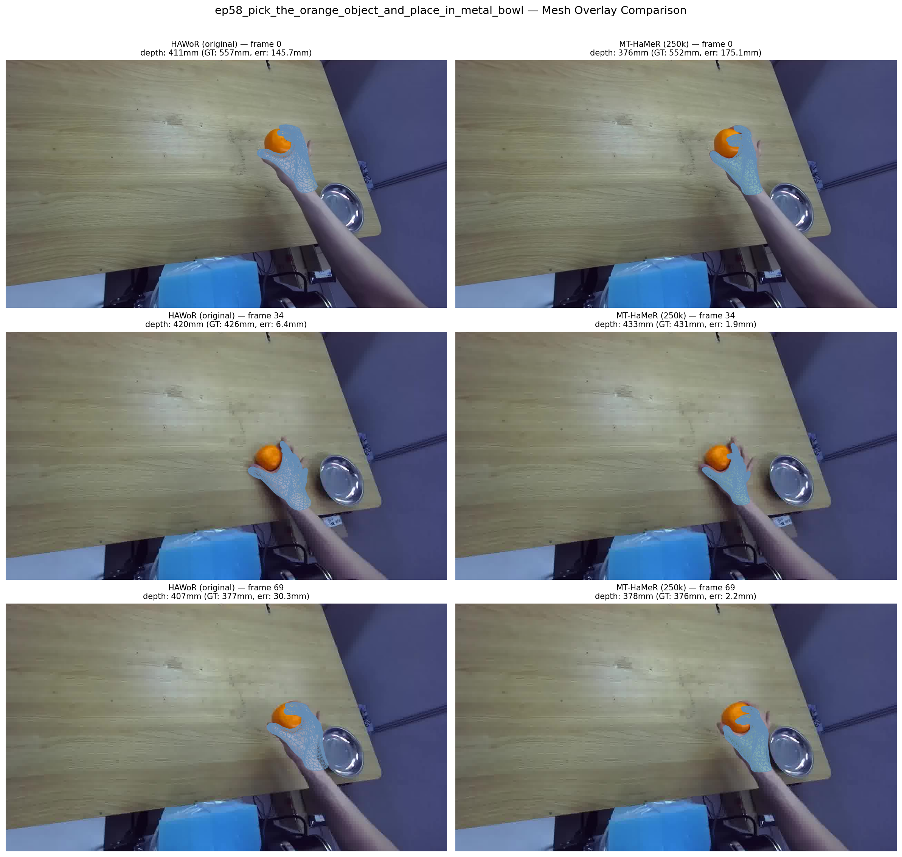
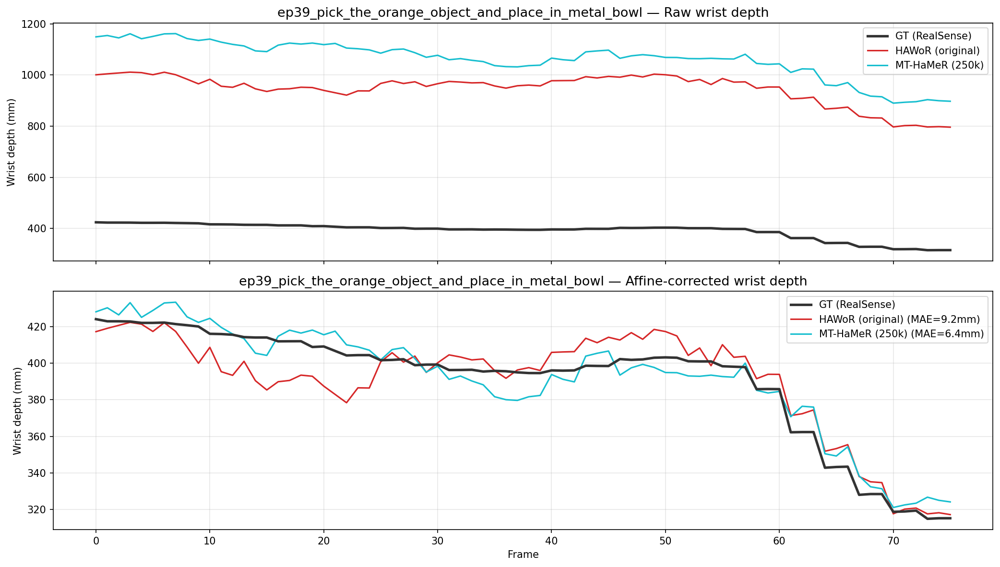
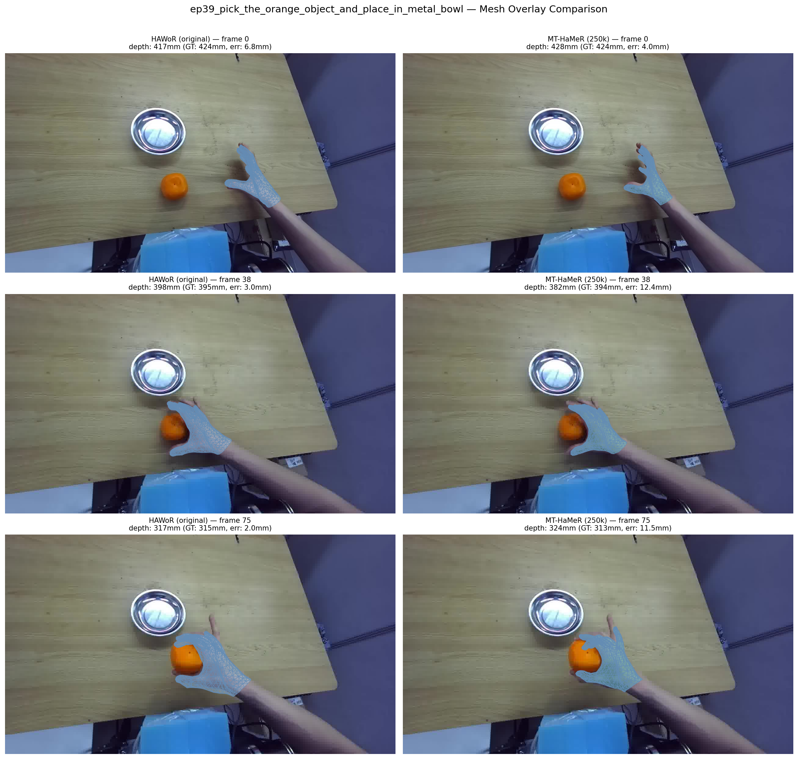

# HAWoR Backbone Comparison: Affine Depth Estimation

**Date**: 2026-04-06  
**SLURM Job**: 279377 (v100 x4, worker-node2001)  
**Task**: Compare original HAWoR backbone vs. MT-HaMeR fine-tuned backbone on affine depth calibration error

## Setup

- **Method**: For each video, HAWoR estimates 3D hand joints. Joint depths are compared against ground-truth RealSense depth via affine calibration (scale + offset fit). Lower MAE/RMSE = better depth consistency.
- **Dataset**: 80 pick-only videos across 3 shards (shard 0 excluded due to corrupted depth file). Each video is ~50-120 frames.
- **Checkpoints compared**:

| Checkpoint | Description | Training Steps | Epoch |
|---|---|---|---|
| `hawor_original` | Official HAWoR release weights | — | — |
| `mt_hamer_last` | MT-HaMeR fine-tuned (final) | 250k | 113 |

- **Metrics**: Wrist MAE/RMSE (affine fit on wrist joint only, applied to all 21), All-21 MAE/RMSE (affine fit on all 21 joints). Units in meters.

## Results

### Global Aggregate (80 videos)

| Metric | `hawor_original` | `mt_hamer_last` | Improvement |
|---|---:|---:|---:|
| Wrist MAE | 31.6 mm | 19.9 mm | **37.0%** |
| Wrist RMSE | 41.0 mm | 26.3 mm | 35.9% |
| All-21 MAE | 31.0 mm | 18.9 mm | **39.0%** |
| All-21 RMSE | 38.5 mm | 24.5 mm | 36.4% |

### Per-Video Error Distribution

**Win rate**: `mt_hamer_last` is better on **78 / 80 videos** (98%). Only 2 videos show minor regression (< 3.2 mm).

| Percentile | `hawor_original` | `mt_hamer_last` |
|---|---:|---:|
| p25 | 27.9 mm | 15.9 mm |
| **Median (p50)** | **30.3 mm** | **18.1 mm** |
| p75 | 33.5 mm | 20.9 mm |
| p95 | 41.9 mm | 29.2 mm |

**Per-video improvement distribution** (All-21 MAE reduction):

| Improvement | Videos |
|---|---:|
| > 20 mm | 3 |
| 10 -- 20 mm | 53 |
| 5 -- 10 mm | 17 |
| 0 -- 5 mm | 5 |
| Regression (< 0) | 2 |

### Per-Shard Consistency

| Checkpoint | Shard 1 (27 vid) | Shard 2 (27 vid) | Shard 3 (26 vid) |
|---|---:|---:|---:|
| `hawor_original` | 32.4 mm | 30.2 mm | 30.4 mm |
| `mt_hamer_last` | 20.2 mm | 18.4 mm | 18.1 mm |

*(All-21 MAE)*

## Sample Visualizations

### ep45

**Depth time-series** (top: raw predictions, bottom: after affine correction):

**Mesh overlay** — `hawor_original` (left) vs `mt_hamer_last` (right):

### ep58

**Depth time-series**:

**Mesh overlay**:

### ep39

**Depth time-series**:

**Mesh overlay**:

## Key Takeaways

- **MT-HaMeR fine-tuning reduces depth error by ~39%** — All-21 MAE drops from 31.0 mm to 18.9 mm (median: 30.3 mm to 18.1 mm).
- **Mesh overlays confirm the depth numbers**: `hawor_original` produces visibly misaligned hand meshes (especially in depth/translation), while `mt_hamer_last` tracks the actual hand position much more faithfully.
- **Consistent across all shards**: improvements are robust and not data-dependent.
- **98% win rate**: `mt_hamer_last` outperforms on 78/80 videos. The 2 regression cases are minor (< 3.2 mm).
- **Practical impact**: ~19 mm mean depth error after affine calibration, compared to ~31 mm for the original — meaningful for downstream hand-object contact estimation.

## Notes

- **Missing data**: pick_only_shard_0 (27 videos) crashed due to a corrupted depth `.npy` file. pnp shards did not produce aggregated results.
- **Affine calibration**: errors measure residual depth noise *after* best-fit scale+offset correction. Lower values indicate the predicted depth is more linearly consistent with ground truth.
- **Mesh rendering note**: `hawor_original` meshes are rendered using raw rotation matrices from cached cam_space JSONs (without the joint angle constraints in `run_mano`). The constraints, designed for the MT-HaMeR pipeline, were found to distort `hawor_original` finger geometry by ~10 mm on average.
- **Source code**: `hand_tracking_ablation/scripts/visualize_depth_comparison_v2.py`, `hand_tracking_ablation/scripts/debug_mesh_comparison.py`
- **Source data**: `hand_tracking_ablation/outputs/affine_depth_batch/pick_only_shard_{1,2,3}/batch_results.json`
