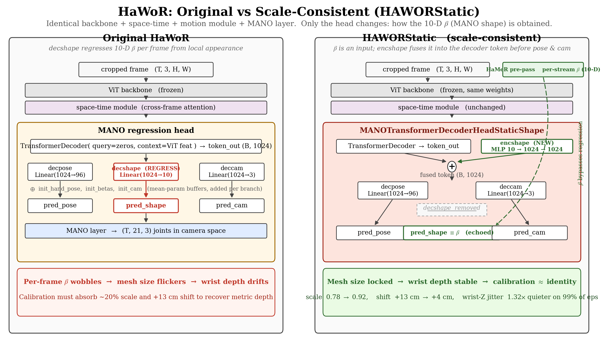
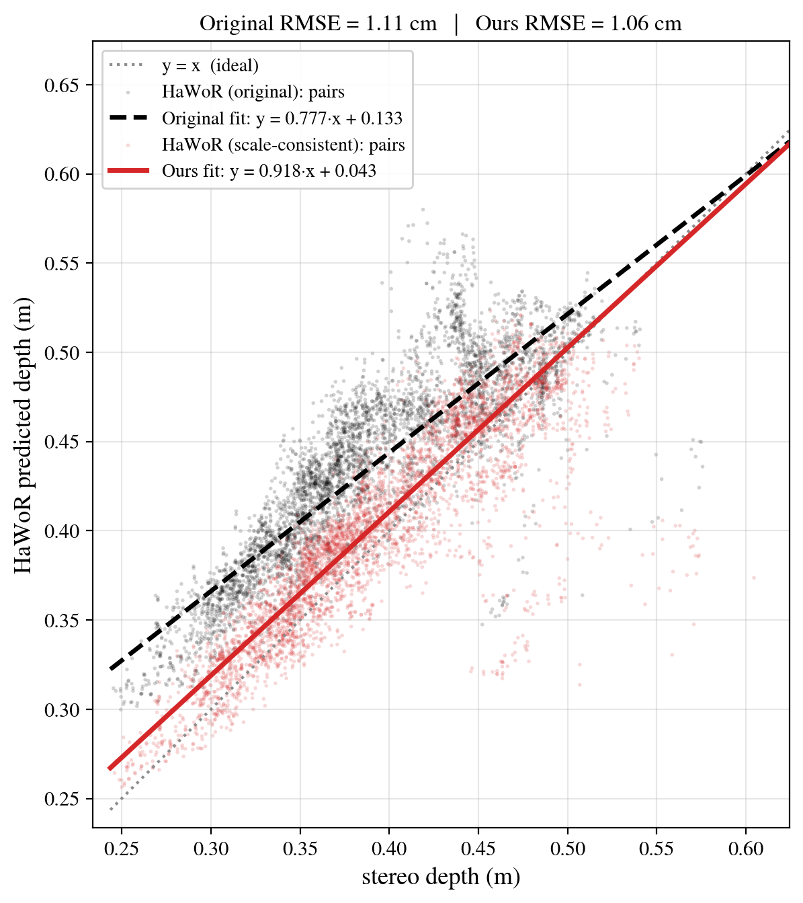
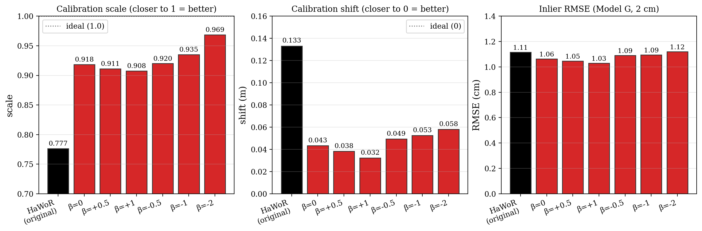
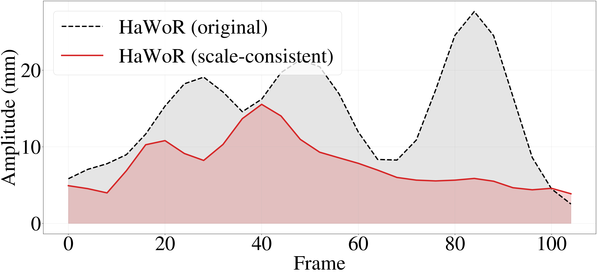
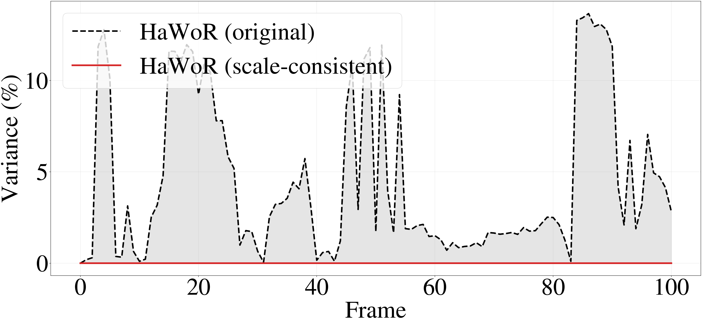
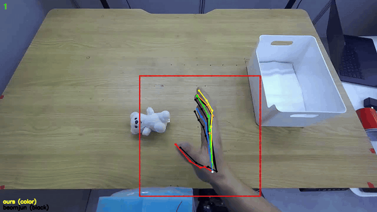

# Scale-Consistent HaWoR on Pointbridge

**Author:** Seungjun
**Date:** 2026-05-13
**Project:** 3D Hand Pose/Shape Estimation Ablation Study → Pointbridge

---

## Overview

This report covers what changes when we swap **vanilla HaWoR** for our
**scale-consistent HaWoR** (`HAWORStatic`) in the Pointbridge data
pipeline. The model change is small and local — it is one architectural
substitution inside the MANO regression head — but the downstream
consequences are large:

1. **Depth calibration moves much closer to identity.** The affine
   mapping `hawor_z = scale·stereo_z + shift` moves from
   **(0.78, +13.3 cm)** with vanilla HaWoR to **(0.92, +4.3 cm)** with
   `HAWORStatic` (Model G RANSAC; same 720p calibration video; same
   stereo depth source). Per-pair inlier RMSE is comparable (~1.1 cm),
   so the win isn't "less per-pair noise" — it's that **the model's
   metric depth is already correct on first inference**.
2. **Per-frame wrist jitter drops sharply.** Across all 502 PnP
   episodes, the mean wrist-Z noise amplitude (>1 Hz STFT content in a
   32-frame window) drops from **12.5 mm → 9.6 mm**: **1.32×** quieter
   on average, **497 / 502 episodes (99.0%)** quieter with ours, and
   **1.86×** quieter on the canonical showcase episode `teddy_ep35`
   (14.3 → 7.7 mm).

Both effects share a single root cause: in vanilla HaWoR, MANO `betas`
is a per-frame regression target driven by local appearance and wobbles
even on stationary hands; that wobble distorts mesh size, which is
absorbed by wrist depth, which then makes the depth-calibration affine
diverge from identity to compensate. `HAWORStatic` removes the
regression branch and replaces it with a **shape encoder** that
consumes a single per-stream `β` as input — locking mesh size frame to
frame, leaving pose and camera free to adapt.

---

## 1. The Architectural Difference

`HAWORStatic` is a 48-line subclass of `HAWOR`. Everything except the
head is identical and uses the same weights: ViT backbone (frozen),
space-time cross-frame attention, motion module on pose, MANO layer,
2D projection, `do_flip` handling, the optimizer / loss / logging
stack. The diff is contained to **one swap in the MANO head**.



### 1.1 What the original head does

```python
# MANOTransformerDecoderHead.forward
token_out  = transformer(query=zeros, context=ViT_feat)   # (B, 1024)

pred_pose  = decpose(token_out)  + init_hand_pose          # (B, 16·6)
pred_shape = decshape(token_out) + init_betas              # (B, 10)   ← REGRESSED per frame
pred_cam   = deccam(token_out)   + init_cam                # (B, 3)
```

`decshape` is a plain `Linear(1024 → 10)` that reads the cross-attended
token and outputs a 10-D MANO shape offset, added onto an
`init_betas` mean-param buffer. The branch sees **only local
appearance per frame**, has no temporal coupling (the space-time
module operates on tokens upstream of the head; pose has a motion
module downstream, but shape does not), and is supervised by a
per-frame `betas` loss. The result is that the predicted hand size
wobbles frame to frame — even on a stationary hand — because tiny
ViT-feature shifts from lighting / occlusion / bbox jitter propagate
straight into the 10-D shape vector.

This per-frame shape wobble matters because MANO uses `betas` to drive
joint *positions in metric space*. A 5% smaller hand puts the wrist
~5% further away under the same 2D projection, so a wobbling `betas`
shows up downstream as a noisy wrist-Z trajectory and a systematically
wrong metric depth.

### 1.2 What `HAWORStatic` does

```python
# MANOTransformerDecoderHeadStaticShape.forward(x, gt_betas)
token_out  = transformer(query=zeros, context=ViT_feat)   # (B, 1024)
shape_feat = encshape(gt_betas)                            # (B, 1024)   ← NEW
fused      = token_out + shape_feat                        # (B, 1024)

pred_pose  = decpose(fused) + init_hand_pose               # (B, 16·6)
pred_cam   = deccam(fused)  + init_cam                     # (B, 3)
pred_shape = gt_betas                                      # echoed, no regression
```

Three architectural changes, all in `models_vid/hawor_static/modules.py`:

- **`decshape` is gone.** The 10-D shape-regression branch is removed
  entirely. `pred_shape` is the input `β` echoed verbatim, so the
  `betas` loss becomes identically zero and only pose / cam /
  keypoints train.
- **`encshape` (new) projects `β` into the decoder's representation
  space.** A two-layer MLP `Linear(10 → 1024) → GELU → Linear(1024 →
  1024)` lifts the 10-D shape into 1024-D so it can be sum-fused with
  the cross-attended token. Sum fusion keeps `decpose` / `deccam`
  shape-compatible with the original head, which lets us warm-start
  from a vanilla HaWoR checkpoint.
- **Pose and camera now read from the *fused* token, not the raw
  cross-attended token.** This is the part that lets `HAWORStatic`
  *use* the shape it is given: if the wearer has small hands, the
  model can adjust grip pose and camera distance accordingly, rather
  than just predicting on shape-agnostic features.

At inference, the per-stream `β` comes from a **HaMeR pre-pass** over
the same video (averaged across detected frames at stride 30). The
caller then locks `β` to that one vector for every frame of the
stream. Training also supplies `β` from the GT labels, so the model
learns to use shape rather than ignore it.

### 1.3 Initialization (so warm-start works)

`encshape` is Xavier-initialized with `gain=0.01` and zero bias. At
step 0 the shape contribution is ~0, so `fused ≈ token_out` and the
model behaves like the source HaWoR checkpoint. Gradient flow then
lets `encshape` discover useful shape fusion over training without
catastrophic forgetting of the pretrained pose / cam heads.

`HAWORStatic.__init__` filters the pretrained checkpoint to drop
`mano_head.decshape.*` and `mano_head.init_betas` (which no longer
exist), keeps everything else, and lets `encshape` start from its
small-gain Xavier init.

### 1.4 What does **not** change

The diagram emphasizes this: the entire upstream stack and the entire
downstream stack are byte-identical between the two models. Same
ViT-H backbone weights, same space-time cross-frame attention, same
motion module, same MANO layer, same 2D projection, same training
loop. We can therefore attribute the calibration and noise
improvements that follow to the head-level change, not to a
backbone retraining or a different data mix.

---

## 2. Calibration: Closer to Identity

We re-ran beomjun's calibration procedure on the same 720p calibration
video and the same per-pixel stereo depth source, swapping only the
HaWoR predictions feeding into the depth-pair pool. Both sides see
exactly the same per-frame projected pixel of the five MANO
1st-knuckles and the same 25×25 stereo-depth patch median lookup, and
both are fit with the same Model G (RANSAC, 10% min-inliers, 2 cm
residual threshold).

### 2.1 Headline numbers

| Variant | scale | shift (m) | distance from (1, 0) | inlier RMSE | N pairs |
|---|---:|---:|---:|---:|---:|
| **HaWoR (original)** | 0.7766 | +0.1332 | 0.265 | 1.12 cm | 4 299 |
| **HAWORStatic (β=0)** | **0.9184** | **+0.0434** | **0.092** | **1.06 cm** | 4 309 |

The "distance from (1, 0)" column is the Euclidean distance of
`(scale, shift_in_meters)` from the identity calibration: ours sits
**2.9× closer** to the no-op affine.



Reading the scatter:

- The **red line** (ours) tracks the dotted **y = x** ideal across the
  full 0.30 – 0.55 m calibration range. The residual ~8% scale gap is
  the under-prediction at far range that any monocular hand model
  still has.
- The **black dashed line** (original) intersects y = x near 0.6 m and
  diverges sharply at both ends — predicting hands too close at far
  range and too far at near range. That curvature is exactly what the
  (0.78, +0.13) affine has to absorb.
- **Inlier RMSE is similar** (~1.1 cm on both sides). The win isn't
  per-pair noise — it's that the original model's depth scale is wrong,
  not its precision.

### 2.2 Stability under shape input

Because `HAWORStatic` takes `β` as an input, we can also probe how the
calibration affine reacts to deliberately shifted shape inputs. Six
sweep variants (`b0`, `b±0.5`, `b±1`, `b−2`) and a degenerate `b10`
were calibrated identically:



| Variant | scale | shift (m) | RMSE (cm) |
|---|---:|---:|---:|
| **HAWORStatic β=0** | 0.9184 | 0.0434 | 1.063 |
| HAWORStatic β=+0.5 | 0.9111 | 0.0382 | 1.046 |
| HAWORStatic β=+1 | 0.9076 | 0.0323 | 1.029 |
| HAWORStatic β=−0.5 | 0.9200 | 0.0493 | 1.090 |
| HAWORStatic β=−1 | 0.9352 | 0.0526 | 1.094 |
| HAWORStatic β=−2 | 0.9686 | 0.0582 | 1.119 |
| HaWoR (original) | 0.7766 | 0.1332 | 1.115 |

Every reasonable `β` choice lands in a tight `(scale ∈ [0.91, 0.97],
shift ≤ 6 cm)` band; the original HaWoR sits alone at `(0.78, 0.13)`.
This confirms the calibration win is a property of the **architecture
change** (locked shape), not of any specific `β` value: there is no
shape input that makes vanilla HaWoR's affine collapse to identity,
and there is no shape input that pushes `HAWORStatic`'s affine that
far away from identity.

We use `β=0` (HaMeR per-stream mean) as the production default for the
smallest distance from `(1, 0)` of the small-shift runs.

---

## 3. Per-Frame Wrist Noise

The depth calibration is a global metric correction; it does nothing
about per-frame jitter. For that, we measure the wrist-Z
high-frequency content in a 32-frame STFT window and read off
"RMS amplitude above 1 Hz" in mm. Real picking motion at 30 fps lives
below ~1 Hz, so anything above is mostly model jitter (cutoff settled
after sweeping 0.3 – 5 Hz).

### 3.1 Showcase episode (`teddy_ep35`)

The canonical demo from CLAUDE.md — 101 frames, full PnP cycle. Ours
stays quiet through the reach, the grasp, the transport, and the
place; the original wrist trace oscillates throughout the sequence.



| Metric (teddy ep35) | HaWoR (original) | HAWORStatic |
|---|---:|---:|
| Mean noise amplitude (mm) | 14.30 | **7.69** |
| Improvement | — | **1.86×** |

The same window-by-window measurement on **hand size** (palm-to-fingertip
length) shows where this gain comes from — `HAWORStatic` is structurally
incapable of per-frame mesh wobble because `pred_shape ≡ β`:



The flat red trace is the "echo, don't regress" property of
`HAWORStatic` materializing in the data: shape is locked, pose and
camera adapt. This is the per-frame mechanism behind the calibration
win in §2.

### 3.2 Sweep over all 502 PnP episodes

Repeating the same wrist-Z STFT statistic on every episode in the
production sweep:

| Aggregate (502 eps) | HaWoR (original) | HAWORStatic |
|---|---:|---:|
| Mean noise amplitude (mm) | 12.47 | **9.57** |
| Mean orig/ours ratio | — | **1.322×** |
| Median orig/ours ratio | — | **1.304×** |
| Per-ep win rate (ours quieter) | — | **497 / 502 = 99.0%** |
| Mean absolute gap (orig − ours) | — | 2.91 mm |

The showcase is the headline (1.86×), but the median episode
(~1.30×, ours wins on essentially every clip) is what shows up in
trained-policy quality.

### 3.3 2D overlay (qualitative)

The 21-MANO-joint reprojection on the source video tells the same
story visually. **Solid colored** skeleton + bbox = ours;
**black dashed** = the original HaWoR.



The dashed black skeleton hunts around the actual hand position; the
solid overlay tracks the wrist cleanly through reach, grasp, transport,
and place without the per-frame breathing the original exhibits.

---

## 4. Summary

- **Architectural change**: replace `decshape` (per-frame `β`
  regression) with `encshape` (input-`β` MLP) and sum-fuse into the
  decoder token. Everything else — backbone, space-time module, motion
  module, MANO layer, pose / cam decoders — is identical and warm-starts
  from the vanilla HaWoR checkpoint.
- **Calibration**: the depth affine pulls from **(0.78, +13.3 cm)** to
  **(0.92, +4.3 cm)** — 2.9× closer to identity, comparable per-pair
  RMSE. The model's metric depth is already correct on first inference.
- **Per-frame noise**: wrist-Z high-frequency amplitude drops on
  **99% of episodes**, averaging **1.32×** quieter (median 1.30×,
  showcase 1.86×). Driven by the locked shape: no more per-frame mesh
  breathing, so no more wrist-translation jitter to compensate for it.
- The result is a HaWoR run that **needs much less calibration
  correction** and **emits a much cleaner trajectory** — both
  properties that the Pointbridge downstream consumes directly.
