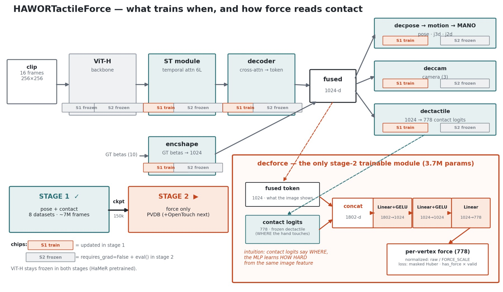
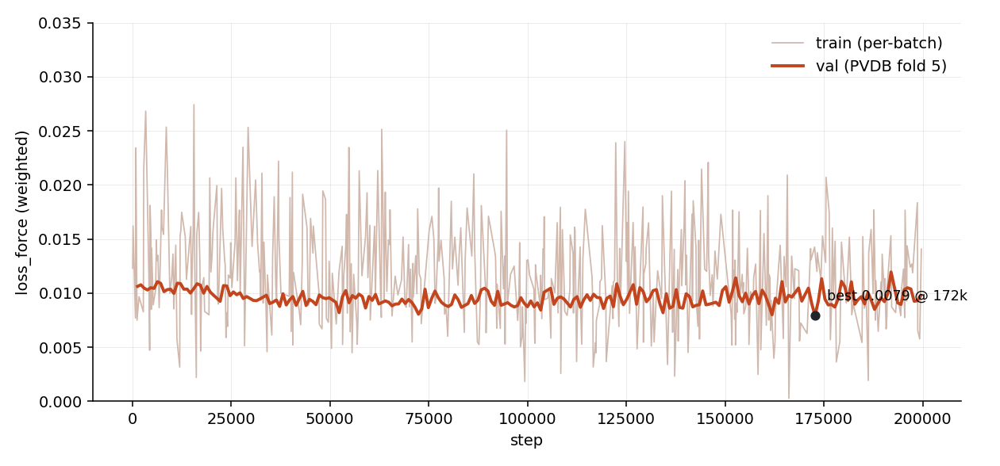
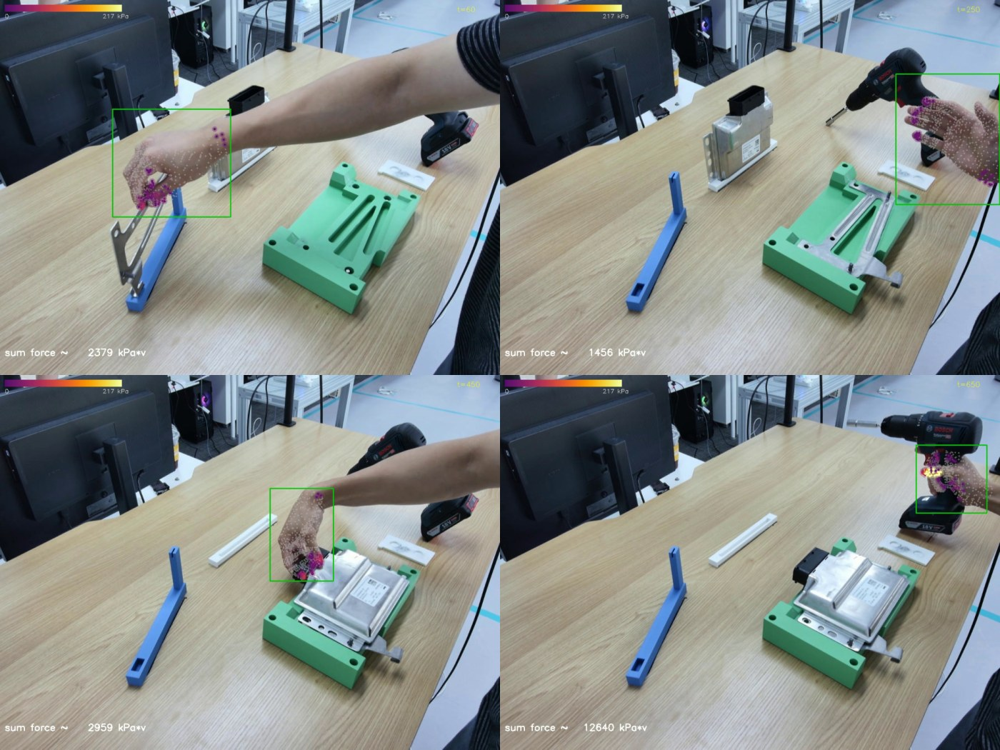

# HAWORTactileForce: Stage-2 Per-Vertex Force Head on a Frozen HAWORTactile

**Author:** Seungjun
**Date:** 2026-07-22
**Project:** 3D Hand Pose/Shape Estimation Ablation Study

---

## Overview

Extends the clip model family with **per-vertex force regression** as a
strictly additive second training stage: load the trained
`hawor_tactile_v1_ws` (pose + binary contact), **freeze everything it
learned**, and train only a new force MLP on the PVDB pressure dataset. The
freeze guarantees stage 2 cannot move pose/contact behavior — the stage-1
checkpoint's predictions are bit-preserved.



## 1. Model (`models_clip/hawor_tactile_force/`)

`HAWORTactileForce` subclasses `HAWORTactile` and swaps in
`MANOTransformerDecoderHeadTactileForce`, which adds one module:

```
decforce: [fused token (1024) ⊕ contact logits (778)] → Linear+GELU (1802→1024)
          → Linear+GELU (1024→1024) → Linear (1024→778)  =  3.7M params
```

- The **contact logits come from the frozen `dectactile`** — they act as a
  stable "WHERE the hand touches" feature; the MLP learns "HOW HARD" from the
  same fused image token. Small-gain init on the last layer keeps step-0
  behavior identical to stage 1.
- Freezing: `requires_grad=False` on all 694M stage-1 params;
  `configure_optimizers` filters by `requires_grad`, so the optimizer contains
  exactly the 6 `decforce` tensors. A `train()` override keeps the frozen
  trunk in `eval()` so ST/motion-module dropout can't inject noise into the
  force features. Verified pre-launch: a real backward produces nonzero grads
  **only** on `mano_head.decforce.*`; the trunk has no BatchNorm, so there is
  no running-stats drift channel either.
- Loss: masked Huber (β=0.1) on **normalized force** (`raw / FORCE_SCALE`,
  110 ≈ p99 of PVDB kPa), summed over 778 vertices, averaged over frames with
  `has_force × valid`, weight `LOSS_WEIGHTS.FORCE=0.01`. Pose/contact losses
  are still computed (comparable curves, explosion guard) but produce no
  gradients.
- Entry point: `scripts/scripts_train/train_clip_force.py` with
  `experiment=hawor_tactile_force` + `data=pvdb_force`.
  Gotcha: the stage-1 ckpt path contains `=` (`epoch=29-step=150000.ckpt`),
  which Hydra's override grammar rejects — the path must live in the
  experiment yaml, not on the CLI.

## 2. Training run (`hawor_tactile_force_v1`)

| | |
|---|---|
| hardware | 1× H200 (`rlwrld-gpu_urgent`), single GPU per the stage-1 recipe |
| data | PVDB train folds 1–4 (6,688 clips), val fold 5 (1,648 clips) |
| schedule | LR 1e-4, warmup 500, batch 8 clips × 16 frames, fp16 |
| duration | **200k steps in 24h 04m, completed naturally, zero crashes** |
| wandb | `rlwrld_hawor_test2/ye1j5wmi` |



`val/loss_force`: 0.0106 → **best 0.00793 at step ~173k** (−25%). The final
steps drift back to ~0.0098, so **use the ~173k checkpoint for downstream
work, not `last.ckpt`** (all 40 checkpoints under
`logs/hawor_tactile_force_v1/checkpoints/`). The head learns the easy part
(predict ~0 on the ~95% of vertices without contact) within a few hundred
steps; the remaining slow descent is contact-magnitude learning, whose
gradient is diluted by the zero-force vertices in the unweighted sum.

## 3. Qualitative demo — wild video inference

`~/tmp/force_vis/infer_force_video.py`: YOLO right-hand detection →
HaWoR-style eval crops → 16-frame windows → project the predicted MANO
vertices, colored by predicted force (grey = hand silhouette below ~9 kPa,
purple→yellow = light→strong force). Betas = zeros (mean shape); focal =
frame diagonal.


*`~/HaWoR/example/cam_0.mp4` (bare hands, tabletop assembly). Fingertip
contacts read as purple; the standout is the drilling moment (bottom-right):
a bright yellow palm hotspot exactly when the hand squeezes the drill —
force tracks grip intensity, not just contact. Full video:
`~/force_vis_cam_0.mp4`.*

Caveats: the head has only seen PVDB's press-on-a-pad lab data, so absolute
kPa on wild videos is indicative, not calibrated; tool grips are
out-of-distribution generalization.

## 4. Next steps

1. **PVDB + OpenTouch joint run** — per-dataset FORCE_SCALE (kPa/110 vs
   counts/3072); OpenTouch labels are ready (SAM3 bboxes baked, 99% of clips
   trainable — see the companion dataset report). Adds ~250k in-the-wild
   egocentric grip frames, exactly the regime the demo shows we extrapolate in.
2. **Contact-weighted force loss** — up-weight nonzero-force vertices to
   concentrate gradient on contact magnitudes (the plateau's likely cause).
3. **Force eval script** — per-vertex force MAE on PVDB val / an OpenTouch
   holdout, so runs compare on numbers rather than curves.

## 5. Pointers

- Code: `feature/HOPE_tactile` — `models_clip/hawor_tactile_force/`,
  `scripts/scripts_train/train_clip_force.py`,
  `models_clip/configs_hydra/{experiment/hawor_tactile_force,data/pvdb_force,data/opentouch_force}.yaml`
- Stage-1 source checkpoint: `logs/hawor_tactile_v1_ws/checkpoints/epoch=29-step=150000.ckpt`
- Run outputs: `logs/hawor_tactile_force_v1/`
