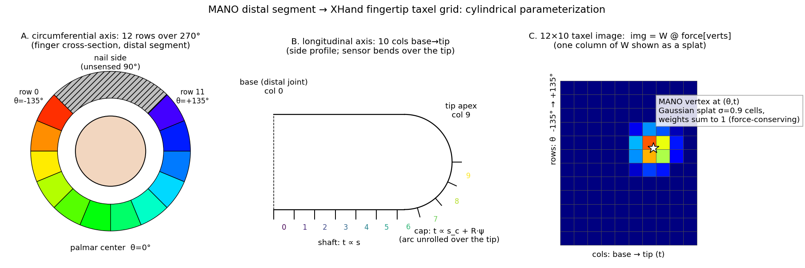
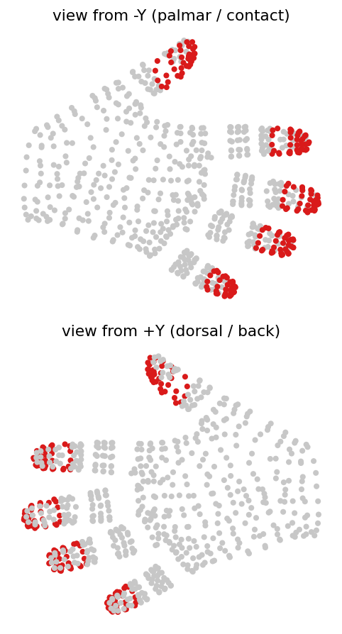
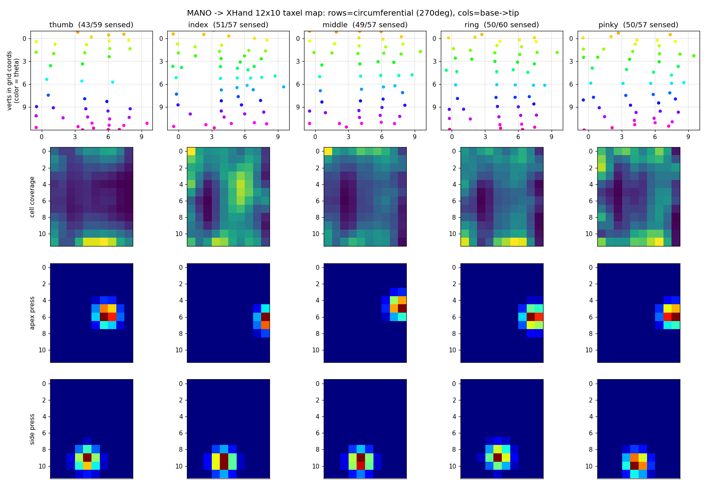
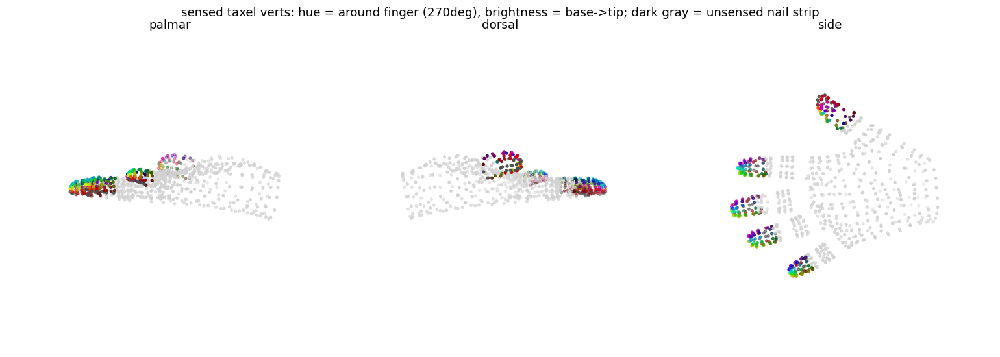
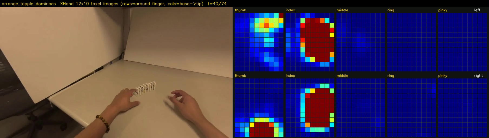
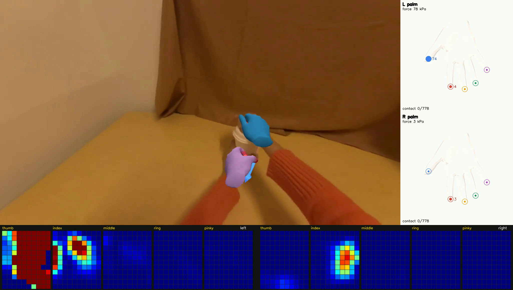
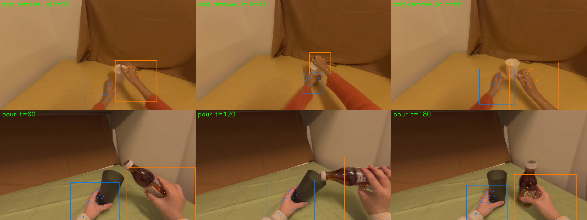

# MANO → XHand 12×10 Fingertip Taxel Mapping

**Goal.** Convert HaWoR's per-vertex hand force predictions (MANO, 778 vertices) into the
tactile format of the RobotEra **XHand-1** dexterous hand, so video-extracted force can be
used to pre-train policies that consume real XHand tactile input.

**Result.** A fixed, force-conserving linear map per finger:

```
image(12, 10) = W @ force[verts]        # W: (120, n_verts), columns sum to 1
```

built once from MANO's rest geometry, applied per frame at negligible cost, and
differentiable if ported to torch. Code: `lib/utils/xhand_taxel.py` (HaWoR repo, commit
`34213b5`), saved map: `_DATA/tactile_ref/xhand_taxel_map.npz`.

---

## 1. The target format: XHand-1 fingertip sensor

Each of the five XHand-1 fingertips carries one tactile module:

| property | value |
|---|---|
| taxel grid | **12 × 10** (120 points) per fingertip |
| coverage | **270° encircling** the distal finger segment, curving over the tip |
| measurement | tri-axial force per taxel, ≥ 0.05 N resolution |
| unsensed region | the ~90° nail-side strip |

Sources: [Robotics 24/7](https://www.robotics247.com/article/humanoid_robot_developer_robot_era_debuts_xhand_for_object_manipulation),
[RobotShop XHAND1](https://www.robotshop.com/products/robotera-dexterous-hand-xhand1-right),
[spec sheet](https://www.canadasatellite.ca/Robotera-XHAND1-Dexterous-Hand.htm).

The key geometric fact is that the sensor is **not a flat pad**: it wraps around the
distal segment and bends over the tip. A mapping that only used the palmar fingertip pad
(~36 MANO vertices) would waste two thirds of the grid and miss side/tip contacts, so the
map is built on the **entire distal phalanx surface** instead.

## 2. Mapping construction



Per finger (thumb, index, middle, ring, pinky), from `MANO_RIGHT` rest pose:

1. **Vertex selection** — the distal-phalanx vertex set: skinning-weight argmax on the
   distal bone (MANO joints 3/6/9/12/15), plus near-joint blend vertices with weight ≥
   0.35. Gives 57–60 vertices per finger.

2. **Cylindrical frame** — the finger axis runs from the distal joint to the fingertip
   apex vertex (apexes from `lib/utils/mano_fingertip.py`: thumb 768, index 320, middle
   444, ring 555, pinky 672). The palmar reference direction (θ = 0) is the mean normal
   of the finger's palmar pad (`fingertip_pads_right.json`), orthogonalized to the axis —
   this handles the thumb correctly, whose pulp faces sideways rather than "down".

   
   *The palmar fingertip pads (highlighted) anchor each finger's θ = 0 direction.*

3. **Circumferential coordinate θ** (panel A) — angle around the axis, 0° at the palmar
   center. The sensed window is **θ ∈ [-135°, +135°]** (the XHand 270° wrap), split into
   **12 rows**; vertices on the nail strip fall outside and receive zero weight —
   dorsal contact is unsensed, exactly like the physical sensor.

4. **Longitudinal coordinate t** (panel B) — arc length along the surface from the
   segment base to the apex, **unrolled over the tip cap**: the segment is modeled as a
   cylinder of radius R (70th-percentile radial distance) up to the shoulder
   `s_c = s_max − R`, then a spherical cap where arc continues as `s_c + R·ψ`. This
   mirrors the physical array bending over the tip, keeping taxel columns evenly spaced
   across the curl instead of bunching at the apex. Split into **10 columns**
   (col 0 = base, col 9 = tip).

5. **Splatting** (panel C) — each vertex lands at continuous grid coordinates and
   distributes its force over nearby cells with a truncated Gaussian (σ = 0.9 cells,
   cut at 2.5σ), **normalized per vertex**. Columns of `W` sum to 1, so
   `sum(image) = sum(sensed vertex forces)`: total force is conserved, a light touch
   stays light, and nothing is rescaled per frame.

**Grid convention.** `image[i, j]`: axis 0 (12 rows) = circumferential, row 0 at
θ = -135°, palmar center between rows 5/6; axis 1 (10 cols) = longitudinal, base → tip.

**Left hand.** MANO_LEFT is the x-mirror of MANO_RIGHT with identical topology, so the
same vertex indices apply and only θ flips sign: the left-hand image is the right-hand
map with rows reversed (`hand="left"` in the API).

## 3. Validation

### Parameterization, coverage, synthetic presses



- **Row 1** — distal vertices in grid coordinates, colored by θ: the hue bands are clean
  and ordered, no fold-overs; 43–51 of ~57 vertices per finger are sensed (the rest are
  the nail strip).
- **Row 2** — cell coverage (`W @ 1`): **120/120 cells reachable** for index, middle,
  ring, pinky; **115/120** for the thumb (its stubbier segment leaves 5 extreme corner
  cells dark — physically plausible, the sensor corner would overhang).
- **Rows 3–4** — unit-force synthetic presses: an **apex press** lights the tip columns
  at the palmar-center rows; a **side press** (θ ≈ +90°) lights the correct off-center
  rows at mid columns.

### 3D sanity check



Sensed vertices painted on the MANO mesh (hue = position around the finger, brightness =
base → tip; dark gray = the excluded nail strip): the palmar view is fully colored, the
dorsal view shows the gray nail strips, and hue rotates continuously around each finger.

### On real predictions

Frame from an EgoDex sequence (`arrange_topple_dominoes`), HaWoR-force per-vertex
predictions mapped through the taxel grid — the index fingertips pressing dominoes
saturate the index arrays while idle fingers stay dark:



Combined with the full HaWoR contact/force visualization (mesh overlay + palm panels)
for cross-checking — the palm-panel per-finger force dots and the taxel arrays agree:



## 4. Deployment on EgoDex (pseudo-GT bboxes)

For the EgoDex batch the noisy YOLO hand detector was replaced HOT3D-style, with **no
changes to the shared pipeline**: EgoDex ships GT 3D hand keypoints + camera pose +
intrinsics per episode (`.hdf5`), so the 25 joints of each hand are projected per frame,
their 2D extent dilated 1.4× into a pseudo-detection, and the result written directly
into the `tracks_0_<N>/model_tracks.npy` cache that the pipeline treats as detector
output (`tmp/egodex_gt_boxes.py`). The GT intrinsic also replaces the default focal
guess (736.6 vs 600, ~23% off) via the `est_focal.txt` cache.


*Projected GT joints (dots) and dilated pseudo-bboxes; blue = left, orange = right.
Note: EgoDex `transforms/camera` is stored in the OpenCV camera convention (+z forward),
not ARKit's (-z forward), verified empirically.*

## 5. Usage

```python
from lib.utils.xhand_taxel import load_taxel_maps, taxel_images

maps = load_taxel_maps()                                  # xhand_taxel_map.npz
imgs = taxel_images(force_frame_778, maps, hand="right")  # (5, 12, 10) thumb..pinky
```

- Rebuild the map: `python lib/utils/xhand_taxel.py`
- Validation figures + per-sequence video: `python scripts/scripts_experiments/visualize_xhand_taxel.py --seq <seq>`
- EgoDex batch runners: `tmp/run_egodex_xhand.py` (taxel videos),
  `tmp/run_egodex_xhand_demo.py` (demo_custom + taxel composite),
  `tmp/egodex_gt_boxes.py` (pseudo-GT boxes) in the HaWoR repo.

## 6. Limitations

- **Pseudo-mapping**: taxel positions come from MANO rest geometry, not a calibration of
  the physical module; per-taxel correspondence is approximate by construction.
- **Normal force only**: XHand taxels are tri-axial; this map produces a scalar (normal)
  force image. The same `W` can project per-vertex force *vectors* if shear channels are
  needed later.
- **Row/column orientation**: whether the physical "12" runs circumferentially is not
  published; 12-around was chosen because the 270° arc is physically longer than the
  segment (≈3.2 mm vs ≈2.5 mm pitch). If the XHand SDK says otherwise, a transpose fixes it.
- **Thumb corners**: 5 of 120 thumb cells are never reachable (coverage = 0) and always
  read zero.
