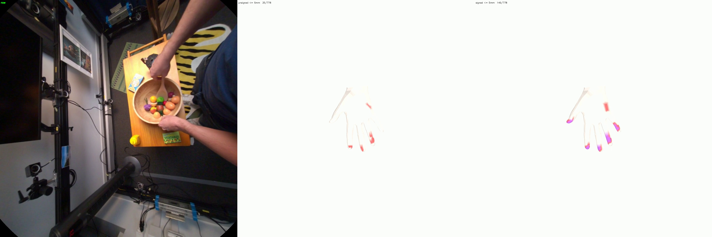
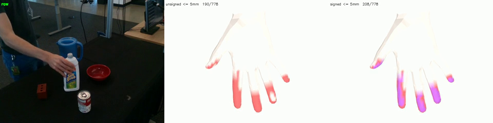

# HOT3D Object-Pose Backfill + Signed-Distance Tactile Labels

**Author:** Seungjun
**Date:** 2026-06-24
**Project:** 3D Hand Pose/Shape Estimation Ablation Study

---

## Overview

Two coupled pieces of work on the hand–object **tactile** labels (per-MANO-vertex
contact distance to nearby object surfaces), used as a weak-supervision /
auxiliary signal in the clip/video models:

1. **HOT3D object-pose backfill.** Tactile labels existed for only **1 of 135**
   HOT3D Aria sequences (`P0011_7c7e8d86`, the original sample) because
   per-frame object pose is baked into each label `.pyd` at conversion time, and
   only that one sequence had been re-converted with the object-pose-aware
   converter. Expanded object pose (and therefore tactile) to **all 135
   sequences** — without re-downloading the multi-GB raw video.

2. **Signed-distance tactile.** Switched the tactile metric from **unsigned
   vertex-to-vertex distance** to **signed point-to-surface distance** (negative
   = penetrating) across **HOT3D, DexYCB, and OakInk2**, so interpenetration of
   any depth is counted as contact. The old unsigned metric silently dropped
   deep penetration, which on real grasps lost roughly half of the true contact.

Both changes preserve the label schema (`distances` stays `(T, 778) float32`),
keep everything **self-contained under `_DATA/`**, and parallelize the recompute
across the full `cpu-compute` partition.

---

## 1. HOT3D object-pose backfill (VRS-free)

### 1.1 The dependency chain

Tactile (`tactile_hot3d.py`) reads object pose from each clip label's
`extra_info[t]['obj_ids']` + `['obj_pose']` (camera-frame `[R|t]`). That field is
written **at conversion time** by `convert_hot3d.py`. 134 of the 135 already-
labelled sequences were produced by the *old* converter and carry an **empty**
`extra_info`, so they had no object pose and no tactile.

Naively, fixing this means re-running `convert_hot3d.py`, which **re-extracts and
undistorts every RGB frame from the ~1.7 GB `recording.vrs`** per sequence and
rebuilds the mp4s — slow, storage-heavy, and (because the new converter selects
frames from `headset_trajectory.csv` rather than the old MPS
`closed_loop_trajectory.csv`) it can shift the frame/clip selection and
**misalign** the refreshed pose against the existing video.

### 1.2 The shortcut: reconstruct object pose from what the labels already store

The existing labels already carry, per frame, the world→camera transform `cTw`.
Object pose in the camera frame is simply

```
obj_pose[t, k] = (cTw[t] @ T_world_obj_k(ts_t))[:3, :4]
```

So the only missing inputs are small per-sequence **ground-truth** files
(`dynamic_objects.csv`, `headset_trajectory.csv`, `camera_models.json`,
≈ 9 MB/seq) plus the object meshes — **no VRS, no image re-extraction**.

The one subtlety is recovering each frame's timestamp (to index
`dynamic_objects.csv`). The label frame index does **not** index the timecode
mapping cleanly (it interleaves non-RGB streams), so instead each frame's
timestamp is recovered by matching its stored `cTw` against the headset
trajectory:

```
pred_cTw(ts) = T_camera_device @ inv(T_world_device(ts))
```

picking the `ts` whose `pred_cTw` is closest to the label's `cTw[t]`. Verified
against `P0011`'s baked pose: **max abs difference 6e-8** over 540 frame×object
cells.

This is implemented as an **in-place backfill** that rewrites only `extra_info`
(preserving every other field and the existing imgname/mp4 alignment exactly) and
mirrors each `<uid>.glb` to `_DATA/meshes/hot3d/<uid>/model.obj`.

**Script:** `scripts/scripts_conversion/backfill_hot3d_objpose.py`
**Driver:** `scripts/scripts_conversion/run_hot3d_objpose_all.sh` (download
ground-truth → backfill → submit tactile), with a free-space guard.

### 1.3 Downloader gotcha

The HOT3D downloader's `-d` flag is a **data-group index into the full CDN
group list**, not a name: for Hot3DAria the order is `0:main_vrs`, `1–4:mps*`,
`5:ground_truth`, `6:hand_data`. Use **`-d 5`** for ground-truth; `-d 0` pulls
the 1.7 GB VRS (which once filled `/fsx`).

### 1.4 Result

All 134 missing sequences downloaded (~1 GB total, 0 failures) and backfilled:
**135/135 sequences now carry object pose on every frame**, match errors ~6e-8,
all 33 referenced object meshes mirrored into `_DATA`.

### 1.5 Self-containment (`~/hot3d` is now disposable)

Verified across all 7125 clips: labels carry baked `obj_pose`; meshes in
`_DATA/meshes/hot3d/` are **real files (not symlinks)** with all 33 referenced
ids present (0 missing); videos are real files. The only `~/hot3d` references are
in the conversion-time backfill script. **Tactile and training do not touch
`~/hot3d`**, so it can be deleted (the only thing lost is the ability to
re-backfill / add new sequences without re-downloading). DexYCB and OakInk2 are
likewise self-contained.

---

## 2. Signed-distance tactile

### 2.1 The problem with unsigned distance

The original metric is the unsigned distance from each MANO vertex to the nearest
object **vertex** (`scipy.spatial.cKDTree.query`, always ≥ 0), thresholded for a
contact label (e.g. ≤ 5 mm). Because it has no notion of inside vs outside, a
hand vertex 8 mm **inside** the object reads as "+8 mm away" and falls outside the
contact band — so **deep penetration is silently dropped**.

On HOT3D grasps this is severe: on a sampled contact clip the unsigned metric
counts ~35 contact vertices per frame, while the signed metric counts ~150, of
which **~70 are penetrating** (literally inside the mesh). The visible symptom was
that a thumb clearly grasping an object showed **no contact** on the thumb,
because its vertices had penetrated past the unsigned threshold.

### 2.2 The fix

Switch to **signed distance**: negative = inside (penetrating), positive =
outside, `+inf` = no object that frame. `distances <= threshold` then captures
genuine contact *and* interpenetration of any depth. The stored field is
unchanged — penetrating vertices simply carry a negative value.

Computed with `trimesh.proximity.signed_distance` (exact point-to-surface, signed
by winding), negated to the "negative = inside" convention.

### 2.3 Making it fast: a two-stage gate

Exact signed distance is ~80× slower than the unsigned vertex query (≈ 1.8 ms →
≈ 147 ms per object per frame on a real mesh), and the naive all-points version
OOMs on HOT3D's dense multi-object frames. So only hand vertices **near** an
object run the exact query; the rest keep their (positive) unsigned distance.

**The gate must be correct.** A first attempt gated on *vertex* distance — but a
vertex deep inside a smooth/large object is far from every surface vertex yet
still penetrating, so that gate wrongly skipped it (a unit test caught a box-
center point returning +87 mm instead of negative). The fix gates on **distance
to the mesh axis-aligned bounding box**, which is **0 for any interior point**, so
penetration can never be missed:

```python
lo, hi = mesh.bounds
d_aabb = sqrt((maximum(0, maximum(lo - hv, hv - hi)) ** 2).sum(axis=1))
near = d_aabb <= SIGNED_GATE   # 0.030 m
```

Validated: box center → −50 mm, just-inside → −1 mm, just-outside → +1 mm, far →
excluded. On dense meshes (DexYCB) results are unchanged vs the vertex gate; the
AABB gate only *adds* the interior points the vertex gate had missed.

### 2.4 Applied to all three datasets

| Script | Object pose source | Mesh root | Notes |
|---|---|---|---|
| `tactile_hot3d.py` | label `extra_info` | `_DATA/meshes/hot3d` | already self-contained |
| `tactile_dexycb.py` | label `extra_info` | `_DATA/meshes/ycb` | **rewritten to be self-contained** — was reading raw `meta.yml` / `labels_*.npz` from `datasets/dex_ycb` (whose `textured_simple.obj` were missing) |
| `tactile_oakink2.py` | label `extra_info` | `_DATA/meshes/oakink2` | already self-contained |

All three now share the same signed `min_signed_distance_to_any` (AABB-gated) and
a multiprocessing worker pool.

---

## 3. Visual comparison

Three-panel debug renders (`scripts/debug/viz_tactile_signed_compare.py` and the
`_dexycb` variant): **raw frame | unsigned (current) contact | signed contact**,
on the canonical palm view. Red = contact within threshold; **purple = the
penetrating subset** (signed < 0).

**HOT3D** (`P0009_e71e2f24`, grasping a bowl). Middle panel (unsigned) leaves the
thumb mostly bare; right panel (signed) fills the thumb and fingertips, with
purple marking the ~70 penetrating vertices:



**DexYCB** (`20200813-subject-02`, grasping a bottle). Smaller gap than HOT3D
(190 → 208 contact verts) because DexYCB's MANO fits are cleaner, but the
penetrating fingertips (purple) are still recovered:



---

## 4. Parallelization

Each `tactile_*.py` takes `--workers N`; the SLURM array claims full
`cpu-compute` nodes (16 cores each) `--exclusive` and runs a 16-worker pool:

```
#SBATCH --array=0-15
#SBATCH --exclusive
#SBATCH --cpus-per-task=16
python tactile_<ds>.py --overwrite --shard $SLURM_ARRAY_TASK_ID --num-shards 16 --workers 16
```

16 shards × 16 workers = **256-way** across the 16-node partition. Each worker
pins BLAS to one thread (parallelism is the pool, not BLAS).

**Submission gotcha:** the env var `SBATCH_PARTITION=rlwrld-gpu` overrides the
`#SBATCH --partition=` line in the script, so the array silently lands on the GPU
partition. Always submit with the partition on the CLI:

```
sbatch --partition cpu-compute slurm/cpu/tactile_hot3d.sh
```

---

## 5. Files

**New**
- `scripts/scripts_conversion/backfill_hot3d_objpose.py` — VRS-free object-pose backfill
- `scripts/scripts_conversion/run_hot3d_objpose_all.sh` — download → backfill → tactile driver
- `scripts/scripts_conversion/hot3d_objpose_seqs.txt` — the 134-sequence list
- `scripts/scripts_conversion/reconvert_hot3d_objpose.sh` — re-conversion fallback (unused path)
- `scripts/debug/viz_tactile_signed_compare.py`, `..._dexycb.py` — 3-panel comparison renders
- `slurm/cpu/tactile_hot3d.sh` — 16-node × 16-worker signed tactile array

**Modified**
- `scripts/scripts_conversion/tactile_hot3d.py`, `tactile_dexycb.py`, `tactile_oakink2.py` — signed distance (AABB-gated) + worker pool; DexYCB made self-contained
- `slurm/cpu/tactile_dexycb.sh`, `tactile_oakink2.sh` — full-node × worker-pool layout
- `scripts/convert_images_to_video.py` — `--only` / `--overwrite` flags

---

## 6. Status

Object-pose backfill: **complete** (135/135 sequences). Signed-distance recompute:
the three tactile arrays were submitted to `cpu-compute` (HOT3D running first,
DexYCB and OakInk2 queued behind it; OakInk2's clips are the longest at thousands
of frames each). The signed metric was verified to match the comparison renders
exactly on real clips from each dataset before the full recompute.
