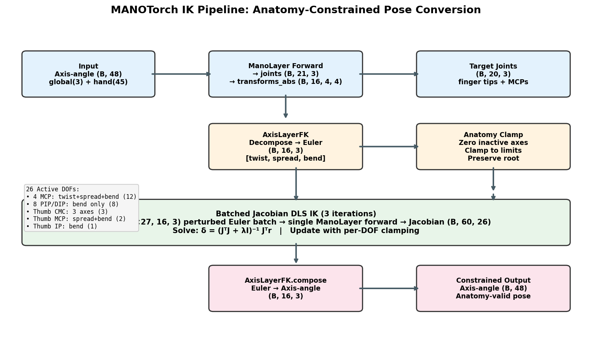
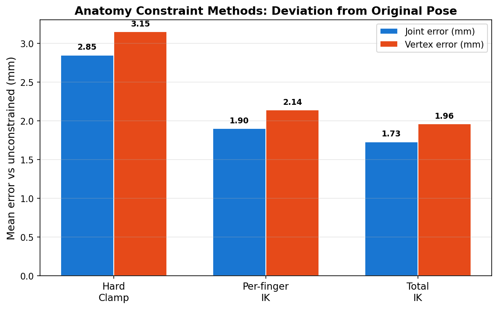
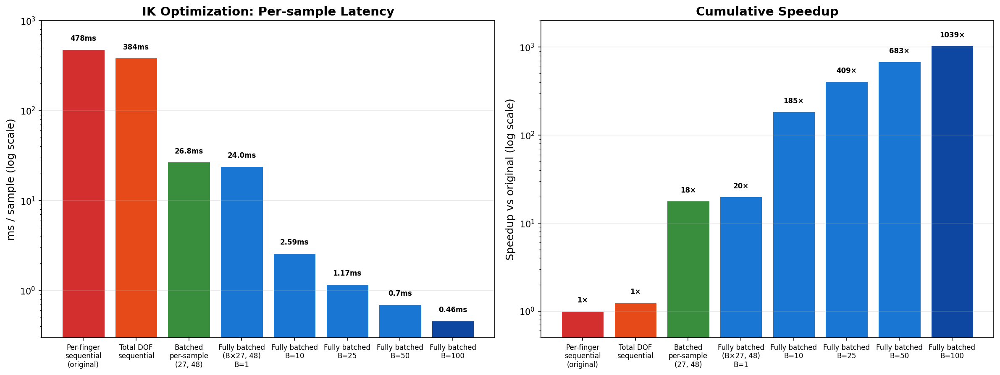
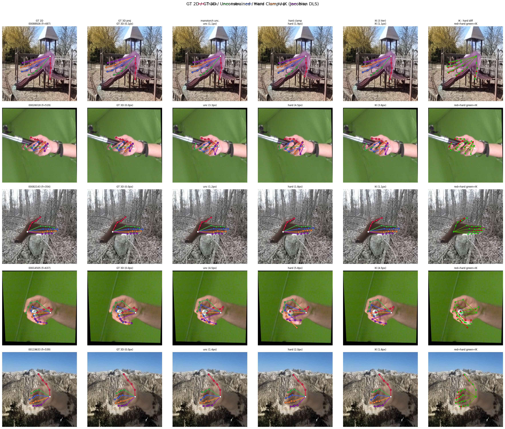

# MANOTorch Anatomy-Constrained IK: Optimization & Training Integration

## Overview

Implemented a batched inverse kinematics (IK) solver for converting unconstrained MANO hand pose parameters into anatomy-valid representations using MANOTorch's Euler angle decomposition. Optimized the solver from 478ms/sample down to 0.46ms/sample (~1000x speedup), pre-computed constrained labels for the full 2.16M-sample training dataset, and integrated the result into the WiLoR-MANOTorch training pipeline.

---

## 1. IK Logic: Axis-Angle to Anatomy-Constrained Euler Angles

### Problem

Standard MANO represents joint rotations as axis-angle vectors (48 params: 3 global + 15 joints x 3). These have no anatomical constraints — joints can twist, spread, and bend beyond physical limits.

### MANOTorch Euler Decomposition

MANOTorch's `AxisLayerFK` decomposes each joint's rotation into anatomy-aligned Euler angles `[twist, spread, bend]`, where each axis has biomechanically meaningful limits:

| Joint Type | Twist | Spread | Bend | Active DOFs |
|------------|-------|--------|------|-------------|
| MCP (Index/Middle/Ring/Pinky) | [-30, +30] | [-30, +30] | [-10, +100] | 3 |
| PIP / DIP | 0 | 0 | [-10, +100] | 1 |
| Thumb CMC | [-55, +55] | [-25, +55] | [-10, +100] | 3 |
| Thumb MCP | 0 | [-20, +20] | [-10, +100] | 2 |
| Thumb IP | 0 | 0 | [-10, +100] | 1 |
| **Total** | | | | **26 DOFs** |

Global orientation (joint 0) is always preserved exactly — it is excluded from both the active mask and the IK solve.

### IK Pipeline



The conversion pipeline for each sample:

1. **MANO Forward**: axis-angle (B, 48) → `ManoLayer` → joint positions (target) + `transforms_abs`
2. **Euler Decomposition**: `AxisLayerFK(transforms_abs)` → Euler angles (B, 16, 3)
3. **Anatomy Clamp**: zero inactive axes, clamp active axes to limits
4. **Jacobian DLS IK** (3 iterations): adjust clamped Euler angles to minimize joint position error vs. unconstrained target
5. **Recompose**: `AxisLayerFK.compose(euler)` → constrained axis-angle (B, 48)

The IK step is critical — without it (hard clamp only), the clamped Euler angles produce joint positions that deviate significantly from the original.

---

## 2. Per-Finger IK vs Total IK

### Per-Finger (Original)

The original implementation solved each finger independently: 5 separate Jacobian solves per sample, each with 3-6 DOFs targeting 2-4 joints. This ignores cross-finger coupling through the wrist.

### Total IK

All 26 DOFs are solved jointly in a single Jacobian system targeting all 20 finger joints (60 target dimensions). This captures the full kinematic coupling and produces better results.



| Method | Joint Error (mm) | Vertex Error (mm) | Reduction vs Hard Clamp |
|--------|----------------:|------------------:|------------------------:|
| Hard Clamp | 2.85 | 3.15 | — |
| Per-finger IK (3 iter) | 1.90 | 2.14 | 33% |
| **Total IK (3 iter)** | **1.73** | **1.96** | **39%** |

Total IK is both more accurate (captures cross-finger coupling) and faster (fewer total iterations).

---

## 3. Speed Optimization

### Optimization Steps

**Step 1: Per-finger sequential → Total sequential**
- Merged 5 per-finger solves into 1 total solve
- Reduced forward passes from 93 to 81 per sample (3 iterations)
- Speedup: 1.24x

**Step 2: Sequential forward → Batched forward per sample**
- Instead of 27 sequential (1, 48) MANO forwards for finite-difference Jacobian, batch into a single (27, 48) forward
- 3 iterations = 3 batched forwards instead of 81 sequential
- Speedup: ~15x (478ms → 26.8ms)

**Step 3: Per-sample loop → Fully batched across samples**
- Stack all B samples' perturbations: (B×27, 48) single forward per iteration
- Batched `torch.linalg.solve` for the DLS system: (B, 26, 26)
- Pre-compute perturbation offsets and damping matrix (reused across iterations)
- GPU fully saturated at batch sizes ≥ 50

### Speed Comparison (A100 80GB)



| Approach | ms/sample | Samples/s | Est. per tar | Speedup |
|----------|----------:|----------:|-------------:|--------:|
| Per-finger sequential (original) | 478.0 | 2.1 | 413s | 1x |
| Total DOF sequential | 384.0 | 2.6 | 333s | 1.2x |
| Batched per-sample (27, 48) | 26.8 | 37.3 | 27s | 18x |
| Fully batched B=1 | 24.0 | 41.6 | 24s | 20x |
| Fully batched B=10 | 2.59 | 386 | 2.6s | 185x |
| Fully batched B=25 | 1.17 | 855 | 1.2s | 409x |
| Fully batched B=50 | 0.70 | 1,436 | 0.7s | 683x |
| **Fully batched B=100** | **0.46** | **2,172** | **0.5s** | **1,039x** |

### Why Autograd Was Slower

We also tested `torch.autograd` for Jacobian computation (single forward + backward instead of finite differences). Autograd was 4-5x slower because:
- MANO is a tiny model (~800 vertices, 16 joints)
- Forward pass is cheap on GPU; autograd graph construction + backward overhead dominates
- Finite-difference with batched forward is more efficient for small models

---

## 4. Dataset Conversion

### Full Dataset Pre-computation

Converted the entire training dataset (2,165 tar files, 2,163,821 samples, 186GB) using the batched IK solver on a single A100:

| Metric | Value |
|--------|-------|
| Total tars | 2,165 |
| Total samples | 2,163,821 |
| Total time | 58 minutes |
| Avg per tar | ~1.5s |

Output stored in `hamer_training_data/dataset_tars_manotorch/`. The conversion preserves all fields (images, keypoints, betas) exactly — only `hand_pose` (48 floats) is modified.

### Converted Parameter Example

The stored format remains axis-angle (48,). A single-DOF bend rotation in Euler space produces non-zero values in all 3 axis-angle components because axis-angle encodes rotation axis × angle, which is generally not axis-aligned.

```
global orient (preserved exactly):
  orig: [-2.245736, +0.367023, -0.959829]
  conv: [-2.245736, +0.367023, -0.959829]
  diff: 0.00e+00

hand pose joint 2 (PIP, bend only):
  orig: [-0.0638, +0.0248, -0.2131]
  conv: [-0.0118, -0.0000, -0.1741]  ← twist/spread reduced, bend adjusted
```

---

## 5. Training Integration

### Config Changes

Created `datasets_tar_manotorch.yaml` pointing to the pre-constrained dataset. The experiment config (`wilor_manotorch.yaml`) now specifies:

```yaml
DATASETS_CONFIG: datasets_tar_manotorch.yaml
```

`CONSTRAIN_GT` and `CONSTRAIN_GT_USE_IK` are deprecated — runtime constraining is no longer needed since GT labels are pre-computed.

### Model Architecture

The WiLoR-MANOTorch model predicts 6D rotation representations (first two columns of rotation matrix), converted to full 3x3 via Gram-Schmidt. The loss compares against GT stored as axis-angle (converted to rotmat at loss time).

```
Prediction: Network → 6D (6,) → rot6d_to_rotmat → rotmat (3,3) → MANO forward
GT:         Dataset → axis-angle (3,) → aa_to_rotmat → rotmat (3,3)
Loss:       L1(pred_rotmat, gt_rotmat)
```

### Training Configuration

- **Model**: WiLoR-MANOTorch (640M params)
- **Hardware**: 4x V100 on worker-node2001
- **Batch size**: 32 per GPU
- **Optimizer**: AdamW, lr=1e-5, weight_decay=1e-4
- **Total steps**: 5M
- **Dataset**: `dataset_tars_manotorch` (pre-constrained via batched IK)
- **Tracking**: W&B

### Benefits of Pre-computed Constraints

| Aspect | Runtime Constraining | Pre-computed |
|--------|---------------------|--------------|
| Training speed | IK overhead per batch | Zero overhead |
| Method | Hard clamp (fast, less accurate) | Batched IK (optimal accuracy) |
| Consistency | Varies by config | Fixed, reproducible |
| GPU memory | Extra IK wrapper on device | No extra memory |

---

## Key Files

| File | Description |
|------|-------------|
| `hamer/models_wilor_manotorch/mano_ik_wrapper.py` | Batched IK solver (CUDA + CPU backends) |
| `hamer/models_wilor_manotorch/manotorch_wrapper.py` | MANOTorch wrapper with anatomy limits |
| `hamer/models_wilor_manotorch/wilor.py` | WiLoR training module (simplified, no runtime IK) |
| `hamer/configs/datasets_tar_manotorch.yaml` | Dataset config for pre-constrained tars |
| `scripts/convert_tars_manotorch.py` | Batch conversion script |
| `scripts/compare_mano_wrappers.py` | Visualization & comparison tool |

---

## Keypoint Visualization



Columns: GT 2D | GT 3D projected | Unconstrained | Hard Clamp | IK (3 iter) | IK vs Hard diff (red=hard, green=IK)
