# Multi-view consistency of HaWoR-tactile contact estimation (datasets_s3/20260716)

**Date:** 2026-08-04
**Data:** `~/MANO-pipeline/datasets_s3/20260716` (260716_humandata_mousebox, 105 segments, 4 ZED stereo cameras × L/R eye = 8 views per segment, 1920×1080 @ 30 fps)
**Model:** `hawor_tactile_v1_ws_150k.ckpt` via `tmp/extract_tactile.py` (YOLO detect+track → HaWoR-tactile head, per-frame contact probability on 778 MANO vertices per hand; no SLAM)
**Segments analyzed:** `_1` (45 s), `_50` (13 s), `_105` (10 s) — 24 videos total. Per-view focal from `intrinsic.yaml`.

## TL;DR

Contact estimation is **not** view-invariant, and the disagreement has clear structure:

1. **Timing agrees, magnitude doesn't.** Every view detects the same contact
   episodes at the same frames, but per-view probability levels differ
   systematically (up to ~40–50% relative). The cross-view std of the
   per-frame mean-contact signal is ~0.015–0.022 on a signal of ~0.05 — a
   **~30% relative spread**.
2. **The stereo baseline sets the ceiling.** The two eyes of the *same* camera
   (~12 cm apart, nearly identical appearance) agree at r ≈ 0.93–0.96 on the
   contact-rich left hand. That is the best this estimator does across *any*
   viewpoint change — cross-camera agreement is r ≈ 0.80–0.86.
3. **Binary contact masks disagree much more than probabilities.** At a 0.5
   threshold, per-vertex contact-patch IoU is only 0.64–0.75 stereo and
   0.42–0.50 cross-camera even on the contact-rich hand.
4. **Idle hands are noise.** For the mostly-idle right hand, cross-camera
   correlation collapses to r ≈ 0.52–0.61 and IoU to ≈ 0 — when there is
   little true contact, per-view false positives dominate.
5. **View quality is predictable from geometry.** The rear camera (43579660)
   loses the left hand (18% coverage in seg 1, 77% in seg 105), reads
   systematically lower probabilities, and produces view-specific false
   positives. The frontal camera (43989660) is the most consistent with the
   others and with the dataset's own processed contact.

## Setup

### Camera views

| Camera | Position | Snapshot |
|---|---|---|
| 43579660 "rear" | behind-right of subject; hands small, near frame edge | 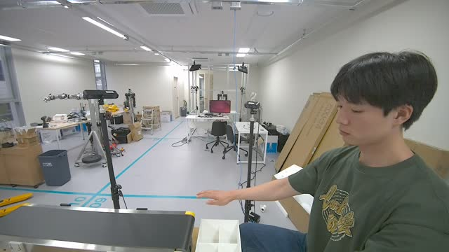 |
| 43989660 "frontal" | facing subject, hands centered (the view MANO-pipeline used for `processed/contact`) | 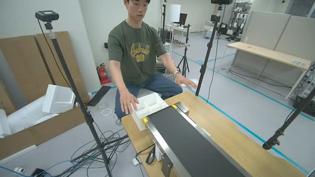 |
| 50387610 "shoulder" | over-the-shoulder from behind-left; hands large; a second person visible in background | 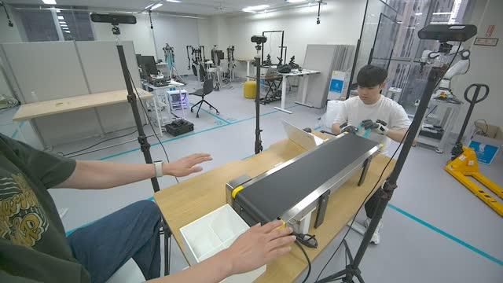 |
| 54480428 "frontL" | front-left, elevated | 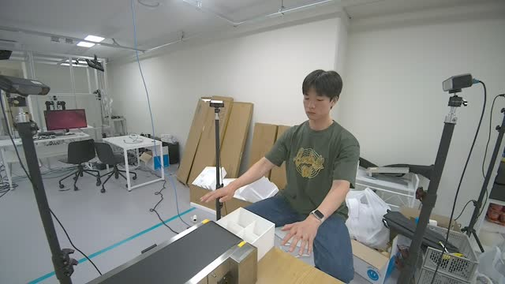 |

Each camera contributes its left and right stereo eye as separate monocular
views (solid / dashed lines in the trace figures; hue = camera). Same-camera
L↔R pairs ("stereo") differ only by a ~12 cm baseline, so they isolate the
estimator's sensitivity to *appearance* from genuine *viewpoint* change.

### Method

For each of the 8 views per segment: YOLO hand detect+track, bbox
interpolation, HaWoR-tactile chunk inference with the view's calibrated focal
`(fx+fy)/2`. Output per view: `tactile (2 hands, T, 778)` contact
probabilities + `valid (2, T)` mask (`tmp/contact_outputs_s3mv/<seg>/<view>.npz`).
Left-hand vertices are stored in the flipped right-template order in all
views, so vertex indices are directly comparable across views. Views within a
segment were cropped to a common frame count (they can differ by one frame).

Comparison metrics on co-valid frames per pair of views: Pearson r and MAE on
raw per-vertex probabilities, and IoU / F1 of the thresholded (p > 0.5)
contact patches. Runner: `tmp/run_s3_multiview.py`, analysis:
`tmp/analyze_s3_multiview.py`, figures: `tmp/plot_s3_multiview.py` (all in the
HaWoR repo).

## Per-view results

### Detection coverage

Right-hand coverage is ≈ 100% in every view of every segment (the subject's
right hand stays in frame). Left-hand coverage is where views differ:

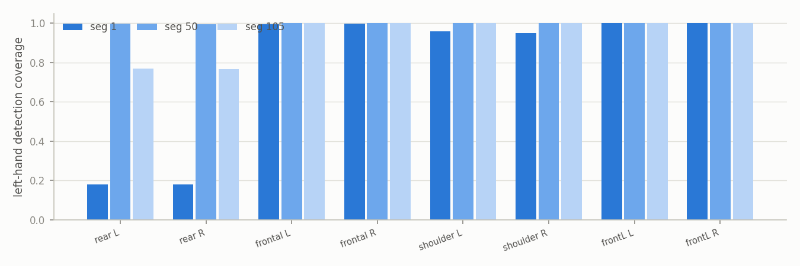

- **rear (43579660)**: catastrophic in seg 1 (**18%** — the left hand sits at
  the frame edge for most of the clip) and degraded in seg 105 (77%). This
  view cannot be trusted for the left hand in this rig placement.
- **shoulder (50387610)**: loses the *right* hand 24–25% of seg 1 (the
  subject's own body occludes it from behind).
- **frontal / frontL**: essentially full coverage everywhere.

### Mean-contact traces (all views overlaid)

Segment 1 (45 s, several pick-and-place cycles):

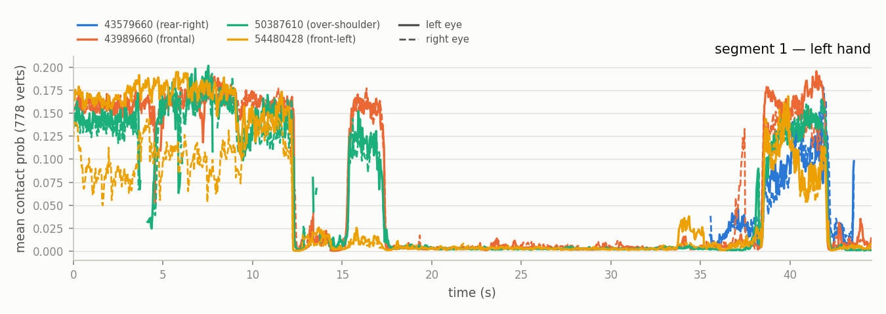

Segment 50:

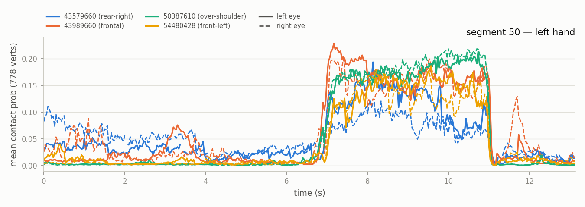

Segment 105 (single grasp at t ≈ 4.5–8 s):

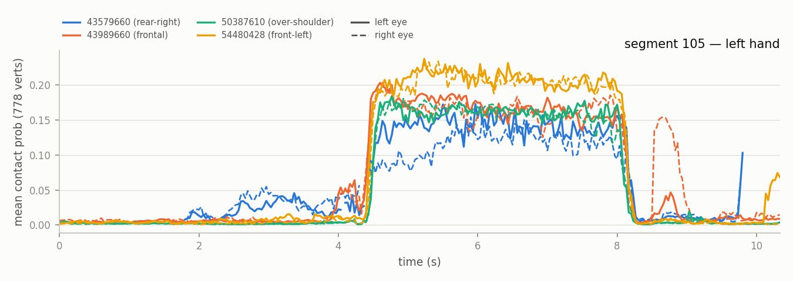

Right-hand traces: [seg 1](assets/seg1_trace_right.png),
[seg 50](assets/seg50_trace_right.png),
[seg 105](assets/seg105_trace_right.png).

What the traces show:

- **Episode boundaries are shared.** Contact onsets/offsets align across all
  8 views to within a few frames (e.g. seg 105's grasp at 4.5→8.1 s; seg 1's
  cycles at 0–12 s, 15–17 s, 38–42 s).
- **Levels are view-specific.** In seg 105 the frontL camera reads a mean of
  ~0.21 during the grasp while the rear camera reads ~0.13 — same hand, same
  frames. In seg 1 the frontL *right eye* reads roughly half the level of the
  other views during the first 9 s.
- **View-specific hallucinations exist.** Seg 1, t ≈ 15–17 s: frontal and
  shoulder report a strong contact episode; frontL reads ~0 and rear has no
  detection at all — the views *qualitatively* disagree on whether the hand
  was touching anything. Seg 105: the frontal right-eye invents a contact bump
  at t ≈ 8.7 s (after release) that no other view sees; the rear camera reads
  a false plateau at t ≈ 2–3.5 s before contact begins.

### Per-fingertip breakdown (left hand)

[seg 1](assets/seg1_fingertips_left.png) ·
[seg 50](assets/seg50_fingertips_left.png) ·
[seg 105](assets/seg105_fingertips_left.png)

The finger *ranking* is stable across views (index/middle strongest, pinky
weakest — consistent with a box grasp), and per-view offsets are roughly
uniform across fingers, i.e. the bias behaves like a per-view gain on contact
confidence rather than a re-attribution of which fingers touch.

## View-wise agreement

Pairwise Pearson r heatmaps (per-vertex probabilities, co-valid frames):

| | left hand | right hand |
|---|---|---|
| seg 1 | 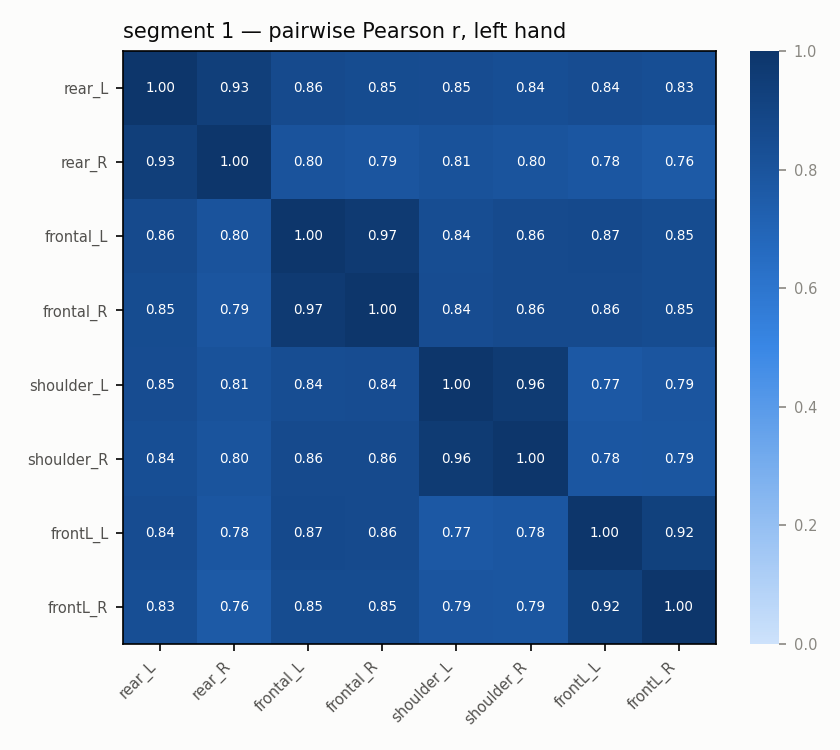 | 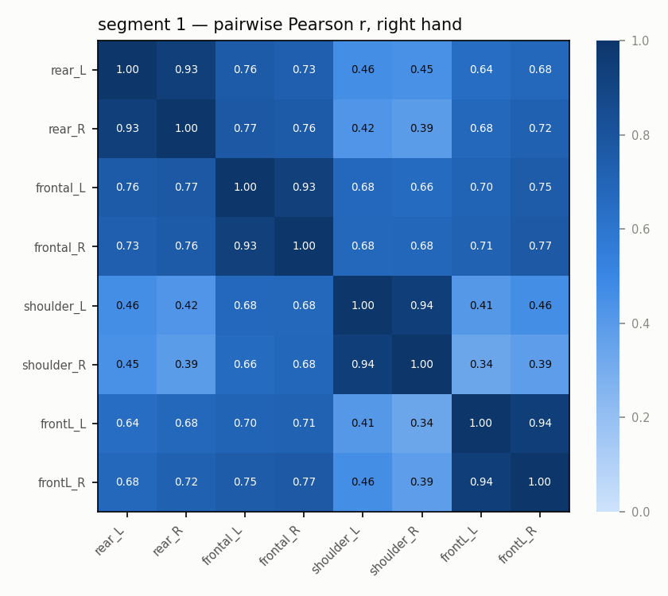 |
| seg 50 | 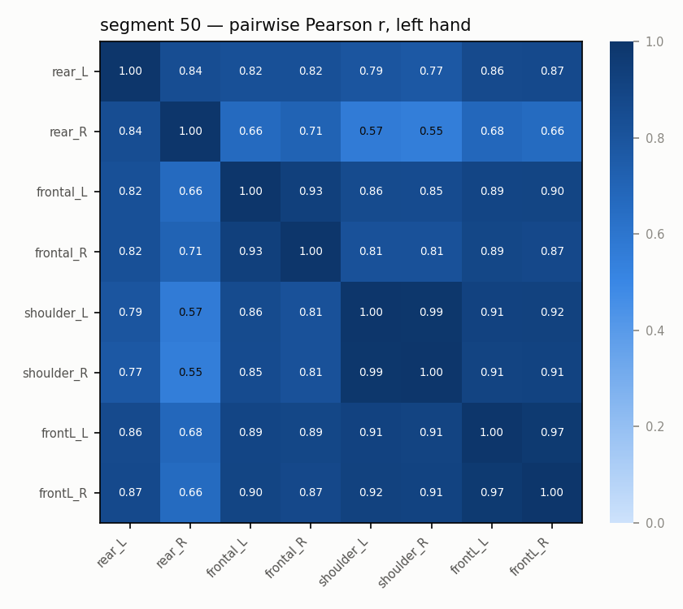 | 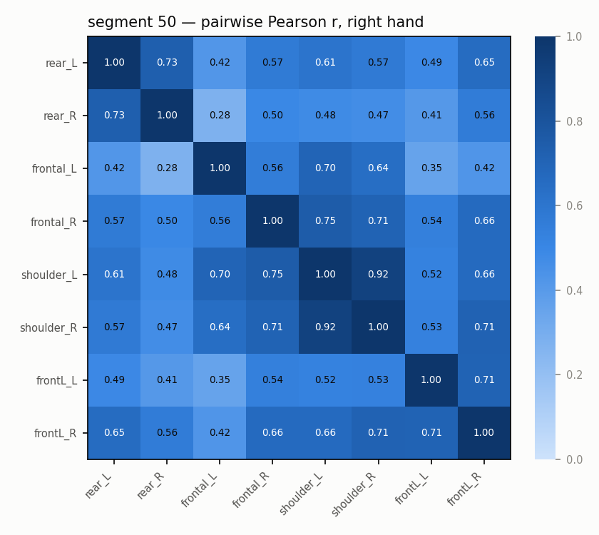 |
| seg 105 | 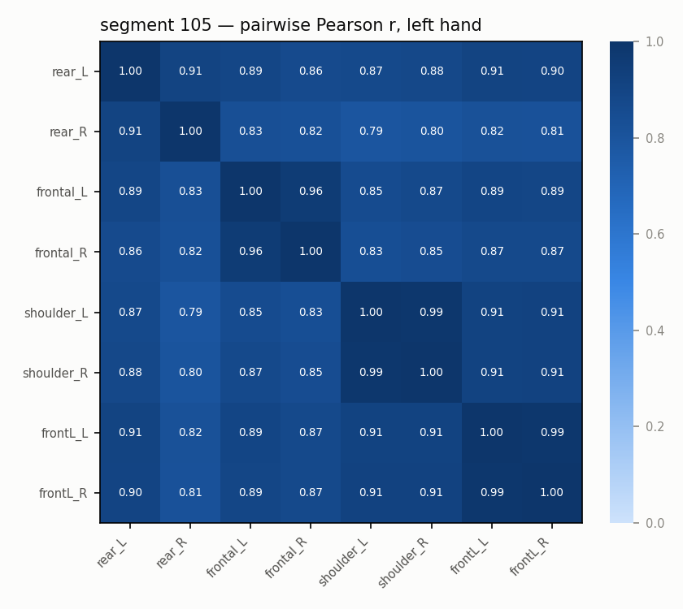 | 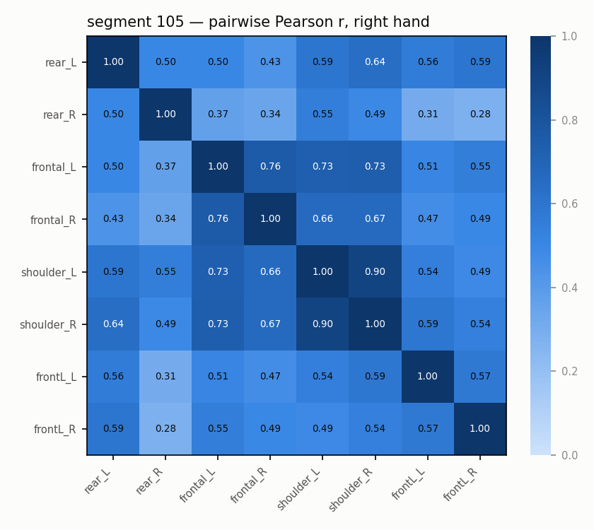 |

Aggregated over pairs (stereo = same camera L↔R, n=4; cross = different
cameras, n=24):

| Segment | Hand | Pair type | Pearson r (mean [min,max]) | MAE | IoU@0.5 | F1@0.5 |
|---|---|---|---|---|---|---|
| 1 | left | stereo | 0.948 [0.924, 0.968] | 0.017 | 0.65 | 0.78 |
| 1 | left | cross | 0.825 [0.763, 0.866] | 0.036 | 0.42 | 0.59 |
| 1 | right | stereo | 0.937 [0.931, 0.942] | 0.014 | 0.55 | 0.71 |
| 1 | right | cross | 0.612 [0.337, 0.773] | 0.033 | 0.19 | 0.30 |
| 50 | left | stereo | 0.932 [0.840, 0.989] | 0.018 | 0.64 | 0.76 |
| 50 | left | cross | 0.804 [0.548, 0.915] | 0.038 | 0.42 | 0.57 |
| 50 | right | stereo | 0.728 [0.558, 0.915] | 0.008 | 0.12 | 0.19 |
| 50 | right | cross | 0.550 [0.275, 0.752] | 0.019 | 0.02 | 0.04 |
| 105 | left | stereo | 0.959 [0.906, 0.988] | 0.016 | 0.75 | 0.85 |
| 105 | left | cross | 0.864 [0.790, 0.914] | 0.041 | 0.50 | 0.66 |
| 105 | right | stereo | 0.684 [0.498, 0.904] | 0.006 | 0.06 | 0.11 |
| 105 | right | cross | 0.525 [0.278, 0.735] | 0.021 | 0.00 | 0.00 |

Readings:

- **Stereo ≫ cross-camera, always.** A 12 cm baseline costs ~0.03–0.05 r; a
  real viewpoint change costs 0.10–0.15 r on the active hand and 0.15–0.30 r
  on the idle hand. The estimator's output depends materially on where the
  camera stands.
- **The worst cross pairs always involve the rear camera** (down to r = 0.34
  for seg 1 right hand, 0.55 for seg 50 left hand). Excluding the rear camera,
  cross-camera left-hand agreement tightens to roughly r ≈ 0.85–0.91.
- **Active hand vs idle hand.** On segs 50/105 the right hand barely touches
  anything (mean contact ~0.01), and agreement numbers collapse — MAE stays
  tiny, but correlation and IoU are dominated by uncorrelated per-view false
  positives. Interpretation: the model's *contact* signal transfers across
  views far better than its *no-contact* silence.

## Sanity check against the dataset's own processed contact

`processed/contact/hand_contact.parquet` in each segment stores contact from
the MANO-pipeline, computed from the **43989660_left view only** with a
778-dim contact vector. Comparing our 43989660_left run against it
(same view, so ideally identical):

| Segment | Hand | Pearson r | MAE |
|---|---|---|---|
| 1 | left | 0.948 | 0.022 |
| 1 | right | 0.847 | 0.025 |
| 50 | left | 0.919 | 0.025 |
| 50 | right | 0.724 | 0.013 |
| 105 | left | 0.968 | 0.017 |
| 105 | right | 0.756 | 0.008 |

Same video, same nominal model family, yet r ≈ 0.92–0.97 rather than 1.0 —
the residual comes from detection/crop differences (different YOLO boxes →
different crops → different predictions) and possibly a checkpoint-version
difference in MANO-pipeline. Notably, this **same-view, different-crop gap is
about as large as the stereo-pair gap**, which reinforces the main finding:
the contact head is sensitive to the appearance of the crop it sees, and any
change to it — box jitter, baseline shift, or a genuinely different viewpoint —
moves the output.

## Why views disagree (interpretation)

- **Monocular appearance dependence.** The tactile head infers contact from a
  single cropped hand image. Cues like finger–object adjacency are
  perspective-dependent; a grasp seen from behind shows the dorsum, hiding
  exactly the vertices that touch.
- **Occlusion asymmetry.** The seg 1 t=15–17 s event demonstrates it: views
  looking into the grasp aperture report contact, views seeing the back of
  the hand do not.
- **Scale/quality gradient.** The rear camera sees hands at the smallest pixel
  scale and near the frame edge; it has both the worst coverage and the
  strongest level bias.
- **No temporal or cross-view fusion.** Chunks are processed independently per
  view; nothing enforces consistency.

## Practical recommendations

1. **Prefer views facing the palm/grasp aperture.** In this rig: frontal
   (43989660) and frontL (54480428) for the left hand; avoid the rear camera
   entirely for contact.
2. **Don't threshold per-view.** Binary masks disagree (IoU ≈ 0.4–0.5 across
   good views). If a downstream consumer needs binary contact, fuse first
   (e.g. median across available views) and threshold after — the timing
   agreement makes fusion easy, and the per-view gain bias cancels in rank
   statistics.
3. **Treat contact *levels* as uncalibrated per view.** Comparisons of
   magnitude across recordings are only meaningful within a fixed camera.
4. **Idle-hand output should be gated** by a contact-episode detector (or the
   valid mask + a minimum-probability floor); its raw per-vertex output is
   view-noise.
5. If view-invariant contact matters for training data, the multi-view rig
   itself is the label source: cross-view median as pseudo-GT, per-view
   deviation as a confidence weight.

## Scaling / reproduction

Only 3 of 105 segments were processed (~6 min/view on one A100, ≈ 70 GPU-h for
the full set). To extend:

```bash
cd ~/HaWoR
.venv/bin/python tmp/run_s3_multiview.py <seg_dirname> [...]   # extraction (cached per view)
.venv/bin/python tmp/analyze_s3_multiview.py <seg> [...] --out tmp/s3_mv_analysis
.venv/bin/python tmp/plot_s3_multiview.py --assets <report>/assets
```
