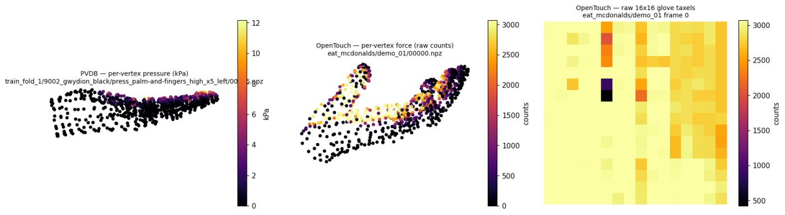
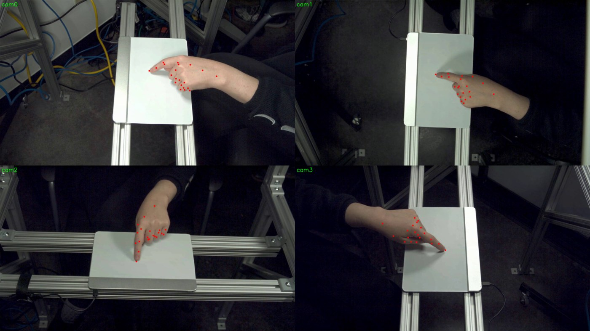
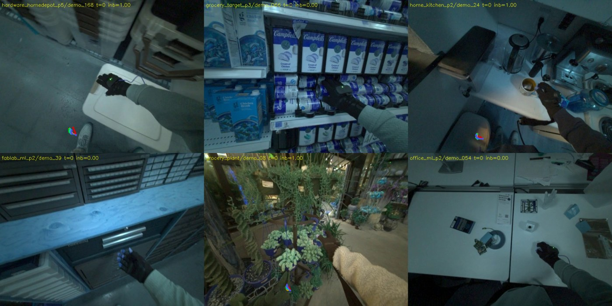
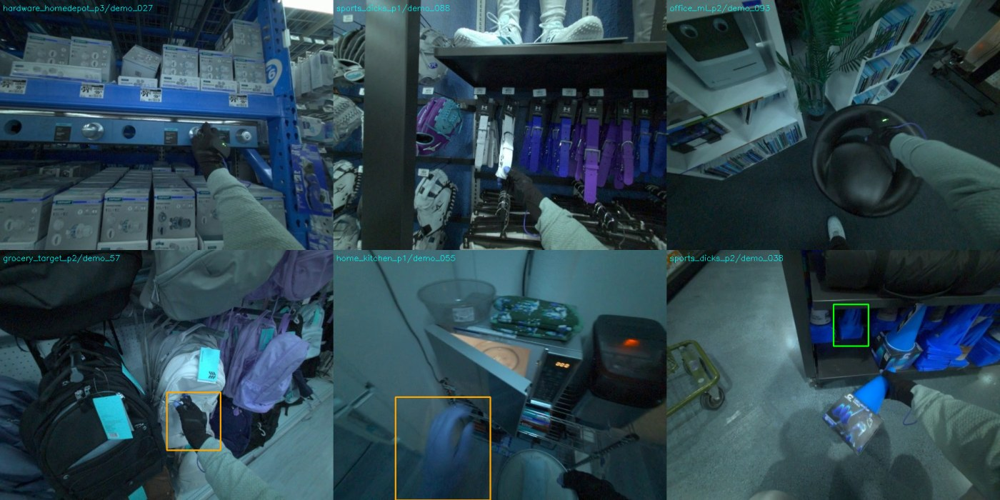
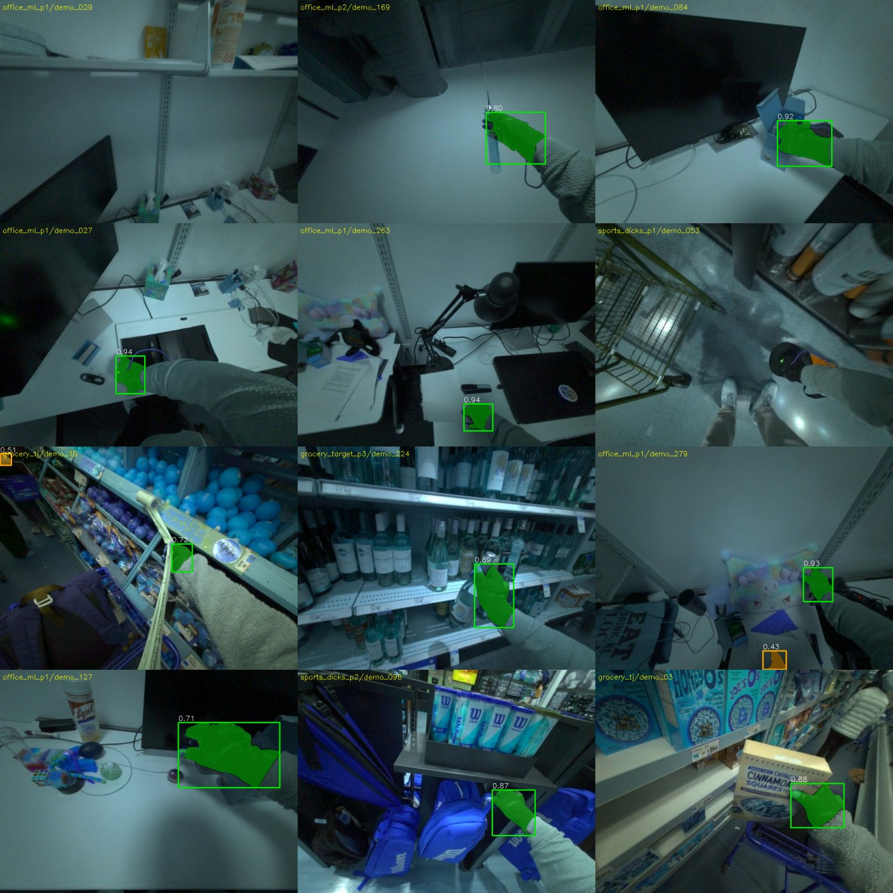
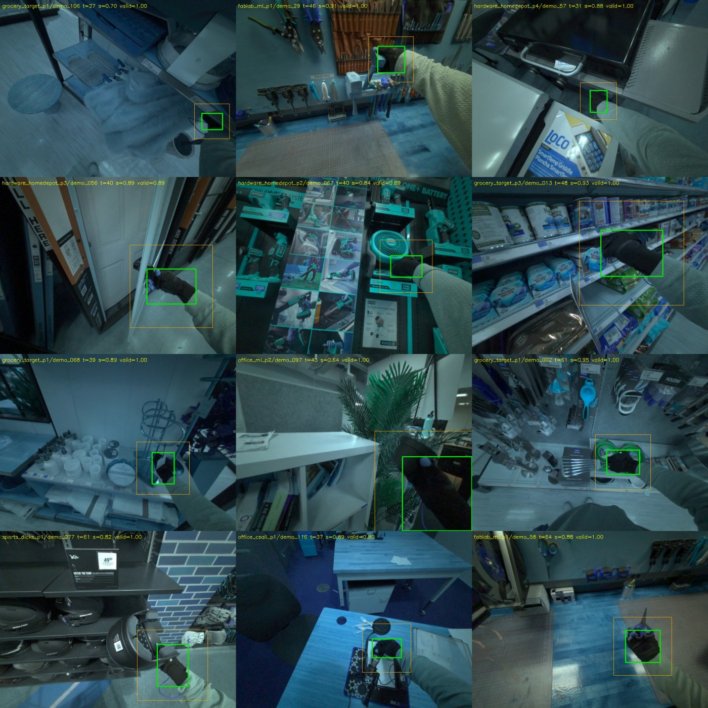

# PVDB + OpenTouch: Per-Vertex Force Datasets for VideoDataset

**Author:** Seungjun
**Date:** 2026-07-22
**Project:** 3D Hand Pose/Shape Estimation Ablation Study

---

## Overview

All existing tactile labels in the clip-training pool are **binary contact**
derived from signed distance. This work adds the third label tier —
**per-vertex force magnitude** — by converting the two datasets that actually
measure it:

| | PVDB (PressureVisionDB) | OpenTouch |
|---|---|---|
| sensing | Sensel pressure pad | 16×16-taxel Rokoko sensor glove |
| force units | **kPa** (real pressure), p99 ≈ 108 | **raw ADC counts**, saturate at 3072 |
| cameras | 4 calibrated static cams, 1920×1080 | 1 egocentric Aria RGB, 640×480 |
| converted | **10,004 clips / ≈450k frames** (train folds 1–4: 6,688 · val fold 5: 1,648 · test held out) | **2,538 clips / ≈280k frames** |
| force sparsity | ~5% of vertices > 0 (contact patches) | ~72% of vertices > 0 (glove measures continuously) |

Both descend from the same **unified per-frame npz** produced in
`~/pvdb_mano_annotation` (EasyMocap MANO fit + HOPE §3.1 taxel→vertex mapping:
`theta / beta / global_orient / transl / vertices(778,3) / vertex_pressure(778)`),
and land in the standard VideoDataset layout:

```
_DATA/haptic_training_label/<ds>/clip/<seq>/cam<c>/<s>_<e>.pyd     # pose labels
_DATA/haptic_training_tactile/<ds>/clip/<seq>/cam<c>/<s>_<e>.pyd   # force labels
_DATA/haptic_training_videos/<ds>/<seq>/cam<c>.mp4                 # H.264
```

The tactile record gained two fields, consumed by `VideoDataset._load_tactile`:

```
force      (T, 778) float32   source units (kPa / counts)
has_force  (T,)     float32   per-frame supervision mask
distances  (T, 778) float32   PVDB: 0 where p>0.5 kPa else +inf · OpenTouch: +inf (no object geometry)
```

Since `distances` rows contain +inf, `has_tactile` stays 0 for both datasets —
force datasets do not perturb the binary-contact objective.


*Left: PVDB per-vertex pressure (kPa) during a palm press — sparse contact
patch. Middle: OpenTouch per-vertex force (counts) — dense across the palm.
Right: the raw 16×16 glove taxel grid the OpenTouch mapping starts from.*

Converters: `scripts/scripts_conversion/convert_pvdb.py` /
`convert_opentouch.py` with shared `_pvdb_ot/common.py`; both sharded over
SLURM (`--no-index` per shard, one index rebuild after). Everything is
self-contained in `_DATA/` per the usual convention.

---

## 1. PVDB — geometrically sound out of the box

Each sequence carries per-camera `ModelViewMatrix` + intrinsics, so keypoints
project correctly in all four views; crops derived from them contain the hand.
`calculate_valid.py` gives a **mean valid-frame rate of 0.96**, and 99% of
clips have at least one trainable 16-frame window.


*The 21 regressed keypoints land on the hand in all four calibrated views.*

## 2. OpenTouch — the pose modality is NOT calibrated to the RGB camera

The recording rig is Meta Aria glasses + Rokoko Smartgloves synchronized at
30 Hz **in time only**. The "hand pose" is glove articulation placed at a
fixed nominal offset: the wrist sits ~1.9 m from origin and moves <10 cm even
while the wearer walks around a store, and the hdf5's `camera_poses` field is
the identity matrix in every frame of every file. No rigid transform maps the
MANO fit onto the visible hand — projection-based crops are meaningless
(median per-clip valid rate 0), which initially blocked image→force training.


*Projected skeletons either miss the frame entirely or form a tiny hand at a
fictional ~1.8 m depth — never on the actual gloved hand. The articulation is
real; only the camera placement is fiction.*

The stock HaWoR hand detector also fails: it was trained on bare hands and
misses the black sensor glove in most frames (or mislabels the side).



## 3. Unlock: SAM3 zero-shot glove segmentation

Following the original (HOPE) author's recipe — SAM3 hand mask → crop —
`facebook/sam3` with the text prompt **"black glove"** localizes the target
hand reliably with no fine-tuning: on a 12-frame sample the best mask sits on
the glove in 10/12 frames with decisive scores (true glove **0.71–0.94**,
false positives ≤ 0.51, correct rejection when the glove is out of frame).
OWLv2 was evaluated first and works (10/12) but with overlapping score bands
(TPs 0.19–0.56 vs FPs ~0.2) and occasional drift onto the other hand's sleeve;
its full-dataset detections are kept as a cross-check.



Full pass (`detect_glove_opentouch_sam3.py`, 8 GPU shards, resumable): all
2,538 clips, zero errors. `backfill_glove_bbox_opentouch.py` then bakes the
labels in place (idempotent via a `bbox_source='sam3'` stamp):

1. score gate ≥ 0.6, temporal support (≥3 gated neighbors within ±7 frames),
   jump rejection vs the local median center, interpolation across gaps ≤ 5;
2. `bbox_xyxy` / `valid` / `valid_t0` recomputed from the cleaned track
   (window convention identical to VideoDataset);
3. kp2d/kp3d **confidences zeroed** — the uncalibrated projections can never
   poison keypoint losses, now or in a future unfrozen run.

**Result: 99% of OpenTouch clips have a trainable window (mean valid rate
0.89) — ~2.2k clips / ~250k frames of in-the-wild egocentric force data,
up from effectively zero.**


*Final labels: green = SAM3 tight box (`bbox_xyxy`), orange = the 1.68× crop
the model actually sees.*

---

## 4. Fixes discovered along the way

- **Keypoint ordering.** The `_pvdb_ot` writer emitted **manotorch** finger
  order (index/middle/ring/pinky/thumb, tips 317/444/556/673/745) while every
  other converted dataset and the model's MANO wrapper use **OpenPose** order
  (verified: dexycb matches the model's joints to 0.8 mm). All 12,542
  PVDB+OpenTouch labels were permuted in place
  (`remap_kp_order_pvdb_ot.py`, stamped `kp_order='openpose'`), and the writer
  now emits OpenPose directly. Crop bboxes / validity are joint-order-invariant,
  so training was unaffected; GT skeleton colors and logged kp losses were.
- **`common.py` reconstruction.** The shared converter module was accidentally
  deleted from disk mid-run (with its `__pycache__`), failing every
  requeued conversion task. It was reconstructed from its two call sites and
  validated **bit-for-bit** against label/tactile files written by the
  original code, then committed so it cannot be lost again.
- **Pickled-dict tactile loading.** `VideoDataset._load_tactile` probed
  `tac.files` (npz-only), silently skipping force in pickled-dict tactile
  records; fixed to probe both container types.

## 5. Where things live

- Branch: `feature/HOPE_tactile` (`099c207`, `a881d19`, `0e36df7`)
- Dataset registry: `PVDB-CLIP-TRAIN` / `PVDB-CLIP-VAL` / `OPENTOUCH-CLIP-TRAIN`
  in `models_clip/configs/datasets_clip.yaml`
- Detections: `_DATA/haptic_training_detect/opentouch{,_sam3}/clip/`
- Visual QA: `hand_tracking_ablation/results/viz_pvdb_opentouch/`

**Open item:** OpenTouch force is in raw counts with no published counts→kPa
calibration; joint PVDB+OpenTouch training needs per-dataset force
normalization (kPa/110 vs counts/3072) — see the companion training report.
