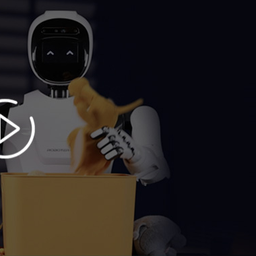
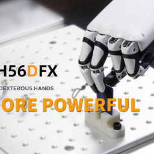
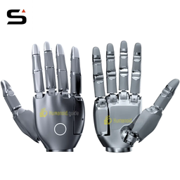
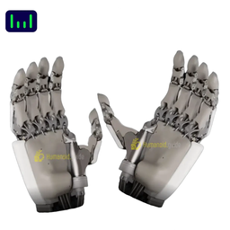
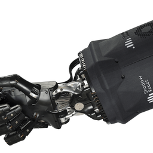
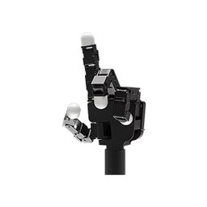
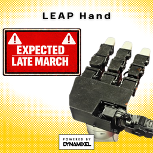
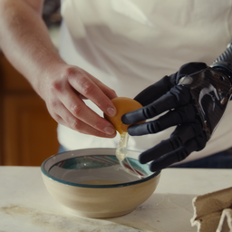
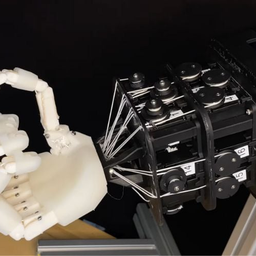

# State-of-the-Art Dexterous Robot Hands Report

**Date:** 2026-04-03

---

## Summary Comparison Table

| Hand | Manufacturer | DoF | Fingers | Weight | Size | Price (USD) |
|------|-------------|-----|---------|--------|------|-------------|
| **XHAND1** | Robotera (China) | 12 | 5 | 1,100 g | 191 x 94 x 47 mm | ~$16,750 |
| **Inspire RH56** | Inspire Robots (China) | 6 (12 joints) | 5 | 540–620 g | Human-sized | $10,000–$22,600 |
| **SharpaWave** | Sharpa (Singapore) | 22 | 5 | 1,200 g | 200 x 90 x 50 mm | Not disclosed |
| **ALLEX Hand** | WIRobotics (South Korea) | 15 | 5 | ~700 g | Human-sized | Not disclosed |
| **Shadow Dexterous** | Shadow Robot (UK) | 24 (20 actuated) | 5 | — | Human-sized | ~$100,000+ |
| **Allegro Hand V4** | Wonik Robotics (South Korea) | 16 | 4 | ~1,100 g | Human-sized | $15,000–$20,000 |
| **LEAP Hand** | CMU (USA) | 16 | 4 | — | Human-sized | ~$2,000 (open-source) |
| **Ability Hand** | PSYONIC (USA) | 6 | 5 | ~450 g | Human-sized | $10,000–$50,000 |
| **Faive Hand** | Faive Robotics | 16 | 5 | — | Human-sized | ~$1,000–$3,000 (open-source) |

---

## Visual Gallery

| XHAND1 | Inspire RH56 | SharpaWave |
|:---:|:---:|:---:|
|  |  |  |

| ALLEX Hand | Shadow Dexterous | Allegro Hand V4 |
|:---:|:---:|:---:|
|  |  |  |

| LEAP Hand | Ability Hand | Faive Hand |
|:---:|:---:|:---:|
|  |  |  |

---

## Detailed Profiles

### 1. XHAND1 — Robotera (China)

- **DoF:** 12 fully active (Thumb 3, Index 3, Middle/Ring/Little 2 each)
- **Size:** 191 mm x 94 mm x 47 mm, 1,100 g
- **Price:** ~$16,750 per hand (RobotShop)
- **Actuation:** Fully gear-driven Quasi-Direct Drive with coreless motors; all joints decoupled and backdrivable (back-drive damping ≤0.1 Nm)
- **Fingertip Force:** 15 N max; whole-hand grip 80 N; max grasp weight 25 kg (palm up)
- **Tactile Sensing:** Five 3D tactile array sensors (270° coverage per fingertip), 120–300 data points each, measuring normal + tangential force + temperature; minimum force resolution 0.05 N
- **Control:** Position, current-loop force, force-position hybrid; 83 Hz control frequency; EtherCAT or RS485
- **Software:** C++, Python, ROS; supports teleoperation via Apple Vision Pro and MANUS gloves
- **Durability:** 1,000,000 no-load grasp cycles
- **Recent:** Showcased at CES 2026; 600+ units delivered; paired with ERA-42 embodied AI model

---

### 2. Inspire RH56 Series — Inspire Robots (China)

- **DoF:** 6 DoF (12 motor joints via 6 miniature linear servo actuators + linkage mechanism)
- **Size:** Human-sized, 540–620 g depending on variant
- **Price:** $10,050–$22,600 depending on vendor and model
- **Actuation:** 6 miniature linear servos, 10–15 kg push/pull force each
- **Grip Force:** Up to 3 kg; thumb max 6 N, four-finger max 4 N, resolution 0.50 N
- **Speed:** Thumb swing 235°/s, thumb bending 150°/s, four-finger bending up to 570°/s
- **Sensors:** 6 integrated pressure sensors; RH56DFTP model adds 17 tactile sensors
- **Precision:** ±0.20 mm repeat positioning
- **Communication:** RS485, DC 24V; ROS-compatible
- **Durability:** 1,000,000+ operational cycles
- **Variants:**
  - **RH56BFX** ("The Pianist") — high speed, precise interactions
  - **RH56DFX** — large grip force, suited for grasping/prosthetics
  - **RH56DFTP** — 17 tactile sensors for advanced feedback
  - **RH56DFQ** — available on Amazon
- **Recent:** 10,000+ units shipped in 2025 (highest-volume dexterous hand manufacturer); featured on CCTV Spring Festival Gala 2026; customers include Agility Robotics and Skild AI; compatible with Unitree G1

---

### 3. SharpaWave — Sharpa (Singapore)

- **DoF:** 22 active DoF
- **Size:** 200 mm x 90 mm x 50 mm (1:1 human-scale), 1,200 g
- **Price:** Not publicly disclosed (mass production began Oct 2025)
- **Tactile Sensing:** Proprietary Dynamic Tactile Array (DTA) — 1,000+ tactile pixels per fingertip, sub-mm spatial resolution (<1 mm), pressure sensitivity 0.005 N across 0–30 N range, 180 FPS
- **Visuo-Tactile:** Each fingertip integrates a miniature camera + tactile array
- **Fingertip Force:** 20 N per fingertip
- **Speed:** Gesture speed exceeding 4 Hz
- **Durability:** 1,000,000 uninterrupted grip cycles
- **AI Integration:** Paired with "CraftNet" VTLA (Vision-Touch-Language-Action) model
- **Recent:** Mass production & shipping since Oct 2025; IROS 2025 live demo; CES 2026 Innovation Award; unveiled "North" full-body autonomous humanoid

---

### 4. ALLEX Hand — WIRobotics (South Korea)

- **DoF:** 15 per hand
- **Size:** Human-hand-sized, ~700 g
- **Price:** Not publicly disclosed (commercialization target: 2030)
- **Fingertip Force:** 40 N (strongest in this comparison)
- **Hook Grip Strength:** Over 30 kg
- **Payload:** Over 3 kg per hand
- **Force Sensitivity:** Detects forces as small as 100 gf without dedicated tactile sensors (compliant mechanisms + motor-current sensing)
- **Fingertip Repeatability:** ≤0.3 mm
- **Actuation:** Ultra-low-friction, high-load actuators; claimed 10x lower friction than traditional cobots; backdrivable
- **Background:** Founded 2021 by four former Samsung robotics engineers; Series A $9.5M (Mar 2024); collaborators include RLWRLD, MIT, UIUC, UMass, KIST, Maxon
- **Recent:** ALLEX humanoid unveiled Aug 2025; demonstrated buttoning shirts, folding laundry, handling heavy loads

---

### 5. Shadow Dexterous Hand — Shadow Robot (UK)

- **DoF:** 24 (20 actuated + 4 under-actuated)
- **Size:** Human-sized
- **Price:** ~$100,000–$125,000+
- **Actuation:** Air muscles or electric motors (E series)
- **Sensors:** Position, force, optional BioTac tactile
- **Notes:** Gold standard for research; 20+ year track record; ROS compatible; used in OpenAI's Rubik's cube RL demo. Most expensive option.

---

### 6. Allegro Hand V4 — Wonik Robotics (South Korea)

- **DoF:** 16 (4 per finger x 4 fingers)
- **Fingers:** 4 (no pinky)
- **Size:** Human-sized, ~1,100 g
- **Price:** ~$15,000–$20,000
- **Sensors:** Joint torque sensors, optional fingertip tactile
- **Notes:** Very popular in academic RL/manipulation research; open SDK; ROS support; torque-controlled; good balance of capability and affordability

---

### 7. LEAP Hand — Carnegie Mellon University (USA)

- **DoF:** 16
- **Fingers:** 4
- **Price:** ~$2,000 (BOM); fully open-source
- **Actuation:** Off-the-shelf Dynamixel servos; 3D-printable components
- **Notes:** Designed by Deepak Pathak's lab (RSS 2023); position and current control; lowest barrier to entry for dexterous manipulation research

---

### 8. Ability Hand — PSYONIC (USA)

- **DoF:** 6 (each finger individually actuated + thumb rotation)
- **Fingers:** 5
- **Size:** Human-sized, ~450 g (lightest in comparison)
- **Price:** $10,000–$50,000 range (prosthetic pricing)
- **Speed:** ~500°/s finger speed
- **Notes:** Originally a prosthetic; FDA-cleared; IP54-rated; increasingly adopted for robotics research; touch sensing on each fingertip

---

### 9. Faive Hand — Faive Robotics

- **DoF:** 16, tendon-driven
- **Fingers:** 5
- **Price:** ~$1,000–$3,000 (BOM, open-source inspired)
- **Notes:** Emerged 2023–2024; designed for sim-to-real transfer; very low cost

---

## Key Trends (2024–2026)

1. **Cost collapse:** Open-source designs (LEAP, Faive) proved capable hands can be built for <$3K, pressuring commercial vendors.
2. **Tactile sensing becoming standard:** SharpaWave leads with 1,000+ pixels/fingertip; XHAND1 offers 3D tactile arrays; even budget options now include force sensors.
3. **Humanoid integration:** Most new hands are designed as components of full humanoid platforms (ALLEX, Sharpa North, Tesla Optimus, Figure 02).
4. **Chinese/Asian manufacturers dominating volume:** Inspire Robots shipped 10,000+ units in 2025 alone; Robotera, Sharpa, and WIRobotics all scaling production.
5. **Sim-to-real focus:** Hand designs increasingly optimize for simulatability (accurate URDF/MJCF models, low-backlash actuators, backdrivability).
6. **Force sensitivity without external sensors:** WIRobotics' ALLEX achieves 100 gf sensitivity through compliant mechanisms and motor-current sensing, avoiding bulky F/T sensors.

---

## Notes

- Prices are approximate and vary by vendor, configuration, and order volume.
- Specs sourced from manufacturer websites, product listings (RobotShop, RBTX, Amazon), press releases, and news coverage (Interesting Engineering, PR Newswire, RoboHorizon).
- Some hands (ALLEX, SharpaWave) are not yet individually sold and pricing remains undisclosed.
