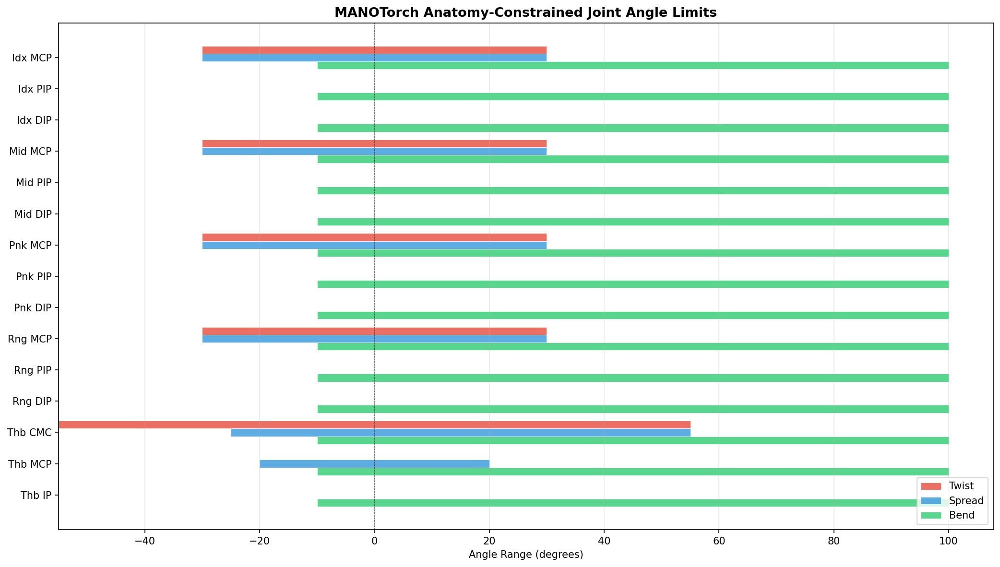
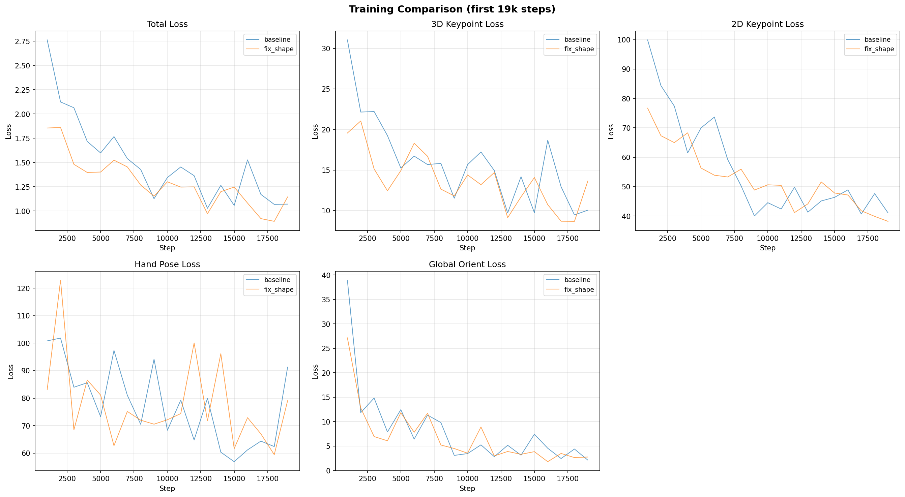
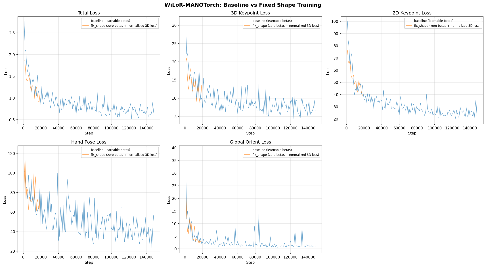
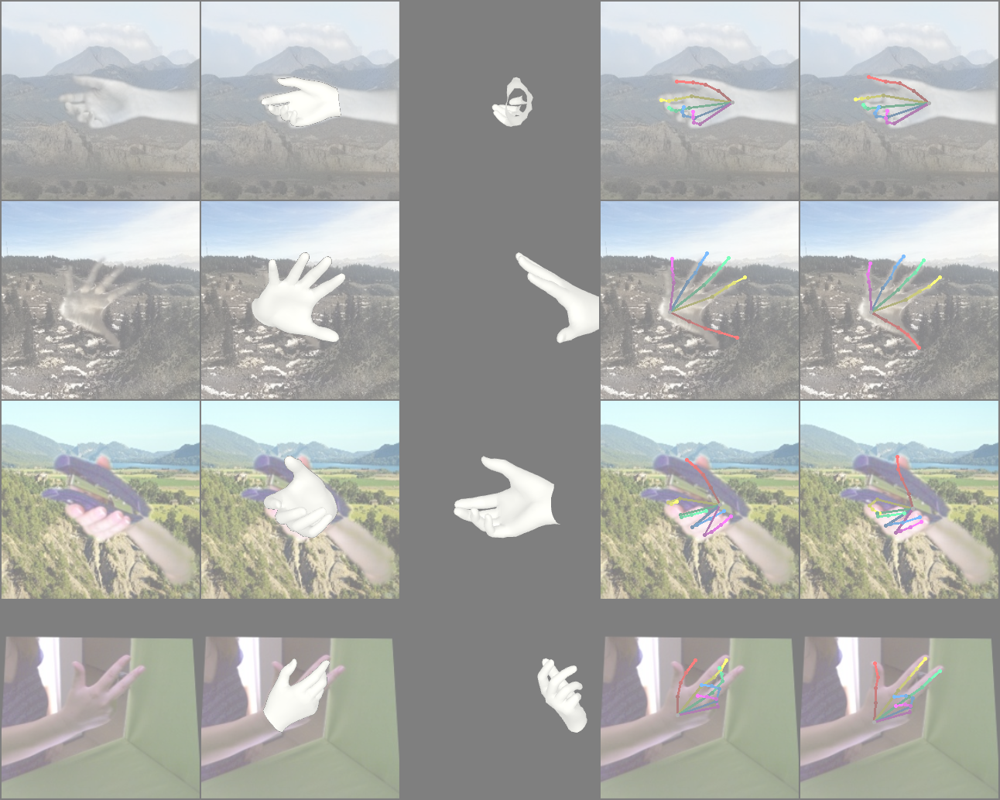
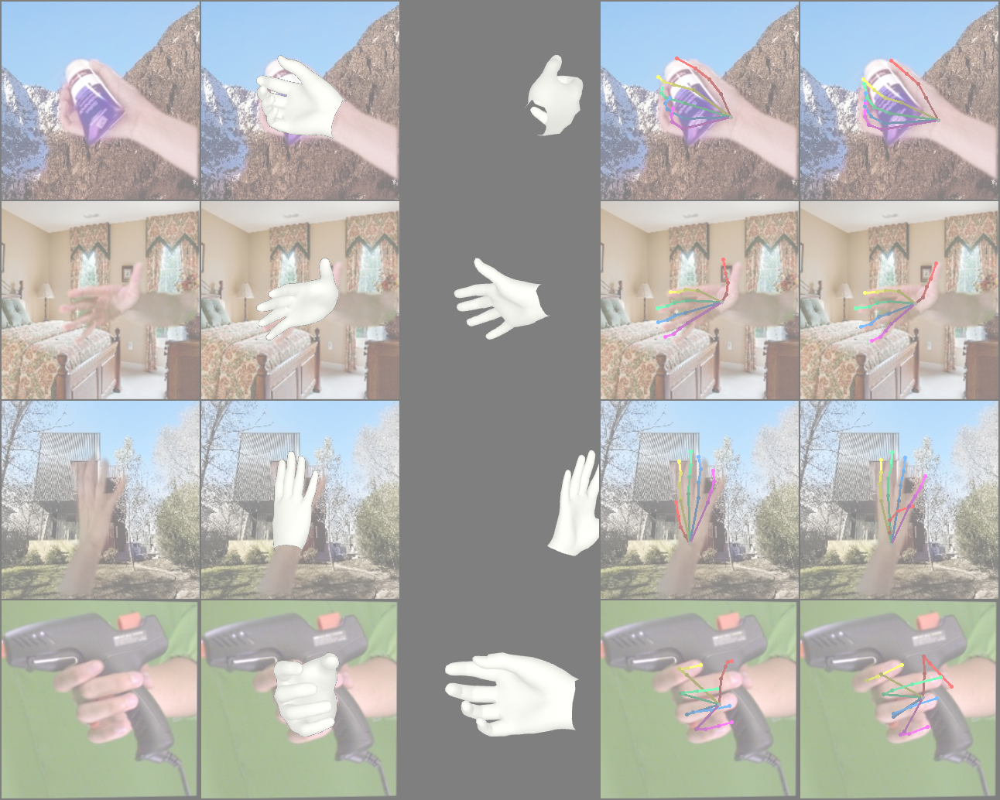
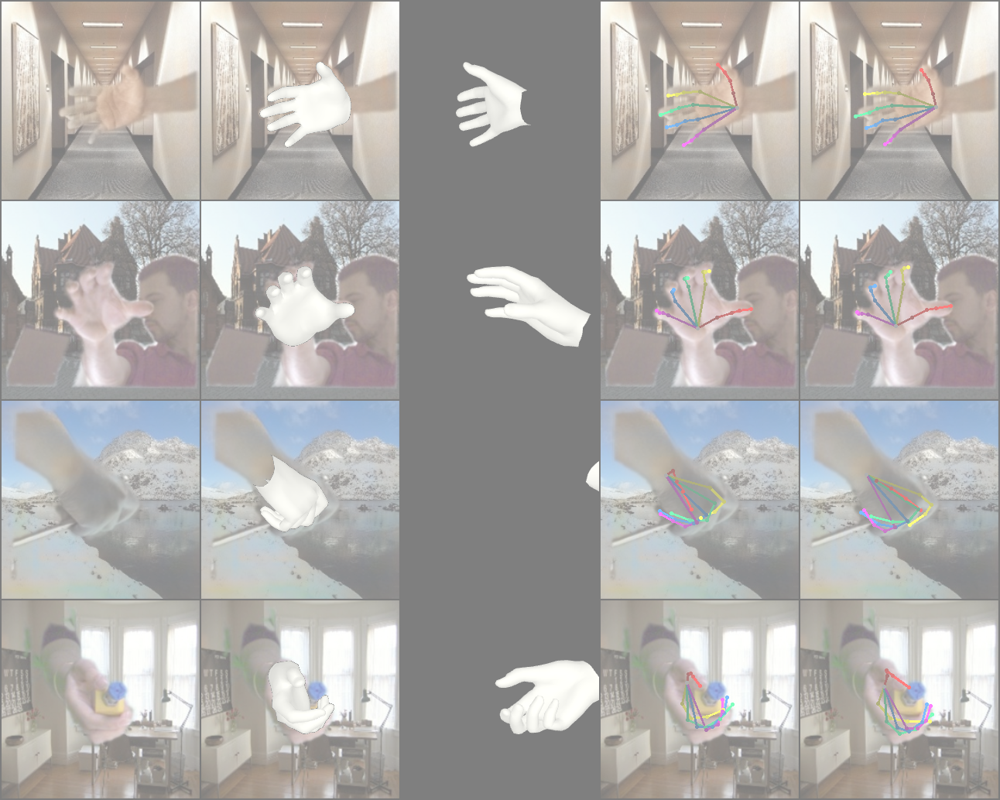

# WiLoR-MANOTorch: Anatomy-Constrained Hand Pose Estimation with Fixed Shape

**Date:** 2025-03-25
**Author:** Seungjun

---

## 1. MANOTorch with Anatomy-Constrained Joint Outputs

Integrated MANOTorch into the WiLoR training pipeline, replacing the standard smplx MANO layer. The key addition is **anatomy-aligned joint rotation constraints** that enforce physically plausible hand poses.

### How it works

The standard MANO model outputs unconstrained axis-angle rotations for 15 hand joints. MANOTorch adds a constraint layer that:

1. Decomposes each joint's rotation into **anatomy-aligned Euler angles** (twist, spread, bend) via `AxisLayerFK`
2. **Zeros inactive axes** — e.g., PIP/DIP joints only bend, they cannot twist or spread
3. **Clamps active axes** to anatomically valid ranges
4. Recomposes the constrained Euler angles back to axis-angle for the MANO forward pass

### Joint Angle Ranges

| Joint Group | Joint | Twist (°) | Spread (°) | Bend (°) |
|---|---|---|---|---|
| **Index** | MCP | [-30, 30] | [-30, 30] | [-10, 100] |
| | PIP | 0 | 0 | [-10, 100] |
| | DIP | 0 | 0 | [-10, 100] |
| **Middle** | MCP | [-30, 30] | [-30, 30] | [-10, 100] |
| | PIP | 0 | 0 | [-10, 100] |
| | DIP | 0 | 0 | [-10, 100] |
| **Ring** | MCP | [-30, 30] | [-30, 30] | [-10, 100] |
| | PIP | 0 | 0 | [-10, 100] |
| | DIP | 0 | 0 | [-10, 100] |
| **Pinky** | MCP | [-30, 30] | [-30, 30] | [-10, 100] |
| | PIP | 0 | 0 | [-10, 100] |
| | DIP | 0 | 0 | [-10, 100] |
| **Thumb** | CMC | [-55, 55] | [-25, 55] | [-10, 100] |
| | MCP | 0 | [-20, 20] | [-10, 100] |
| | IP | 0 | 0 | [-10, 100] |

- MCP joints (metacarpophalangeal) have 3 DOF: twist + spread + bend
- PIP/DIP joints are hinge joints: bend only
- Thumb CMC has the widest range due to its saddle joint anatomy



### Implementation

GT labels are **pre-constrained via batched IK** in the dataset preprocessing pipeline (`dataset_tars_manotorch`), so the model learns to output constrained poses via loss supervision. The forward-pass constraint projection is optionally available but disabled by default to avoid non-smooth gradient flow from the Euler clamp.

---

## 2. Fixed Shape Parameters (Zero Betas) Training

### Motivation

To simplify the model and test whether hand shape estimation is necessary for accurate pose prediction, we created a variant (`wilor_manotorch_fix_shape`) that fixes MANO betas to zero (mean hand shape) throughout training.

### Changes

- **Backbone (ViT):** Removed the shape embedding token and `decshape` decoder — the transformer no longer predicts betas
- **RefineNet:** Removed `dec_shape` linear layer — no shape refinement
- **MANO forward pass:** Always uses `betas = torch.zeros(B, 10)`
- **Loss:** Removed betas parameter loss (`LOSS_WEIGHTS.BETAS = 0.0`)
- **3D keypoint loss:** Replaced `Keypoint3DLoss` with `NormalizedKeypoint3DLoss` (see below)

### Scale-Normalized 3D Keypoint Loss

With fixed betas, the model always produces mean-shape bone lengths. However, GT 3D keypoints from datasets (FreiHAND, InterHand26M, etc.) reflect each person's actual hand size. This creates a systematic bone-length mismatch that the model cannot resolve.

To address this, we introduced `NormalizedKeypoint3DLoss` that rescales GT keypoints to match the predicted hand scale:

```
gt_scale = mean_bone_length(gt_keypoints)
pred_scale = mean_bone_length(pred_keypoints)
gt_rescaled = (gt / gt_scale) * pred_scale
loss = L1(pred, gt_rescaled)
```

This preserves the original loss magnitude (unlike dividing both by hand_scale, which changes the loss scale) while removing the penalty for bone-length differences.

---

## 3. Training Results (Preliminary)

Both models are trained on the same mixed dataset (FreiHAND, InterHand26M, MTC, RHD, COCO-Wholebody, HALPE, etc.) with 4x V100 GPUs, batch size 32, learning rate 1e-5.

| | Baseline (learnable betas) | Fix Shape (zero betas) |
|---|---|---|
| **Status** | Running (~148k steps) | Running (~19k steps) |
| **Node** | worker-node2001 | worker-node2000 |
| **SLURM Job** | 259050 | 259665 |

### Loss Comparison at ~19k Steps

| Loss Component | Baseline @ 19k | Fix Shape @ 19k |
|---|---|---|
| Total loss | ~1.5 | ~1.1 |
| 3D keypoints | ~15 | ~14 |
| 2D keypoints | ~55 | ~38 |
| Hand pose | ~75 | ~79 |
| Global orient | ~8 | ~2.7 |

Early observations:
- Fix shape model converges comparably on 3D keypoint loss, confirming the normalized loss handles the scale mismatch
- 2D keypoint loss converges faster in the fix shape variant — fewer parameters to learn may help
- Hand pose loss is similar between both models
- Global orient loss converges faster in the fix shape variant

### Training Curves





### Prediction Visualizations

**Baseline @ 20k steps:**



**Fix Shape @ 20k steps:**



**Baseline @ 98k steps (for reference):**



---

## 4. Next Steps

- Continue training fix_shape model to convergence and compare final evaluation metrics
- Run evaluation on FreiHAND / InterHand26M benchmarks (PA-MPJPE, AUC)
- Investigate whether the normalized 3D loss introduces any training instability at later stages
